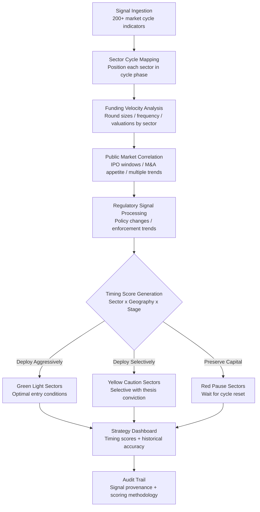

# Market Timing Analyzer

Frankmax

NAICS 523910-523999

> **Investors / VCs / Syndicates** — Investment Strategy Module

## Objective & Purpose

Market timing in venture and private equity is simultaneously dismissed as impossible and practiced by every successful investor. The difference between deploying capital at the right moment and deploying six months too early or too late can be the difference between a 10x return and a 2x return. Sector cycles, fundraising windows, M&A appetite, public market sentiment, and regulatory shifts all create timing signals that most investors process intuitively rather than systematically. The result: fund vintage year performance varies by 3-5x based largely on deployment timing relative to market cycles.

The Market Timing Analyzer aggregates and synthesizes macro and micro timing signals across sectors, geographies, and asset classes. It monitors over 200 market cycle indicators -- funding velocity by sector, public market multiples, M&A transaction volume, IPO pipeline depth, interest rate trajectories, regulatory activity, and technology adoption curves -- to produce sector-specific timing scores. These scores indicate whether current conditions favor aggressive deployment, selective deployment, or capital preservation in each target sector.

The system does not predict the future; it quantifies the present. By computing where each sector sits in its cycle (early expansion, peak, contraction, trough) based on measurable indicators, it provides the data infrastructure for disciplined timing decisions. Over time, the model calibrates against actual fund returns, building a proprietary timing intelligence layer that no single investor could construct from manual market observation alone.

## Business Context

| Attribute | Value |
|---|---|
| **Business Process** | Market cycle analysis and investment timing |
| **Business Function** | Investment Strategy |
| **Category** | Analytics |
| **Target Audience** | 13. Investors / VCs / Syndicates |
| **Bundle** | Custom VC/PE Intelligence Pack ($5,000-$10,000/mo) |
| **Monthly Cost of Inaction** | $100K-$500K (suboptimal deployment timing) |

## BPMN Workflow

## Features

1. **200+ Market Cycle Indicators** — Tracks funding round volume by sector and stage, median valuation multiples, time between rounds, LP commitment pace, public market sector indices, M&A transaction volume, IPO filing pipeline, interest rate curves, CPI trends, and technology adoption S-curves. Each indicator is weighted by predictive power.

2. **Sector Cycle Phase Detection** — Classifies each monitored sector into one of four cycle phases: early expansion (increasing activity, reasonable valuations), peak (maximum activity, compressed returns), contraction (declining activity, rising distress), and trough (minimal activity, maximum value opportunity). Phase transitions trigger alerts.

3. **Geographic Timing Differential** — Market cycles are not synchronized globally. The system tracks timing differentials between US, Europe, Asia, and emerging markets within each sector, identifying geographic arbitrage opportunities where the same thesis can be deployed at different cycle stages.

4. **Vintage Year Simulation** — Models hypothetical fund returns based on different deployment timing strategies against historical data. Shows the return impact of deploying capital 6 months earlier, 6 months later, or across different sector allocations.

5. **Fundraising Window Analysis** — For GPs planning new fund raises, the system identifies optimal LP engagement windows based on institutional allocation cycles, competitive GP fundraising calendars, and LP sentiment indicators.

6. **Regulatory Impact Forecasting** — Monitors regulatory signals (proposed legislation, enforcement actions, regulatory agency communications) and models their likely timing impact on affected sectors. Regulatory changes often create the most significant timing opportunities.

7. **Contrarian Signal Detection** — Identifies sectors where market consensus and measurable fundamentals diverge. When the market is bearish on a sector but fundamental indicators show strength (or vice versa), the system flags potential contrarian timing opportunities.

## Workflow & Automation

**Step 1: Continuous Signal Collection** — Market data feeds update continuously from financial data providers, regulatory databases, news aggregators, job posting platforms, and patent filing systems. Each data source has defined refresh cadences and data quality thresholds.

**Step 2: Indicator Computation** — Raw signals are transformed into standardized indicators with historical context. Each indicator includes current value, 30/90/365-day trend, percentile rank against historical range, and statistical significance of recent changes.

**Step 3: Cycle Phase Classification** — Sectors are classified into cycle phases using a multi-indicator consensus model. Phase classification requires agreement across multiple indicator categories (funding, valuation, sentiment, fundamentals) to avoid false signals from any single data source.

**Step 4: Timing Score Generation** — Composite timing scores are generated for each sector-geography-stage combination. Scores range from strong deploy (optimal conditions) to strong pause (unfavorable conditions), with granular gradations and confidence intervals.

**Step 5: Fund-Specific Contextualization** — Timing scores are filtered and weighted against the fund's specific thesis, remaining dry powder, portfolio construction targets, and fund lifecycle stage. A timing signal that is irrelevant to the fund's thesis is suppressed; signals aligned with active deal evaluation are amplified.

**Step 6: Reporting and Decision Support** — Weekly timing briefings are generated for the investment committee. Monthly deep-dive reports cover sector-specific timing analysis. All reports include historical accuracy metrics for the model's prior timing calls.

## Input/Output Specifications

| Direction | Data | Format | Description |
|---|---|---|---|
| Input | Funding round data | API (Crunchbase / PitchBook) | Round sizes, valuations, investors, timing |
| Input | Public market data | API (Bloomberg / Refinitiv) | Sector indices, multiples, IPO filings, M&A volume |
| Input | Regulatory signals | API / RSS | Proposed legislation, enforcement actions, policy changes |
| Input | Fund parameters | JSON / UI | Thesis, stage focus, geographic targets, dry powder |
| Output | Sector timing scores | JSON + UI dashboard | Deploy/caution/pause by sector-geography-stage |
| Output | Cycle phase maps | REST API / UI | Visual sector cycle positioning with trend arrows |
| Output | Timing briefings | PDF / Markdown | Weekly IC-ready timing analysis reports |
| Output | Audit trail | JSON (immutable log) | Signal provenance, scoring methodology, accuracy tracking |

## Integration Points

| System | Integration Type | Data Flow |
|---|---|---|
| **Deal Flow Scoring Engine** | Outbound enrichment | Timing scores feed deal-level scoring as market context |
| **Exit Scenario Modeler** | Bidirectional | Market conditions inform exit timing; exit pipeline affects market signals |
| **LP Reporting Automator** | Outbound feed | Timing context included in LP deployment reports |
| **Fund Performance Attribution** | Inbound calibration | Historical returns calibrate timing model accuracy |
| **Bloomberg / Refinitiv** | Inbound API | Public market data feeds |
| **Crunchbase / PitchBook** | Inbound API | Private market funding data |
| **Failure Intelligence Library** | Outbound anonymized | Timing patterns feed cross-fund intelligence |

## Pricing & Revenue Model

| Component | Pricing | Notes |
|---|---|---|
| **VC/PE Intelligence Pack** | $5,000-$10,000/month | Includes Market Timing + Deal Flow + Portfolio Health |
| **Standalone — Single Sector** | $2,500/month | One sector with full geographic coverage |
| **Standalone — Multi-Sector** | $5,000/month | Up to 8 sectors with cross-sector analysis |
| **Institutional / Fund-of-Funds** | Custom pricing | All sectors, custom models, API access |
| **Governance add-on** | +$1,000/month | IC-auditable methodology, LP transparency reporting |

**Revenue model**: Market Timing Analyzer targets the highest-stakes decision in venture capital -- when to deploy. The return differential between optimal and suboptimal timing can exceed 3x over a fund lifecycle, making the tool's cost immaterial relative to its value. The "fries" attach through governance (IC-auditable methodology), custom sector models, and historical accuracy tracking at 80-90% margin.

## NAICS/SIC Mapping

| NAICS Code | SIC Code | Industry | Relevance |
|---|---|---|---|
| 523910 | 6726 | Miscellaneous Financial Investment Activities | VC/PE investment timing optimization |
| 523920 | 6199 | Portfolio Management and Investment Advice | Market cycle advisory |
| 523999 | 6199 | Miscellaneous Financial Investment Activities | Syndicate timing coordination |
| 525910 | 6726 | Open-End Investment Funds | Fund deployment strategy |
| 523130 | 6211 | Commodity Contracts Dealing | Market cycle pattern analysis |
| 541720 | 8732 | Research and Development in Social Sciences | Economic cycle research |
