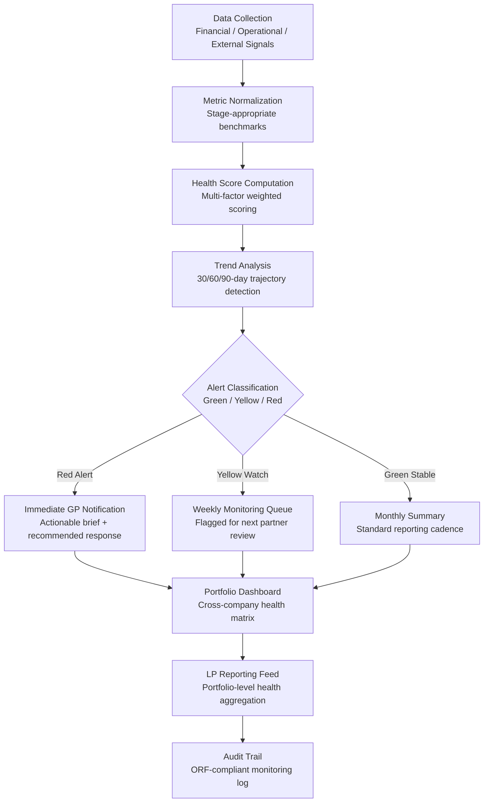

# Portfolio Company Health Monitor

Frankmax

NAICS 523910-523999

> **Investors / VCs / Syndicates** — Portfolio Ops Module

## Objective & Purpose

Portfolio monitoring is the blind spot of venture capital. Board decks arrive quarterly, curated by founders with an incentive to present favorable narratives. Between board meetings, investors rely on ad hoc check-ins, gut instinct, and the absence of bad news as a proxy for company health. The result: problems surface 3-6 months late, after the window for effective intervention has closed. When a portfolio company misses a critical inflection point, the cost is not just a write-down -- it is the lost opportunity cost of capital that could have been redeployed or the cost of a bridge round that would have been unnecessary with earlier intervention.

The Portfolio Company Health Monitor provides continuous, data-driven health assessment across every portfolio company. It ingests financial data (revenue, burn, cash position), operational metrics (headcount changes, product velocity, customer pipeline), and external signals (market sentiment, competitive moves, hiring patterns) to compute a real-time health score for each company. The system detects pattern deviations -- declining growth rates, accelerating burn, slowing hiring, or customer concentration risk -- weeks before they appear in board materials.

The strategic value compounds across the portfolio. Cross-company pattern analysis reveals systemic risks (shared vendor dependencies, overlapping customer bases, correlated market exposure) and identifies portfolio-level optimization opportunities (shared services, customer introductions, hiring pipelines). Every data point feeds the marketplace telemetry layer, building a proprietary benchmark database of startup health patterns across stages, sectors, and geographies.

## Business Context

| Attribute | Value |
|---|---|
| **Business Process** | Portfolio management and monitoring |
| **Business Function** | Portfolio Ops |
| **Category** | Analytics |
| **Target Audience** | 13. Investors / VCs / Syndicates |
| **Bundle** | Custom VC/PE Intelligence Pack ($5,000-$10,000/mo) |
| **Monthly Cost of Inaction** | $100K-$1M (late detection of portfolio distress) |

## BPMN Workflow

## Features

1. **Automated Financial Data Ingestion** — Connects to portfolio company accounting systems (QuickBooks, Xero, NetSuite), banking feeds, and cap table platforms (Carta, Pulley). Pulls monthly financial snapshots without manual data requests, eliminating the quarterly reporting lag.

2. **Stage-Appropriate Benchmarking** — Applies different health criteria based on company stage. Pre-revenue companies are measured on burn efficiency and milestone velocity; growth-stage companies on revenue trajectory and unit economics; late-stage on path to profitability and market share. Benchmarks draw from anonymized cross-portfolio data.

3. **Leading Indicator Detection** — Monitors over 40 leading indicators that predict company distress 60-120 days before financial statements reflect the problem: slowing engineering commits, declining job postings, executive departures, customer review sentiment shifts, and web traffic trajectory changes.

4. **Portfolio Concentration Risk Analysis** — Maps dependencies across the portfolio: shared customers, overlapping vendors, correlated market exposures, and competing product roadmaps. Identifies concentration risks that are invisible when monitoring companies individually.

5. **Founder Sentiment Tracking** — Analyzes communication patterns (email frequency, response latency, tone shifts in board updates) to detect early signs of founder burnout, disengagement, or strategic uncertainty. Flags changes in communication behavior without reading message content.

6. **Automated Board Deck Validation** — Cross-references claims in board materials against ingested financial and operational data. Flags discrepancies between reported metrics and actual data, ensuring GP and LP decisions are based on verified information.

7. **Intervention Playbook Engine** — When health scores deteriorate, the system recommends intervention strategies based on the specific failure pattern: operating partner deployment for execution issues, bridge financing for cash emergencies, executive coaching for leadership concerns, or pivot support for market fit problems.

## Workflow & Automation

**Step 1: Portfolio Onboarding** — Each portfolio company connects financial systems, grants read-only API access to operational tools, and establishes data sharing agreements. The system begins ingesting historical data to establish baseline health patterns.

**Step 2: Continuous Data Collection** — Financial data syncs daily from connected systems. External signals (hiring, web traffic, app store rankings, news mentions) are monitored continuously. Operational metrics update based on integration depth with each company.

**Step 3: Health Score Calculation** — Weekly health scores are computed for each company across five dimensions: financial health, growth trajectory, operational efficiency, team stability, and market position. Scores are normalized to stage-appropriate benchmarks.

**Step 4: Trend and Anomaly Detection** — The system compares current scores against 30, 60, and 90-day trajectories. Statistically significant deteriorations trigger alerts. The system distinguishes between seasonal patterns, one-time events, and genuine trend changes.

**Step 5: Alert Routing and Response** — Red alerts go immediately to the lead GP with an actionable brief. Yellow alerts are queued for the next partner meeting. Green companies receive standard monthly summaries. All alerts include recommended response actions.

**Step 6: Cross-Portfolio Analysis** — Monthly portfolio-level analysis identifies systemic patterns: which sectors are strengthening, which are weakening, where concentration risks exist, and where portfolio companies could support each other through introductions or shared services.

## Input/Output Specifications

| Direction | Data | Format | Description |
|---|---|---|---|
| Input | Financial statements | API (QuickBooks / Xero / NetSuite) | Revenue, expenses, cash, burn rate, runway |
| Input | Cap table data | API (Carta / Pulley) | Ownership, dilution, option pool, convertible instruments |
| Input | Operational metrics | API / CSV | Headcount, product velocity, customer pipeline |
| Input | External signals | REST API | Hiring activity, web traffic, news, app rankings |
| Output | Company health scores | JSON + UI | Multi-dimensional score with trend trajectory |
| Output | Portfolio heat map | REST API / UI | Cross-company health visualization |
| Output | Alert notifications | Email / Slack / API | Red and yellow alerts with actionable briefs |
| Output | LP reporting feed | JSON / PDF | Aggregated portfolio health for LP communications |

## Integration Points

| System | Integration Type | Data Flow |
|---|---|---|
| **Deal Flow Scoring Engine** | Inbound reference | Portfolio outcome data calibrates deal scoring accuracy |
| **LP Reporting Automator** | Outbound feed | Health scores and portfolio metrics feed LP reports |
| **Exit Scenario Modeler** | Bidirectional | Health trajectories inform exit timing; exit models set health targets |
| **Fund Performance Attribution** | Outbound metrics | Company-level performance feeds fund-level attribution |
| **QuickBooks / Xero / NetSuite** | Inbound API | Financial data ingestion |
| **Carta / Pulley** | Inbound API | Cap table and ownership data |
| **Failure Intelligence Library** | Outbound anonymized | Health patterns feed cross-industry startup intelligence |

## Pricing & Revenue Model

| Component | Pricing | Notes |
|---|---|---|
| **VC/PE Intelligence Pack** | $5,000-$10,000/month | Includes Portfolio Health + Deal Flow + Exit Modeler |
| **Standalone — Small Fund** | $3,000/month | Up to 15 portfolio companies monitored |
| **Standalone — Mid Fund** | $6,000/month | Up to 40 portfolio companies, cross-portfolio analysis |
| **Large Fund / Multi-Fund** | Custom pricing | Unlimited companies, multi-fund dashboards, dedicated support |
| **Governance add-on** | +$1,200/month | LP-auditable health methodology, compliance export |

**Revenue model**: Portfolio Health Monitor is the retention anchor for VC/PE clients. Once a fund integrates portfolio data and establishes baseline health patterns, switching costs are significant. The "fries" attach through governance layers (LP-auditable health methodology), cross-portfolio analytics (benchmarking against anonymized peer data), and intervention playbook customization at 70-85% margin.

## NAICS/SIC Mapping

| NAICS Code | SIC Code | Industry | Relevance |
|---|---|---|---|
| 523910 | 6726 | Miscellaneous Financial Investment Activities | VC/PE portfolio management |
| 523920 | 6199 | Portfolio Management and Investment Advice | Portfolio monitoring and advisory |
| 523991 | 6726 | Trust, Fiduciary, and Custody Activities | Fiduciary portfolio oversight |
| 523999 | 6199 | Miscellaneous Financial Investment Activities | Syndicate portfolio coordination |
| 525910 | 6726 | Open-End Investment Funds | Fund-level portfolio aggregation |
| 541611 | 7371 | Administrative Management Consulting | Portfolio operations consulting |
