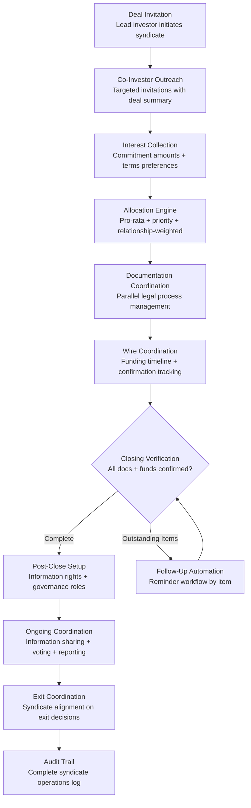

# Syndicate Coordination Platform

Frankmax

NAICS 523910-523999

> **Investors / VCs / Syndicates** — Operations Module

## Objective & Purpose

Co-investment is the dominant deal structure in venture capital and growth equity. Over 70% of rounds above Series A involve multiple institutional investors, and syndicate complexity increases with every participant. Coordinating allocation, documentation, communication, and governance across 3-10 co-investors per deal consumes enormous operational bandwidth: chasing wires, reconciling allocation memos, coordinating side letter provisions, managing information flow, and ensuring governance alignment. For angel syndicates and rolling funds with dozens of individual participants per deal, the complexity is exponentially higher.

The Syndicate Coordination Platform provides end-to-end operational infrastructure for multi-investor deals. It manages the full lifecycle from initial syndicate formation through allocation, documentation, funding, ongoing information sharing, and eventually exit coordination. The system replaces the ad hoc mix of email threads, shared spreadsheets, and phone calls that currently constitutes syndicate operations at most firms.

The platform becomes more valuable as it networks grow. When multiple co-investors in a deal use the system, coordination friction drops to near zero. Over time, the platform builds a co-investor relationship graph that identifies optimal syndicate partners based on investment thesis alignment, operational compatibility, and historical co-investment success. This network effect creates a natural moat: the more investors use the platform, the more valuable it becomes for each participant.

## Business Context

| Attribute | Value |
|---|---|
| **Business Process** | Co-investment management and syndicate operations |
| **Business Function** | Operations |
| **Category** | Coordination |
| **Target Audience** | 13. Investors / VCs / Syndicates |
| **Bundle** | Custom VC/PE Intelligence Pack ($5,000-$10,000/mo) |
| **Monthly Cost of Inaction** | $20K-$100K (operational overhead + deal velocity loss) |

## BPMN Workflow

## Features

1. **Syndicate Formation Engine** — Lead investors initiate syndicate invitations with configurable deal summaries, allocation terms, and timeline requirements. The system suggests optimal co-investor matches based on thesis alignment, check size fit, and historical co-investment patterns.

2. **Allocation Management** — Handles allocation across multiple methodologies: pro-rata based on fund size, priority allocation for existing relationships, auction-based allocation for oversubscribed rounds, and custom allocation for strategic co-investors. Tracks commitment, allocation, and funding status in real-time.

3. **Parallel Documentation Coordination** — Manages the parallel legal workstreams across multiple investors: subscription agreement execution, side letter negotiation, KYC/AML verification, and regulatory filing coordination. Tracks document status by investor and flags bottlenecks.

4. **Wire and Funding Coordination** — Tracks wire transfer status from commitment through execution: wire instructions distribution, funding deadline management, confirmation tracking, and reconciliation. Automated reminders for outstanding wires reduce the most common closing delay.

5. **Post-Close Information Management** — Establishes information-sharing protocols for the syndicate: what information is shared with all co-investors, what is restricted to board-level investors, and how founder communications are distributed. Manages the ongoing information flow throughout the investment lifecycle.

6. **Voting and Governance Coordination** — When syndicate decisions require coordination (follow-on investment, exit approval, governance changes), the system manages the voting process: distributing materials, collecting votes, tracking deadlines, and documenting outcomes.

7. **Co-Investor Relationship Graph** — Builds a network map of co-investment relationships: who invests alongside whom, at what stages, in which sectors, and with what outcomes. Identifies the most valuable syndicate partners and suggests new co-investment opportunities based on relationship strength and thesis alignment.

8. **Exit Coordination Module** — Manages the complex coordination required for syndicate exits: alignment on timing, voting on exit proposals, allocation of secondary sale opportunities, and distribution of exit proceeds. Ensures all syndicate members are informed and aligned throughout the exit process.

## Workflow & Automation

**Step 1: Syndicate Initiation** — The lead investor creates a syndicate deal in the platform, specifying deal terms, allocation methodology, target syndicate composition, and timeline. Co-investor invitations are sent with appropriate deal information based on relationship tier.

**Step 2: Interest and Commitment Collection** — Co-investors review deal materials and submit interest levels and commitment amounts through the platform. The system tracks responses, sends reminders, and provides the lead investor with a real-time commitment tracker.

**Step 3: Allocation and Documentation** — Once commitments are collected, the lead investor finalizes allocation. The system generates allocation notices and initiates parallel documentation workflows: subscription agreements, side letters, and compliance verifications for each participant.

**Step 4: Funding Coordination** — Wire instructions are distributed to allocated investors with clear deadlines. The system tracks wire execution status, sends automated reminders, and provides the lead investor with a funding completion dashboard.

**Step 5: Post-Close Operations** — After closing, the platform transitions to ongoing coordination mode: routing founder updates to appropriate syndicate members, managing information rights compliance, and facilitating ad hoc syndicate communications.

**Step 6: Lifecycle Events** — The platform manages syndicate coordination for all lifecycle events: follow-on rounds (pro-rata allocation), governance decisions (voting coordination), information requests (compliant distribution), and exit processes (alignment and execution).

## Input/Output Specifications

| Direction | Data | Format | Description |
|---|---|---|---|
| Input | Deal terms and structure | JSON / UI | Valuation, round size, allocation methodology |
| Input | Co-investor profiles | JSON / API | Fund size, thesis, investment history, preferences |
| Input | Legal documents | PDF / DOCX | Subscription agreements, side letters, compliance docs |
| Input | Wire confirmations | API / manual | Funding status from banking systems |
| Output | Allocation notices | PDF / Email | Final allocation amounts with funding instructions |
| Output | Syndicate dashboard | REST API / UI | Real-time status across all active syndicates |
| Output | Voting and governance records | JSON + PDF | Decision records with full participation tracking |
| Output | Audit trail | JSON (immutable log) | Complete syndicate operations history |

## Integration Points

| System | Integration Type | Data Flow |
|---|---|---|
| **Deal Flow Scoring Engine** | Inbound trigger | Scored deals initiate syndicate formation |
| **Term Sheet Analyzer** | Inbound reference | Term analysis informs co-investor communication |
| **LP Reporting Automator** | Outbound feed | Co-investment activity included in LP reports |
| **Portfolio Company Health Monitor** | Inbound feed | Portfolio health data shared with syndicate per information rights |
| **Exit Scenario Modeler** | Bidirectional | Exit models inform syndicate alignment; syndicate votes affect exit path |
| **DocuSign / Ironclad** | Bidirectional API | Document execution and status tracking |
| **Banking Systems** | Inbound API | Wire confirmation and reconciliation |

## Pricing & Revenue Model

| Component | Pricing | Notes |
|---|---|---|
| **VC/PE Intelligence Pack** | $5,000-$10,000/month | Includes Syndicate Platform + Deal Flow + Portfolio Health |
| **Standalone — Emerging Manager** | $1,500/month | Up to 5 active syndicates |
| **Standalone — Active Syndicator** | $3,500/month | Up to 20 active syndicates, relationship graph |
| **Angel Syndicate / Rolling Fund** | $2,500/month | High-volume, many participants per deal |
| **Platform / Network License** | Custom pricing | Multi-firm network, shared coordination layer |

**Revenue model**: Syndicate Coordination Platform exhibits strong network effects -- value increases with each co-investor on the platform. The immediate value is operational efficiency (10-20 hours saved per syndicate deal), but the long-term value is the co-investor relationship graph and matching engine. The "fries" attach through governance layers (audit-ready syndicate records), network analytics, and cross-platform coordination at 75-85% margin.

## NAICS/SIC Mapping

| NAICS Code | SIC Code | Industry | Relevance |
|---|---|---|---|
| 523910 | 6726 | Miscellaneous Financial Investment Activities | VC/PE syndicate operations |
| 523920 | 6199 | Portfolio Management and Investment Advice | Co-investment advisory |
| 523999 | 6199 | Miscellaneous Financial Investment Activities | Syndicate coordination and management |
| 525910 | 6726 | Open-End Investment Funds | Fund-level co-investment operations |
| 523130 | 6211 | Commodity Contracts Dealing | Multi-party transaction coordination |
| 541611 | 7371 | Administrative Management Consulting | Operational process management |
