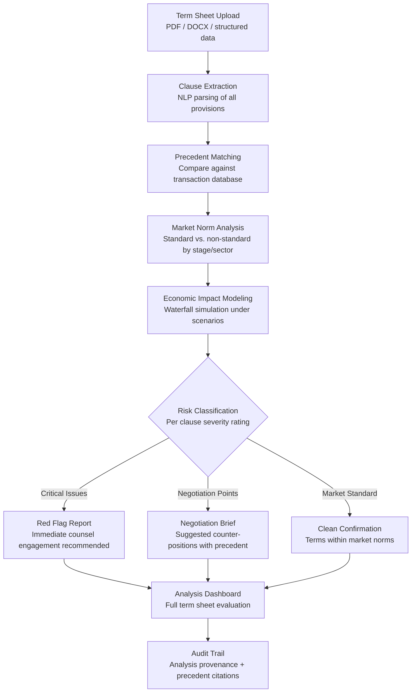

# Term Sheet Analyzer

Frankmax

NAICS 523910-523999

> **Investors / VCs / Syndicates** — Legal/Finance Module

## Objective & Purpose

Term sheets are where economic and governance terms are set for the life of an investment, yet they are negotiated under time pressure with asymmetric information. Founders often accept terms they do not fully understand; investors sometimes include provisions that create unintended consequences downstream. Liquidation preferences, anti-dilution mechanics, board composition rights, protective provisions, and drag-along clauses interact in complex ways that only surface during future financing rounds, governance disputes, or exit events. A single non-standard provision can shift millions of dollars in exit proceeds.

The Term Sheet Analyzer applies natural language processing and legal pattern matching to evaluate term sheets against a database of thousands of precedent transactions. It identifies non-standard provisions, flags terms that deviate from market norms for the specific stage, sector, and geography, and models the downstream economic impact of every material clause. The system does not replace legal counsel -- it arms both investors and founders with analytical context that enables faster, more informed negotiation.

The compound value lies in the precedent database. Every analyzed term sheet (with appropriate anonymization) contributes to the marketplace's understanding of market terms: what is standard, what is aggressive, and how terms trend over time. This creates a proprietary benchmark that becomes more valuable with every transaction analyzed, providing context that no single law firm or investor can match.

## Business Context

| Attribute | Value |
|---|---|
| **Business Process** | Deal structuring and term negotiation |
| **Business Function** | Legal/Finance |
| **Category** | Legal |
| **Target Audience** | 13. Investors / VCs / Syndicates |
| **Bundle** | Custom VC/PE Intelligence Pack ($5,000-$10,000/mo) |
| **Monthly Cost of Inaction** | $50K-$500K (adverse terms discovered too late) |

## BPMN Workflow

## Features

1. **Automated Clause Extraction** — Parses term sheets in any format (PDF, DOCX, email text) using NLP to extract and classify every material provision: valuation, liquidation preference structure, anti-dilution mechanics, board composition, protective provisions, drag-along/tag-along rights, information rights, and ROFR/co-sale provisions.

2. **Precedent Transaction Database** — Compares extracted terms against a continuously growing database of precedent transactions, segmented by stage, sector, geography, and deal size. Shows where each clause falls on the market distribution: standard, investor-favorable, founder-favorable, or non-standard.

3. **Economic Impact Simulation** — Models the dollar impact of every economic term across exit scenarios. Shows how liquidation preference structure, anti-dilution provisions, and participation caps affect proceeds distribution at different exit valuations. Quantifies the real-dollar difference between alternative term proposals.

4. **Governance Provision Analysis** — Evaluates governance terms beyond economics: board composition implications, protective provision scope, information right obligations, and founder vesting acceleration triggers. Maps governance terms to real scenarios: what happens in a down round, a founder departure, or a strategic pivot.

5. **Interaction Effect Detection** — Identifies clause interactions that create unintended consequences: how a full-ratchet anti-dilution clause interacts with a participating preferred liquidation preference in a down-round scenario, or how protective provision stacking across multiple rounds creates governance deadlocks.

6. **Negotiation Strategy Generator** — For each non-standard or aggressive term, the system generates negotiation counter-positions with precedent support. Shows what alternative language is market-standard and provides specific clause wording from precedent transactions.

7. **Historical Term Trend Analysis** — Tracks how terms evolve over market cycles: liquidation preference multiples during peak vs. trough, anti-dilution mechanism prevalence, and board seat allocation trends. Provides temporal context for whether current terms reflect market conditions or opportunistic overreach.

## Workflow & Automation

**Step 1: Document Upload** — Upload the term sheet in any format. The system extracts text, identifies clause boundaries, and classifies each provision within minutes. Multi-document sets (term sheet plus side letters or prior round documents) are processed together.

**Step 2: Clause-by-Clause Analysis** — Each extracted clause is analyzed independently: classified by type, compared against precedent database, scored for market-standard compliance, and flagged for potential issues. Confidence scores indicate NLP extraction reliability.

**Step 3: Economic Modeling** — All economic terms are combined into a cap table waterfall model. The system runs exit simulations across a range of valuations to show dollar-level impact of each term. Side-by-side comparisons show the difference between proposed terms and market-standard alternatives.

**Step 4: Governance Assessment** — Governance provisions are mapped to scenario outcomes: down-round protection, founder departure, strategic pivot authority, and information access. The system identifies governance gaps and overreaches relative to the investment stage.

**Step 5: Risk Report Generation** — A comprehensive analysis report is generated with clause-by-clause assessment, economic impact summary, governance evaluation, and prioritized negotiation recommendations. Critical issues are highlighted for immediate counsel review.

**Step 6: Negotiation Support** — During active negotiation, the system provides real-time analysis of proposed revisions. Each counter-offer is re-analyzed against the full term sheet context, ensuring that concessions in one area do not create unintended consequences elsewhere.

## Input/Output Specifications

| Direction | Data | Format | Description |
|---|---|---|---|
| Input | Term sheets | PDF / DOCX / TXT | Primary deal documents for analysis |
| Input | Prior round documents | PDF / DOCX | Historical terms for interaction analysis |
| Input | Cap table data | API (Carta / Pulley) / CSV | Ownership structure for waterfall modeling |
| Input | Deal context | JSON / UI | Stage, sector, geography, deal size for precedent matching |
| Output | Clause analysis report | PDF / JSON | Clause-by-clause evaluation with precedent comparison |
| Output | Economic impact model | XLSX / PDF | Waterfall simulation across exit scenarios |
| Output | Negotiation brief | PDF / Markdown | Prioritized counter-positions with precedent support |
| Output | Audit trail | JSON (immutable log) | Analysis methodology, precedent citations, NLP confidence |

## Integration Points

| System | Integration Type | Data Flow |
|---|---|---|
| **Deal Flow Scoring Engine** | Inbound trigger | Top-scored deals advance to term sheet analysis |
| **Exit Scenario Modeler** | Bidirectional | Term structure informs exit modeling; exit scenarios validate term economics |
| **Founder Assessment Engine** | Inbound context | Founder track record informs governance provision recommendations |
| **Fund Performance Attribution** | Outbound reference | Term quality correlates with investment performance |
| **Carta / Pulley** | Inbound API | Cap table data for waterfall modeling |
| **Law firm document systems** | Inbound feed | Prior transaction documents for precedent database |
| **Failure Intelligence Library** | Outbound anonymized | Term patterns feed cross-fund legal intelligence |

## Pricing & Revenue Model

| Component | Pricing | Notes |
|---|---|---|
| **VC/PE Intelligence Pack** | $5,000-$10,000/month | Includes Term Sheet Analyzer + Deal Flow + Portfolio Health |
| **Standalone — Per Analysis** | $750/analysis | Individual term sheet deep-dive |
| **Standalone — Unlimited** | $3,500/month | Unlimited analyses, precedent database access |
| **Law Firm License** | Custom pricing | Multi-client use, bulk processing, API access |
| **Governance add-on** | +$1,000/month | LP-auditable deal structuring methodology |

**Revenue model**: Term Sheet Analyzer converts the most consequential legal document in venture into a data-driven analysis. A single flagged adverse provision can save $1M-$10M in exit proceeds. The "fries" attach through precedent database access (subscription value compounds over time), interaction effect modeling, and cross-fund term benchmarking at 80-90% margin.

## NAICS/SIC Mapping

| NAICS Code | SIC Code | Industry | Relevance |
|---|---|---|---|
| 523910 | 6726 | Miscellaneous Financial Investment Activities | VC/PE deal structuring |
| 523920 | 6199 | Portfolio Management and Investment Advice | Investment advisory deal terms |
| 523999 | 6199 | Miscellaneous Financial Investment Activities | Syndicate term coordination |
| 525910 | 6726 | Open-End Investment Funds | Fund-level deal governance |
| 541110 | 8111 | Offices of Lawyers | Legal term analysis support |
| 541199 | 8111 | All Other Legal Services | Contract analysis and benchmarking |
