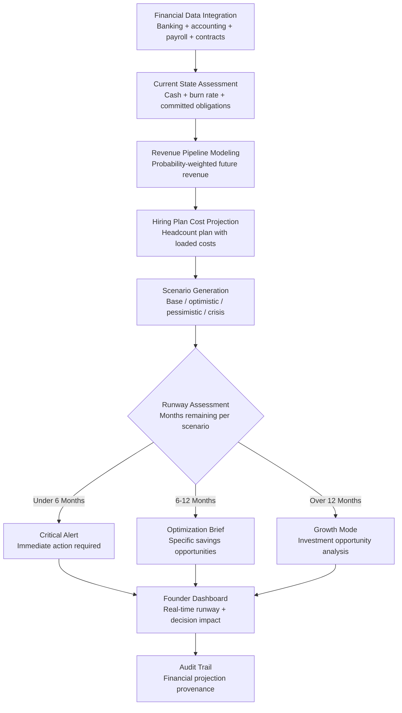

# Burn Rate Optimizer

Frankmax

NAICS 541511

> **High-Power Founders & Operators** — Finance Module

## Objective & Purpose

More startups die from running out of money than from building the wrong product. Yet most founders manage burn rate through quarterly snapshots and mental math: "we have X in the bank and spend Y per month, so we have Z months of runway." This arithmetic ignores the dynamics that actually kill companies: accelerating burn from hiring plans, delayed revenue from longer sales cycles, hidden costs from vendor contracts with escalation clauses, and the 3-6 month fundraising timeline that must start well before the cash alarm sounds. By the time a founder realizes runway is critically short, the options have already narrowed to unfavorable terms or shutdown.

The Burn Rate Optimizer provides real-time financial modeling that goes far beyond simple runway arithmetic. It integrates actual spending data, committed obligations, revenue pipeline probability, hiring plan costs, vendor contract terms, and fundraising timeline assumptions to model runway under multiple scenarios. The system continuously monitors actual vs. planned spending, flags category-level deviations, and projects the impact of every spending decision on runway.

The tool transforms cash management from a periodic review into a continuous discipline. Founders see the real-time runway impact of every decision: hiring that engineer costs 2.3 months of runway; signing that vendor contract reduces the fundraising safety window by 45 days; accelerating marketing spend by $20K/month brings the "must start fundraising" date forward by 6 weeks. This decision-level granularity turns abstract financial planning into concrete, actionable intelligence.

## Business Context

| Attribute | Value |
|---|---|
| **Business Process** | Financial management and runway optimization |
| **Business Function** | Finance |
| **Category** | Planning |
| **Target Audience** | 14. High-Power Founders & Operators |
| **Bundle** | Founder/Operator Sprint Pack ($499/mo) |
| **Monthly Cost of Inaction** | $30K-$150K (preventable cash crises) |

## BPMN Workflow

## Features

1. **Real-Time Runway Computation** — Connects to banking feeds and accounting systems to compute runway in real-time, not from month-end snapshots. Every transaction updates the runway clock. Founders see their exact financial position at any moment, not a 30-day-old estimate.

2. **Committed Obligation Tracking** — Maps all committed future spending: signed vendor contracts, lease obligations, employment contracts with notice periods, equity-based compensation with cash components, and debt service. Shows the "floor" burn rate -- the minimum spend even if all discretionary spending stops immediately.

3. **Revenue Pipeline Integration** — Integrates sales pipeline data with probability weights based on stage. A $100K deal at 60% probability contributes $60K to revenue projections. Pipeline data updates daily, and the system tracks forecast accuracy over time to calibrate probability weights.

4. **Decision Impact Simulator** — Before any spending commitment, founders can model the runway impact: "If I hire 3 engineers at $180K loaded, how does that change my fundraising timeline?" The simulator shows cash impact over 3, 6, 12, and 18-month horizons across all scenarios.

5. **Category-Level Spend Analysis** — Breaks spending into functional categories (engineering, sales, marketing, G&A, infrastructure) with trend analysis and benchmark comparisons. Identifies categories where spend is growing faster than plan and where efficiency opportunities exist.

6. **Fundraising Timeline Calculator** — Works backward from runway to determine the latest date by which fundraising must begin. Factors in typical fundraising duration (3-6 months by stage), bridge financing probability, and market conditions to compute a "fundraising alarm" date.

7. **Scenario Planning Engine** — Maintains four active scenarios: base case (plan), optimistic (revenue acceleration), pessimistic (revenue delay + cost overrun), and crisis (revenue stops, minimum viable operations). Each scenario shows different runway outcomes and required responses.

## Workflow & Automation

**Step 1: Financial System Connection** — Connect banking feeds (Plaid, Mercury, SVB), accounting system (QuickBooks, Xero), payroll (Gusto, Rippling), and billing platform (Stripe, Chargebee). The system begins computing real-time runway within hours of connection.

**Step 2: Baseline Establishment** — The system establishes a spending baseline by category over the trailing 3-6 months. Seasonal patterns, one-time expenses, and recurring obligations are classified. This baseline becomes the reference for deviation detection.

**Step 3: Forward Projection** — Using the baseline, committed obligations, hiring plan, and revenue pipeline, the system generates forward projections across all four scenarios. Projections update daily as new data flows in.

**Step 4: Continuous Monitoring** — Every transaction is classified and compared against the plan. Category-level deviations (marketing spend 20% over plan for the third consecutive month) trigger alerts with specific remediation suggestions.

**Step 5: Decision Support** — When founders consider spending decisions, they model the impact in the simulator before committing. The system provides instant feedback: runway change, scenario impact, and comparison to benchmark spending patterns.

**Step 6: Board and Investor Reporting** — Monthly financial summaries are generated automatically from actual data, formatted for board consumption with runway projections, scenario analysis, and key financial metrics. No manual report preparation required.

## Input/Output Specifications

| Direction | Data | Format | Description |
|---|---|---|---|
| Input | Bank transactions | API (Plaid / Mercury) | Real-time transaction feed for cash position |
| Input | Accounting data | API (QuickBooks / Xero) | Categorized expenses, revenue recognition |
| Input | Payroll data | API (Gusto / Rippling) | Headcount costs, tax obligations, benefits |
| Input | Sales pipeline | API (HubSpot / Salesforce) | Deals by stage with probability weights |
| Output | Runway dashboard | JSON + UI | Real-time runway across four scenarios |
| Output | Decision impact model | REST API / UI | Instant runway impact for proposed decisions |
| Output | Financial summary | PDF / Markdown | Board-ready monthly financial report |
| Output | Audit trail | JSON (immutable log) | Projection methodology, data sources, accuracy tracking |

## Integration Points

| System | Integration Type | Data Flow |
|---|---|---|
| **Pivot Signal Detector** | Bidirectional | Runway urgency contextualizes pivot decisions; pivot scenarios affect burn |
| **Hiring Signal Analyzer** | Outbound constraint | Runway data constrains hiring plan recommendations |
| **Execution Velocity Dashboard** | Inbound reference | Execution speed affects revenue timeline projections |
| **Stakeholder Communication Engine** | Outbound feed | Financial metrics feed investor update generation |
| **Decision Fatigue Reducer** | Outbound context | Financial position informs decision priority ranking |
| **Mercury / SVB / Plaid** | Inbound API | Banking transaction data |
| **QuickBooks / Xero** | Inbound API | Accounting data |

## Pricing & Revenue Model

| Component | Pricing | Notes |
|---|---|---|
| **Founder/Operator Sprint Pack** | $499/month | Includes Burn Rate + Pivot Signal + Execution Velocity |
| **Standalone** | $249/month | Real-time runway + scenario modeling |
| **With Advisory Layer** | $599/month | Includes monthly financial review brief |
| **Accelerator License** | Custom pricing | Multi-company financial monitoring |
| **Governance add-on** | +$100/month | Board-ready reporting, audit-compliant projections |

**Revenue model**: Burn Rate Optimizer addresses the existential financial risk for every startup. A single month of extended runway through better cash management justifies the annual subscription cost. At $499/month bundled, the tool is priced below the cost of a fractional CFO's monthly retainer. The "fries" attach through board reporting, scenario planning depth, and fundraising timeline advisory at 80-90% margin.

## NAICS/SIC Mapping

| NAICS Code | SIC Code | Industry | Relevance |
|---|---|---|---|
| 541511 | 7371 | Custom Computer Programming Services | Software startup financial management |
| 541512 | 7372 | Computer Systems Design Services | Tech company cash management |
| 541519 | 7379 | Other Computer Related Services | Technology services financial planning |
| 511210 | 7372 | Software Publishers | Software company runway optimization |
| 541211 | 8721 | Offices of Certified Public Accountants | Startup accounting integration |
| 541219 | 8721 | Other Accounting Services | Financial projection and advisory |
