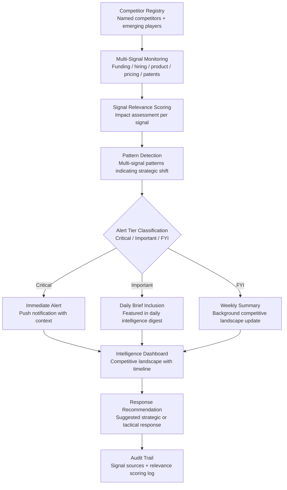

# Competitive Intelligence Feed

Frankmax

NAICS 541511

> **High-Power Founders & Operators** — Strategy Module

## Objective & Purpose

Founders are blindsided by competitors not because the information was unavailable, but because no one was watching. A competitor launches a feature you planned for next quarter. A new entrant raises a $50M Series B in your market. A large incumbent quietly acquires an adjacent player positioning for your space. Each of these events was preceded by signals -- job postings, patent filings, conference talks, pricing changes, partnership announcements -- that were publicly available but impossible to monitor manually at scale. The founder who learns about competitive moves from customers or board members is already 2-3 months behind.

The Competitive Intelligence Feed provides continuous, automated monitoring of the competitive landscape tailored to the founder's specific market. It tracks every named competitor and emerging player across multiple signal types: funding activity, hiring patterns, product launches, pricing changes, patent filings, partnership announcements, executive movements, customer review sentiment, web traffic trends, and app store performance. The system synthesizes these signals into a daily or weekly intelligence brief that requires less than 5 minutes to review.

The differentiator from generic news monitoring is signal-to-noise optimization. The system learns which types of competitive intelligence the founder acts on and which they ignore, progressively improving the relevance of its feed. Over time, the brief becomes a precisely calibrated competitive radar that surfaces only the signals that matter to this specific company in this specific market.

## Business Context

| Attribute | Value |
|---|---|
| **Business Process** | Market monitoring and competitive tracking |
| **Business Function** | Strategy |
| **Category** | Analytics |
| **Target Audience** | 14. High-Power Founders & Operators |
| **Bundle** | Founder/Operator Sprint Pack ($499/mo) |
| **Monthly Cost of Inaction** | $20K-$100K (competitive blindside + late response) |

## BPMN Workflow

## Features

1. **Competitor Registry Management** — Maintains a living registry of direct competitors, adjacent players, potential entrants, and substitute solutions. The registry updates automatically as new players emerge through funding announcements, product launches, or market entry signals.

2. **Multi-Channel Signal Monitoring** — Tracks competitors across 15+ signal channels: Crunchbase (funding), LinkedIn (hiring), Product Hunt / app stores (launches), web archives (pricing), USPTO (patents), PR Newswire (partnerships), Glassdoor (internal sentiment), SimilarWeb (traffic), G2/Capterra (reviews), and social media (executive commentary).

3. **Signal Relevance Scoring** — Each detected signal is scored for relevance to the founder's specific competitive position. A competitor hiring 5 ML engineers is high-relevance if the founder is building an AI product; low-relevance if the competitive dimension is distribution, not technology.

4. **Strategic Shift Detection** — Identifies multi-signal patterns that indicate a competitor is making a strategic shift: simultaneous hiring in a new domain + pricing change + partnership announcement may signal market repositioning that individual signals would not reveal.

5. **Calibrated Intelligence Briefs** — Generates daily (5-minute read) and weekly (15-minute read) intelligence briefs calibrated to the founder's engagement patterns. The system learns which signal types the founder engages with and progressively optimizes brief content.

6. **Response Recommendation Engine** — For significant competitive moves, the system suggests tactical and strategic responses based on the founder's market position, resource constraints, and product roadmap. Recommendations are practical and time-bounded.

7. **Historical Timeline View** — Maintains a complete competitive timeline: every signal, every move, every pattern, chronologically organized. Enables retrospective analysis of how competitive dynamics evolved and identification of patterns for future anticipation.

## Workflow & Automation

**Step 1: Competitive Landscape Definition** — The founder identifies primary competitors, adjacent players, and market segments to monitor. The system enriches this list by discovering additional players through market analysis and funding database scanning.

**Step 2: Continuous Monitoring Activation** — The system begins monitoring all registered competitors and market segments across all connected signal channels. Baseline competitive profiles are established within 1-2 weeks.

**Step 3: Daily Signal Processing** — New signals are collected, deduplicated, scored for relevance, and analyzed for patterns. Critical signals trigger immediate push alerts. Important signals are queued for the daily brief. Routine signals accumulate for weekly summaries.

**Step 4: Brief Generation and Delivery** — Intelligence briefs are generated at the founder's preferred time and delivered through their preferred channel (email, Slack, app). Briefs are structured for rapid consumption: headline, impact assessment, and recommended response.

**Step 5: Founder Engagement Learning** — The system tracks which brief items the founder reads, clicks through, shares, or acts on. This engagement data calibrates future relevance scoring, improving brief quality with every interaction.

**Step 6: Strategic Integration** — Monthly, the system generates a comprehensive competitive landscape report suitable for board meetings, investor conversations, or strategic planning sessions. The report synthesizes months of signal data into competitive positioning analysis.

## Input/Output Specifications

| Direction | Data | Format | Description |
|---|---|---|---|
| Input | Competitor identifiers | JSON / UI | Companies and market segments to monitor |
| Input | Funding data | API (Crunchbase / PitchBook) | Competitor funding activity |
| Input | Hiring data | API (LinkedIn / Indeed) | Competitor hiring patterns and job postings |
| Input | Product signals | API / Web | Product launches, pricing changes, feature updates |
| Output | Daily intelligence brief | Email / Slack / Markdown | Calibrated daily competitive digest |
| Output | Critical alerts | Push notification / Slack | Immediate notification of material competitive moves |
| Output | Competitive timeline | REST API / UI | Chronological competitive activity history |
| Output | Audit trail | JSON (immutable log) | Signal sources, relevance scores, engagement data |

## Integration Points

| System | Integration Type | Data Flow |
|---|---|---|
| **Pivot Signal Detector** | Outbound feed | Competitive dynamics inform pivot calculus |
| **Customer Discovery Accelerator** | Bidirectional | Customer-mentioned competitors update registry; competitive data enriches interview context |
| **Execution Velocity Dashboard** | Outbound context | Competitive urgency contextualizes execution priorities |
| **Stakeholder Communication Engine** | Outbound feed | Competitive landscape summary included in board updates |
| **Personal Operating System** | Outbound feed | Critical competitive alerts integrated into daily brief |
| **Crunchbase / PitchBook** | Inbound API | Funding and company data |
| **LinkedIn / Indeed** | Inbound API | Hiring signal data |

## Pricing & Revenue Model

| Component | Pricing | Notes |
|---|---|---|
| **Founder/Operator Sprint Pack** | $499/month | Includes Competitive Intelligence + Pivot Signal + Burn Rate |
| **Standalone** | $199/month | Basic monitoring, daily briefs, 10 competitors |
| **Standalone — Extended** | $399/month | Advanced monitoring, pattern detection, 50 competitors |
| **Enterprise License** | Custom pricing | Multi-market, multi-team, unlimited competitors |
| **Governance add-on** | +$100/month | Board-ready competitive reports |

**Revenue model**: Competitive Intelligence Feed delivers daily value through signal-to-noise optimization. The cost of being blindsided by a single competitive move (repositioning, pricing response, customer loss) typically exceeds $50K-$200K. At $499/month bundled, the tool pays for itself on the first avoided competitive surprise. The "fries" attach through pattern detection, response recommendations, and board-ready reporting at 85-90% margin.

## NAICS/SIC Mapping

| NAICS Code | SIC Code | Industry | Relevance |
|---|---|---|---|
| 541511 | 7371 | Custom Computer Programming Services | Tech startup competitive monitoring |
| 541512 | 7372 | Computer Systems Design Services | Technology market intelligence |
| 541519 | 7379 | Other Computer Related Services | Technology competitive analysis |
| 511210 | 7372 | Software Publishers | Software market monitoring |
| 541910 | 7323 | Marketing Research and Public Opinion Polling | Competitive research methodology |
| 519130 | 7375 | Internet Publishing and Broadcasting | Digital signal monitoring |
