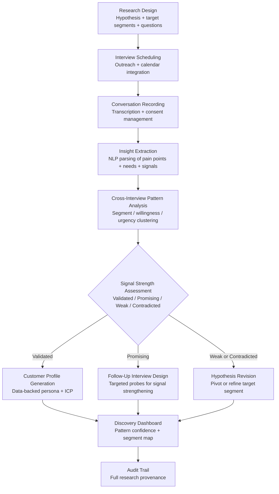

# Customer Discovery Accelerator

Frankmax

NAICS 541511

> **High-Power Founders & Operators** — Product Module

## Objective & Purpose

Customer discovery -- the process of validating who will pay for what you are building and why -- is the foundation of every successful startup. Yet it remains one of the most poorly executed activities in the founding process. Founders conduct 5-10 interviews, hear what they want to hear, declare product-market fit validated, and begin building. The problem is not lack of effort but lack of methodology: confirmation bias dominates unstructured conversations, sample sizes are too small for pattern reliability, and the insights from interviews are stored in founder memory rather than in structured, analyzable formats.

The Customer Discovery Accelerator transforms customer research from an ad hoc founder activity into a systematic, AI-augmented discipline. It provides structured interview frameworks, records and transcribes conversations (with consent), extracts structured insights using NLP, identifies patterns across interviews that no human could detect from memory alone, and quantifies the strength of customer signals. The system distinguishes between "customers who express interest" (weak signal) and "customers who demonstrate willingness to pay, urgency to solve, and authority to purchase" (strong signal).

The compound value emerges from cross-interview pattern analysis. After 20-30 structured conversations, the system identifies customer segments, willingness-to-pay patterns, competitive alternatives in use, purchase triggers, and objection clusters with statistical confidence. This pattern-level insight -- which requires 50+ manual interviews to develop intuitively -- accelerates the path from "we think we know our customer" to "we have data-validated customer profiles."

## Business Context

| Attribute | Value |
|---|---|
| **Business Process** | Customer development and market validation |
| **Business Function** | Product |
| **Category** | Research |
| **Target Audience** | 14. High-Power Founders & Operators |
| **Bundle** | Founder/Operator Sprint Pack ($499/mo) |
| **Monthly Cost of Inaction** | $20K-$100K (building for the wrong customer) |

## BPMN Workflow

## Features

1. **Structured Interview Framework** — Provides research-grade interview guides based on the company's hypotheses: problem validation questions, solution fit probes, willingness-to-pay exploration, competitive alternative mapping, and purchase process investigation. Questions are sequenced to minimize leading bias and maximize signal quality.

2. **Automated Transcription and Coding** — Records interviews (with participant consent), transcribes in real-time, and automatically codes responses against a structured taxonomy: pain point intensity, current solution satisfaction, willingness to pay, decision-making authority, and implementation timeline. Coding quality exceeds manual research assistant accuracy.

3. **Cross-Interview Pattern Detection** — After 10+ interviews, the system begins identifying statistically significant patterns: which pain points appear most frequently, which segments show strongest willingness to pay, what price anchors emerge naturally, and which competitive alternatives are most commonly cited.

4. **Customer Segment Clustering** — Automatically clusters interviewees into segments based on response patterns, not demographics. Segments emerge from shared pain points, similar purchase processes, comparable willingness-to-pay ranges, and common competitive alternatives. This data-driven segmentation often reveals customer types the founder did not anticipate.

5. **Signal vs. Noise Classification** — Distinguishes between strong buying signals (expressed urgency, budget authority, active search for solution, willingness to pay specified amount) and weak interest signals (polite enthusiasm, hypothetical interest, expressed desire without action commitment). Prevents the most common discovery error: confusing interest with intent.

6. **Hypothesis Tracking Dashboard** — Maintains a living document of customer hypotheses with evidence status: validated (strong signal from multiple interviews), promising (some signal, needs more data), unvalidated (insufficient data), and contradicted (evidence against). Founders see their assumption map evolve in real-time.

7. **Competitive Alternative Mapping** — Aggregates mentions of current solutions, workarounds, and competitors across all interviews. Builds a competitive landscape from the customer's perspective -- which often differs significantly from the founder's competitive analysis.

## Workflow & Automation

**Step 1: Hypothesis Definition** — Founders define their core hypotheses: target customer profile, problem being solved, proposed solution value, and expected willingness to pay. These hypotheses structure the interview framework.

**Step 2: Interview Preparation** — The system generates interview guides, outreach templates, and scheduling workflows. Guides are tailored to the specific hypotheses being tested, with branching logic for different response patterns.

**Step 3: Interview Execution** — During interviews, the system records (with consent), transcribes in real-time, and provides the interviewer with suggested follow-up probes based on the conversation flow. Post-interview, responses are automatically coded.

**Step 4: Pattern Analysis** — After each batch of 5+ interviews, the system updates pattern analysis: emerging segments, signal strength by hypothesis, and recommended areas for deeper exploration. Confidence intervals widen or narrow based on data accumulation.

**Step 5: Insight Synthesis** — The system generates synthesis reports: validated customer profiles (with supporting evidence), prioritized pain points (by frequency and intensity), willingness-to-pay ranges (by segment), and competitive landscape (from customer perspective).

**Step 6: Strategy Recommendation** — Based on accumulated evidence, the system recommends next steps: proceed to build (strong validation), narrow focus (one segment validated, others not), expand research (insufficient data), or reconsider approach (hypotheses contradicted).

## Input/Output Specifications

| Direction | Data | Format | Description |
|---|---|---|---|
| Input | Customer hypotheses | JSON / UI | Target profile, problem, solution, pricing assumptions |
| Input | Interview recordings | Audio / Video (with consent) | Customer conversation recordings |
| Input | CRM contact data | API (HubSpot / Salesforce) | Customer pipeline for interview recruitment |
| Input | Prior research | CSV / PDF | Historical customer feedback, surveys, NPS data |
| Output | Coded interview data | JSON + UI | Structured insights extracted from each conversation |
| Output | Pattern analysis | PDF / Markdown | Cross-interview patterns with confidence levels |
| Output | Customer profiles | PDF / JSON | Data-validated ICPs and personas |
| Output | Audit trail | JSON (immutable log) | Full research methodology and provenance |

## Integration Points

| System | Integration Type | Data Flow |
|---|---|---|
| **Pivot Signal Detector** | Outbound feed | Customer discovery data informs PMF scoring |
| **Competitive Intelligence Feed** | Bidirectional | Competitive data enriches interview context; customer-cited competitors update competitive landscape |
| **Stakeholder Communication Engine** | Outbound feed | Discovery insights included in investor updates |
| **Execution Velocity Dashboard** | Outbound reference | Validated customer profiles inform product roadmap velocity |
| **HubSpot / Salesforce** | Bidirectional API | Contact data in; discovery insights tag contacts |
| **Calendly / Calendar** | Outbound integration | Interview scheduling automation |
| **Failure Intelligence Library** | Outbound anonymized | Discovery patterns feed cross-startup intelligence |

## Pricing & Revenue Model

| Component | Pricing | Notes |
|---|---|---|
| **Founder/Operator Sprint Pack** | $499/month | Includes Customer Discovery + Pivot Signal + Burn Rate |
| **Standalone** | $299/month | Interview framework, transcription, pattern analysis |
| **With Research Advisory** | $699/month | Includes interview methodology coaching and synthesis review |
| **Accelerator License** | Custom pricing | Multi-company research infrastructure |
| **Governance add-on** | +$100/month | Board-ready research reports, methodology documentation |

**Revenue model**: Customer Discovery Accelerator reduces the time from hypothesis to validated insight from months to weeks. Building on an unvalidated hypothesis wastes $50K-$200K in development costs. At $499/month bundled, the tool pays for itself if it prevents a single month of building the wrong thing. The "fries" attach through research advisory, structured methodology, and cross-startup pattern benchmarking at 80-90% margin.

## NAICS/SIC Mapping

| NAICS Code | SIC Code | Industry | Relevance |
|---|---|---|---|
| 541511 | 7371 | Custom Computer Programming Services | Software startup customer validation |
| 541512 | 7372 | Computer Systems Design Services | Tech product market research |
| 541519 | 7379 | Other Computer Related Services | Technology customer development |
| 511210 | 7372 | Software Publishers | Software product discovery |
| 541910 | 7323 | Marketing Research and Public Opinion Polling | Customer research methodology |
| 541720 | 8732 | Research and Development in Social Sciences | Market validation research |
