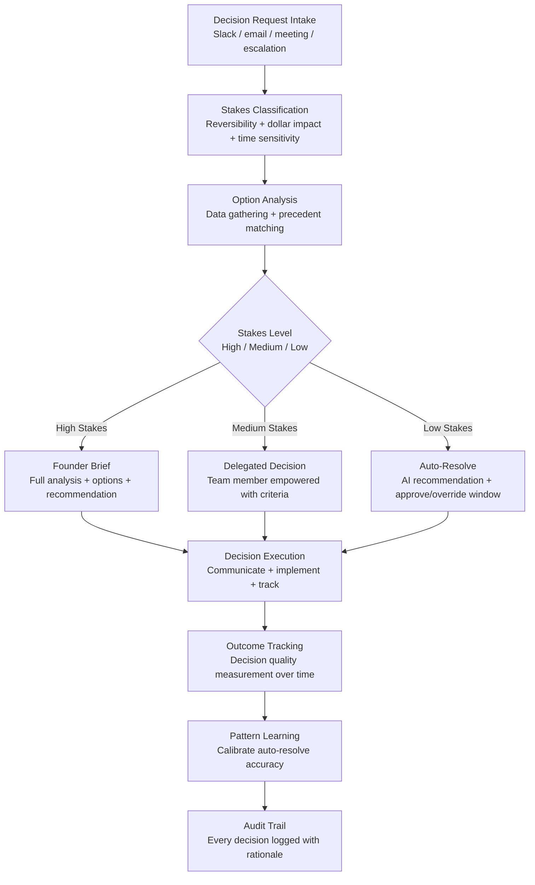

# Decision Fatigue Reducer

Frankmax

NAICS 541511

> **High-Power Founders & Operators** — Executive Function Module

## Objective & Purpose

Research indicates that the average adult makes approximately 35,000 decisions per day. For founders and operators, the number skews higher: every team member's question, every customer escalation, every vendor selection, every product trade-off, and every strategic fork is a decision that draws from the same finite cognitive reserve. Decision fatigue is not a metaphor -- it is a measurable degradation in decision quality that increases with the number of decisions made. By afternoon, founders are making materially worse decisions than they made in the morning, yet the afternoon decisions may be higher-stakes.

The Decision Fatigue Reducer applies AI to pre-analyze, batch, delegate, and automate the low-stakes decisions that consume the majority of a founder's cognitive bandwidth. The system categorizes every incoming decision request by stakes level (reversible vs. irreversible, dollar impact, time sensitivity, strategic vs. operational), pre-analyzes options with supporting data, and recommends dispositions. For decisions below a configurable stakes threshold, the system proposes auto-resolution: "Based on your decision patterns and stated criteria, the recommended choice is X. Approve or override within 24 hours; if no response, X is executed."

The productivity gain is not in the decisions automated -- it is in the cognitive capacity preserved for the decisions that matter. When a founder arrives at a critical strategic decision having made 200 fewer trivial decisions that day, the quality of that strategic decision measurably improves. The tool does not make important decisions for the founder; it ensures the founder has the cognitive resources to make important decisions well.

## Business Context

| Attribute | Value |
|---|---|
| **Business Process** | Decision support and cognitive load management |
| **Business Function** | Executive Function |
| **Category** | Productivity |
| **Target Audience** | 14. High-Power Founders & Operators |
| **Bundle** | Founder/Operator Sprint Pack ($499/mo) |
| **Monthly Cost of Inaction** | $20K-$60K (compounding poor decisions from fatigue) |

## BPMN Workflow

## Features

1. **Decision Intake Classification** — Captures decision requests from all channels (Slack messages, email threads, meeting notes, direct questions) and classifies them by stakes level: reversibility (easy to undo vs. permanent), financial impact (under $1K vs. over $100K), time sensitivity (immediate vs. can wait a week), and strategic importance (operational vs. direction-setting).

2. **Pre-Analysis Engine** — For every decision above trivial, the system gathers relevant data, identifies precedent decisions the founder has made in similar situations, maps available options, and summarizes the trade-offs. The founder receives a brief, not a question.

3. **Auto-Resolution for Low-Stakes Decisions** — Decisions below the founder's configured stakes threshold receive AI-recommended resolutions based on learned decision patterns. The founder has a configurable approval window (1-24 hours) to override; if no override, the recommendation executes. Typical auto-resolution rate: 40-60% of daily decisions.

4. **Delegation Framework** — Medium-stakes decisions are routed to appropriate team members with decision criteria, relevant context, and authority boundaries. The system matches decision types to team members based on domain expertise and past decision quality, building a delegation map over time.

5. **Decision Batching** — Non-urgent decisions are batched into scheduled review windows rather than interrupting throughout the day. The founder reviews batched decisions once or twice daily, processing them efficiently in sequence rather than context-switching for each one.

6. **Cognitive Load Monitoring** — Tracks the founder's decision volume by hour, day, and week. Alerts when decision volume exceeds sustainable thresholds. Recommends scheduling high-stakes decisions during low-fatigue periods and auto-resolving during high-fatigue periods.

7. **Decision Quality Feedback Loop** — Tracks outcomes of all decisions: auto-resolved, delegated, and founder-decided. Compares outcome quality across decision types and methods, calibrating the system's auto-resolve recommendations and delegation routing for continuous improvement.

## Workflow & Automation

**Step 1: Channel Integration** — Connect communication channels where decisions are requested: Slack, email, project management tools, and calendar. The system begins capturing and classifying decision requests automatically.

**Step 2: Stakes Calibration** — The founder defines stakes thresholds: what dollar amount is trivial, what decisions should always come to them, what types can be delegated, and what approval window is comfortable for auto-resolution. Calibration takes 1-2 weeks of founder feedback.

**Step 3: Pattern Learning** — Over the first 2-4 weeks, the system learns the founder's decision patterns: how they decide on vendor selections, how they prioritize competing requests, what criteria they apply to hiring approvals, and how they handle customer escalations. Pattern learning enables increasingly accurate auto-resolution.

**Step 4: Active Decision Management** — The system is now active: low-stakes decisions are auto-resolved (with override window), medium-stakes decisions are delegated (with criteria), and high-stakes decisions are briefed (with analysis). The founder's daily decision load drops by 40-60%.

**Step 5: Batch Review** — Non-urgent decisions accumulate in batch review queues. The founder reviews batches at scheduled times (typically morning and late afternoon), processing efficiently in sequence rather than throughout the day.

**Step 6: Quality Monitoring** — Monthly, the system reports on decision quality: auto-resolve accuracy (how often were auto-resolves overridden or reversed), delegation effectiveness (outcome quality of delegated decisions), and founder decision quality correlation with fatigue levels.

## Input/Output Specifications

| Direction | Data | Format | Description |
|---|---|---|---|
| Input | Decision requests | API (Slack / Email / PM tools) | Questions, escalations, approvals requiring founder input |
| Input | Founder preferences | JSON / UI | Stakes thresholds, delegation rules, batch schedules |
| Input | Historical decisions | JSON / CSV | Past decisions for pattern learning |
| Input | Outcome data | API / Manual | Results of prior decisions for quality tracking |
| Output | Decision briefs | Markdown / Slack | Pre-analyzed options for high-stakes decisions |
| Output | Auto-resolve notifications | Slack / Email | AI recommendations with approve/override window |
| Output | Delegation routing | API integration | Decision packages routed to appropriate team members |
| Output | Audit trail | JSON (immutable log) | Every decision, method, rationale, and outcome |

## Integration Points

| System | Integration Type | Data Flow |
|---|---|---|
| **Personal Operating System** | Bidirectional | Decision load feeds daily planning; POS schedules batch review windows |
| **Burn Rate Optimizer** | Inbound context | Financial position informs stakes classification for spending decisions |
| **Execution Velocity Dashboard** | Inbound context | Execution data provides context for operational decisions |
| **Stakeholder Communication Engine** | Outbound feed | Decision outcomes feed stakeholder communication |
| **Slack / Teams** | Bidirectional API | Decision requests in; recommendations and delegations out |
| **Email (Gmail / Outlook)** | Bidirectional API | Decision requests in; briefs out |
| **Failure Intelligence Library** | Outbound anonymized | Decision patterns feed cross-founder intelligence |

## Pricing & Revenue Model

| Component | Pricing | Notes |
|---|---|---|
| **Founder/Operator Sprint Pack** | $499/month | Includes Decision Fatigue + Personal OS + Stakeholder Comms |
| **Standalone** | $249/month | Decision classification, auto-resolve, batching |
| **With Executive Coaching Layer** | $599/month | Includes decision quality review and improvement coaching |
| **C-Suite License** | Custom pricing | Multi-executive, organizational decision routing |
| **Governance add-on** | +$100/month | Decision audit trail, compliance documentation |

**Revenue model**: Decision Fatigue Reducer targets the most constrained resource at any startup: the founder's cognitive capacity. Recovering 40-60% of daily decision bandwidth directly improves the quality of the remaining high-stakes decisions. At $499/month bundled, the tool costs less than one hour of a founder's effective hourly value. The "fries" attach through executive coaching, decision quality analytics, and organizational delegation optimization at 85-90% margin.

## NAICS/SIC Mapping

| NAICS Code | SIC Code | Industry | Relevance |
|---|---|---|---|
| 541511 | 7371 | Custom Computer Programming Services | Tech founder productivity |
| 541512 | 7372 | Computer Systems Design Services | Technology executive support |
| 541519 | 7379 | Other Computer Related Services | Technology leadership optimization |
| 511210 | 7372 | Software Publishers | Software company executive function |
| 541611 | 7371 | Administrative Management Consulting | Executive decision support |
| 541612 | 7361 | Human Resources Consulting Services | Leadership effectiveness methodology |
