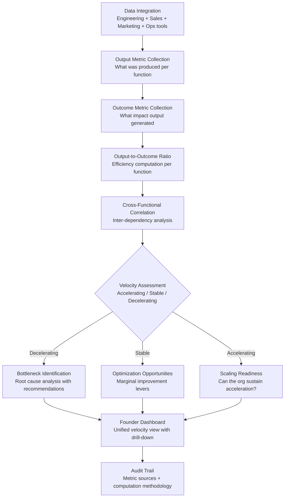

# Execution Velocity Dashboard

Frankmax

NAICS 541511

> **High-Power Founders & Operators** — Operations Module

## Objective & Purpose

Speed is the only sustainable advantage a startup has over incumbents. But speed without direction is chaos, and speed without measurement is illusion. Most startups confuse activity with progress: shipping features does not equal customer acquisition, releasing code does not equal product quality, and holding meetings does not equal alignment. The gap between output (what was produced) and outcome (what impact it had) is where startups waste the majority of their execution capacity. Without measuring this gap, founders cannot distinguish between teams that are executing effectively and teams that are busy but unproductive.

The Execution Velocity Dashboard provides a unified view of organizational execution across every function: engineering (feature delivery, bug resolution, deployment frequency), sales (pipeline progression, deal velocity, close rate), marketing (lead generation, content production, channel performance), and operations (process cycle time, automation coverage, support resolution). For each function, the dashboard tracks both output metrics (what was done) and outcome metrics (what impact it had), computing an output-to-outcome ratio that reveals true execution efficiency.

The strategic insight is not speed measurement -- any project management tool can track velocity. The insight is cross-functional velocity correlation. When engineering ships faster but sales closes slower, is it a product quality problem, a market problem, or a sales process problem? When marketing generates more leads but conversion drops, is targeting wrong or is the product not ready? The dashboard reveals these cross-functional dynamics that are invisible in siloed metrics tools.

## Business Context

| Attribute | Value |
|---|---|
| **Business Process** | Operational performance tracking |
| **Business Function** | Operations |
| **Category** | Analytics |
| **Target Audience** | 14. High-Power Founders & Operators |
| **Bundle** | Founder/Operator Sprint Pack ($499/mo) |
| **Monthly Cost of Inaction** | $30K-$100K (invisible execution inefficiency) |

## BPMN Workflow

## Features

1. **Unified Cross-Functional View** — Aggregates metrics from engineering (GitHub, Jira, Linear), sales (HubSpot, Salesforce), marketing (Google Analytics, HubSpot), and operations (Zendesk, Intercom) into a single dashboard. Founders see the entire organization's execution velocity without switching between 8-10 tools.

2. **Output-to-Outcome Ratio Engine** — Computes the efficiency of every function: features shipped vs. user adoption, deals progressed vs. revenue closed, content produced vs. leads generated, support tickets resolved vs. customer satisfaction. This ratio is the truest measure of organizational productivity.

3. **Cross-Functional Dependency Mapping** — Identifies how velocity in one function affects others: engineering ship rate impact on sales demo capability, marketing lead quality impact on sales conversion, product stability impact on support volume. Reveals bottlenecks that live between teams, not within them.

4. **Trend-Based Velocity Tracking** — Tracks velocity trends over 4, 8, 12, and 26-week windows. Distinguishes between short-term fluctuations (sprint anomalies, holiday effects) and genuine velocity trend changes (sustained acceleration or deceleration).

5. **Bottleneck Root Cause Analysis** — When velocity decelerates, the system identifies probable root causes by correlating metric changes: "Engineering velocity dropped 15% over 4 weeks, correlated with a 30% increase in bug tickets from the billing module and a new team member onboarding in that area."

6. **Benchmark Comparison** — Compares the organization's velocity metrics against anonymized benchmarks for companies of similar stage, size, and sector. Shows where the company is executing above, at, or below peer velocity in each function.

7. **Scaling Readiness Assessment** — As velocity accelerates, evaluates whether the organization can sustain the pace: are processes scalable, are team structures adequate, is infrastructure keeping up, and are quality metrics holding? Identifies where acceleration will create breaking points.

## Workflow & Automation

**Step 1: Tool Integration** — Connect all operational tools: project management, CRM, analytics, support, and code repositories. The system begins collecting metrics immediately and establishes baselines over the first 2-4 weeks.

**Step 2: Metric Normalization** — Raw metrics from different tools are normalized into comparable units: engineering velocity in story points or feature count, sales velocity in pipeline dollars per week, marketing velocity in qualified leads per dollar, and support velocity in resolution time.

**Step 3: Dashboard Computation** — Output and outcome metrics are computed for each function. Output-to-outcome ratios are calculated. Cross-functional correlations are analyzed. The dashboard updates daily with weekly trend computations.

**Step 4: Anomaly and Trend Detection** — The system flags statistically significant velocity changes: deceleration beyond normal variance, acceleration that may be unsustainable, and cross-functional divergences that indicate inter-team friction or dependency issues.

**Step 5: Recommendation Generation** — For identified bottlenecks or opportunities, the system generates specific recommendations: process changes, resource reallocation, tool investments, or team structure adjustments, with projected velocity impact for each.

**Step 6: Reporting and Communication** — Weekly velocity summaries are generated for founder review. Monthly reports are formatted for board consumption. All reports include trend context, benchmark comparison, and actionable recommendations.

## Input/Output Specifications

| Direction | Data | Format | Description |
|---|---|---|---|
| Input | Engineering metrics | API (GitHub / Jira / Linear) | Commits, PRs, deployments, sprint data |
| Input | Sales metrics | API (HubSpot / Salesforce) | Pipeline progression, deal velocity, close rates |
| Input | Marketing metrics | API (Google Analytics / HubSpot) | Leads, conversion, channel performance |
| Input | Support metrics | API (Zendesk / Intercom) | Ticket volume, resolution time, satisfaction |
| Output | Velocity dashboard | JSON + UI | Unified cross-functional execution view |
| Output | Bottleneck analysis | PDF / Markdown | Root cause identification with recommendations |
| Output | Benchmark comparison | REST API / UI | Peer velocity positioning by function |
| Output | Audit trail | JSON (immutable log) | Metric sources, normalization methodology |

## Integration Points

| System | Integration Type | Data Flow |
|---|---|---|
| **Technical Debt Quantifier** | Inbound correlation | Tech debt data explains engineering velocity patterns |
| **Burn Rate Optimizer** | Inbound context | Financial constraints contextualize velocity expectations |
| **Hiring Signal Analyzer** | Bidirectional | Velocity data informs hiring priorities; new hires affect velocity projections |
| **Pivot Signal Detector** | Outbound feed | Execution velocity contributes to PMF assessment |
| **Personal Operating System** | Outbound feed | Velocity summary feeds founder daily brief |
| **Stakeholder Communication Engine** | Outbound feed | Execution metrics included in investor updates |
| **GitHub / Jira / Linear / HubSpot** | Inbound API | Operational tool data |

## Pricing & Revenue Model

| Component | Pricing | Notes |
|---|---|---|
| **Founder/Operator Sprint Pack** | $499/month | Includes Execution Velocity + Burn Rate + Pivot Signal |
| **Standalone** | $299/month | Cross-functional velocity tracking and benchmarking |
| **With Advisory Layer** | $599/month | Includes monthly execution review session |
| **Growth-Stage License** | Custom pricing | Multi-team, department-level granularity |
| **Governance add-on** | +$100/month | Board-ready execution reports, audit-compliant metrics |

**Revenue model**: Execution Velocity Dashboard provides the unified operational view that every founder needs but no single tool provides. The cross-functional correlation capability -- identifying bottlenecks between teams, not within them -- is the unique value proposition. The "fries" attach through benchmarking access, advisory layers, and board-ready reporting at 80-90% margin.

## NAICS/SIC Mapping

| NAICS Code | SIC Code | Industry | Relevance |
|---|---|---|---|
| 541511 | 7371 | Custom Computer Programming Services | Software startup execution tracking |
| 541512 | 7372 | Computer Systems Design Services | Technology operations measurement |
| 541519 | 7379 | Other Computer Related Services | Technology services performance |
| 511210 | 7372 | Software Publishers | Software company operational analytics |
| 541611 | 7371 | Administrative Management Consulting | Operations consulting methodology |
| 541618 | 7389 | Other Management Consulting Services | Execution optimization advisory |
