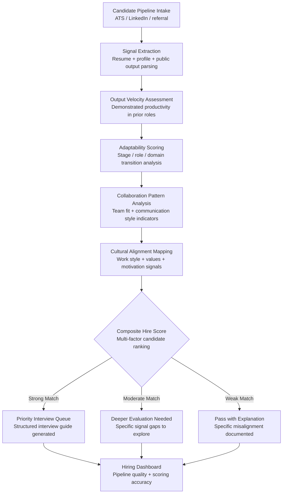

# Hiring Signal Analyzer

Frankmax

NAICS 541511

> **High-Power Founders & Operators** — HR Module

## Objective & Purpose

A single bad hire at a startup costs 6-12 months of lost momentum: 3 months to realize the mistake, 3 months to manage the exit, and 3-6 months to rehire and ramp a replacement. At companies with fewer than 50 employees, each hire represents 2-5% of total headcount -- the equivalent of a Fortune 500 company hiring 1,000 people at once. Yet most startups evaluate candidates with the same shallow signals that Fortune 500 companies use: resume keywords, interview charisma, and reference checks from hand-picked advocates. The failure rate for startup hires consistently exceeds 30%, and the cost compounds: bad hires demoralize good employees, slow product velocity, and drain founder attention.

The Hiring Signal Analyzer applies AI to identify the signals that actually predict startup hire success -- and they are not the signals most founders prioritize. The system evaluates candidates across measurable dimensions: demonstrated output velocity in prior roles, adaptability indicators (role transitions, company-stage transitions, domain transitions), collaboration patterns (open-source contributions, cross-functional project history), learning trajectory (skill acquisition speed, certification velocity), and cultural alignment signals (work style preferences, communication patterns). Every signal is validated against outcome data from the marketplace's cross-company hiring dataset.

The tool does not automate hiring decisions. Founders must still make the final call. But it replaces gut-feel pattern matching with data-driven signal analysis, reducing the most expensive category of founder error.

## Business Context

| Attribute | Value |
|---|---|
| **Business Process** | Talent acquisition and hiring quality |
| **Business Function** | HR |
| **Category** | Recruitment |
| **Target Audience** | 14. High-Power Founders & Operators |
| **Bundle** | Founder/Operator Sprint Pack ($499/mo) |
| **Monthly Cost of Inaction** | $40K-$120K (bad hire costs per incident) |

## BPMN Workflow

## Features

1. **Multi-Source Candidate Profiling** — Aggregates candidate data from ATS systems (Lever, Greenhouse, Ashby), LinkedIn profiles, GitHub contributions, publication history, and professional portfolio. Builds a comprehensive signal profile without requiring candidates to complete additional assessments.

2. **Output Velocity Measurement** — Analyzes evidence of output in prior roles: GitHub commit patterns, product launch history, published work, project timelines, and scope of responsibility growth. Distinguishes between candidates who ship and candidates who participate.

3. **Adaptability Scoring** — Measures transition history: company stage transitions (big company to startup, or startup to startup), role transitions (IC to manager, generalist to specialist), and domain transitions (sector changes requiring rapid learning). Frequent successful transitions indicate the adaptability startups require.

4. **Stage-Appropriate Fit Analysis** — Evaluates candidate fit for the company's current stage, not in the abstract. A candidate excellent for Series B may be wrong for seed stage, and vice versa. The system scores fit against the specific challenges of the company's current phase: building from zero, scaling initial traction, or optimizing growth.

5. **Structured Interview Guide Generation** — For candidates advancing to interviews, the system generates role-specific interview guides that probe identified signal gaps. If adaptability is unproven, the guide includes scenario questions designed to evaluate it. If output velocity is unclear, the guide focuses on concrete work examples.

6. **Reference Signal Enhancement** — Generates targeted reference check questions based on the candidate's signal profile. Instead of generic "how was this person to work with" questions, the system produces specific probes: "Can you describe a time they had to learn a new domain rapidly?" or "How did they handle ambiguity when requirements changed?"

7. **Hiring Outcome Tracking** — Tracks hire outcomes (retention at 6/12/18 months, performance ratings, promotion velocity) and correlates with original signal scores. Over time, the system learns which signals predict success specifically at the founder's company, creating a proprietary hiring model.

## Workflow & Automation

**Step 1: Pipeline Connection** — Connect the company's ATS and sourcing channels. Active candidates and new applicants flow into the system automatically. Historical hire data is ingested for outcome calibration.

**Step 2: Automated Signal Extraction** — For each candidate, the system extracts and scores signals from all available data sources. Scoring completes within hours of candidate entry, ensuring the pipeline moves at startup speed.

**Step 3: Score-Based Ranking** — Candidates are ranked by composite score with transparency into each dimension. Founders can adjust dimension weights based on role-specific priorities (an engineering hire might weight output velocity higher; a sales hire might weight adaptability higher).

**Step 4: Interview Preparation** — For shortlisted candidates, the system generates customized interview guides, reference check questions, and red-flag areas to probe. Interview panels receive candidate-specific preparation briefs.

**Step 5: Decision and Outcome Logging** — Hiring decisions (offer, pass, hold) are logged with reasoning. Accepted offers are tracked through onboarding and performance milestones. Every outcome feeds back into the scoring model.

**Step 6: Continuous Calibration** — Quarterly, the system compares signal scores against actual hire outcomes. Scoring weights are adjusted based on what actually predicts success at this specific company. The model improves with every hire.

## Input/Output Specifications

| Direction | Data | Format | Description |
|---|---|---|---|
| Input | Candidate applications | API (Lever / Greenhouse / Ashby) | Resume, cover letter, application data |
| Input | Professional profiles | API (LinkedIn) | Work history, skills, connections |
| Input | Code contributions | API (GitHub / GitLab) | Commit history, project involvement, code quality |
| Input | Hire outcome data | JSON / CSV | Retention, performance, promotion data for calibration |
| Output | Candidate scores | JSON + UI dashboard | Multi-dimensional signal scores with ranking |
| Output | Interview guides | PDF / Markdown | Role-specific, candidate-specific interview preparation |
| Output | Reference check guides | PDF / Markdown | Targeted reference questions based on signal gaps |
| Output | Audit trail | JSON (immutable log) | Scoring methodology, signal sources, outcome tracking |

## Integration Points

| System | Integration Type | Data Flow |
|---|---|---|
| **Burn Rate Optimizer** | Inbound constraint | Runway data constrains hiring plan scope |
| **Execution Velocity Dashboard** | Bidirectional | Team velocity data calibrates hiring impact; new hires affect velocity projections |
| **Technical Debt Quantifier** | Inbound context | Tech debt severity informs engineering hire priorities |
| **Personal Operating System** | Outbound schedule | Interview scheduling integration |
| **Lever / Greenhouse / Ashby** | Bidirectional API | Candidate data in; scores and guides out |
| **LinkedIn** | Inbound API | Professional profile data |
| **GitHub / GitLab** | Inbound API | Code contribution analysis |

## Pricing & Revenue Model

| Component | Pricing | Notes |
|---|---|---|
| **Founder/Operator Sprint Pack** | $499/month | Includes Hiring Signal + Burn Rate + Execution Velocity |
| **Standalone** | $349/month | Unlimited candidate scoring, interview guides |
| **With Advisory Layer** | $649/month | Includes quarterly hiring strategy review |
| **Accelerator License** | Custom pricing | Multi-company hiring intelligence |
| **Governance add-on** | +$100/month | Bias audit, compliance documentation |

**Revenue model**: Hiring Signal Analyzer addresses the highest per-incident cost center for startups. A single avoided bad hire ($150K-$300K fully loaded cost) pays for years of subscription. At $499/month bundled, the tool is priced at less than 1% of a single mid-level hire's annual cost. The "fries" attach through interview guide customization, outcome calibration, and cross-company hiring benchmarking at 80-90% margin.

## NAICS/SIC Mapping

| NAICS Code | SIC Code | Industry | Relevance |
|---|---|---|---|
| 541511 | 7371 | Custom Computer Programming Services | Tech startup hiring optimization |
| 541512 | 7372 | Computer Systems Design Services | Engineering team building |
| 541519 | 7379 | Other Computer Related Services | Technology talent acquisition |
| 511210 | 7372 | Software Publishers | Software company recruitment |
| 541612 | 7361 | Human Resources Consulting Services | Hiring methodology and assessment |
| 561311 | 7361 | Employment Placement Agencies | Talent sourcing and evaluation |
