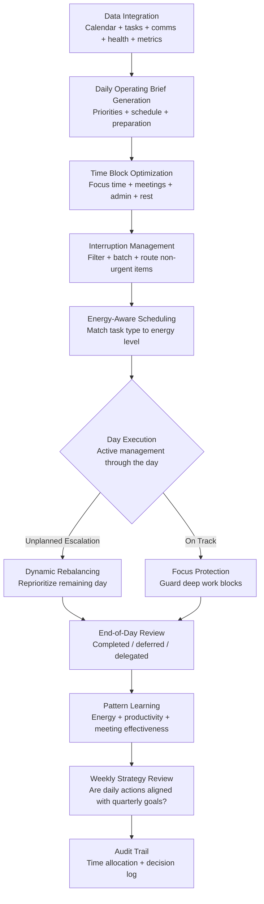

# Personal Operating System

Frankmax

NAICS 541511

> **High-Power Founders & Operators** — Executive Function Module

## Objective & Purpose

The founder is the single point of failure in every startup. When the founder's cognitive capacity is depleted, decision quality drops, execution slows, relationships degrade, and health suffers -- creating a cascading failure that begins with the individual and ends with the company. Yet most founders manage themselves with the same tools they used as individual contributors: a calendar, a to-do list, and willpower. There is no operating system for the founder role -- no system that integrates time management, priority setting, energy optimization, relationship maintenance, and strategic thinking into a coherent daily workflow.

The Personal Operating System provides that missing layer. It integrates the founder's calendar, task management, communication channels, health data (sleep, exercise, stress indicators), and strategic priorities into a unified system that manages the founder's most constrained resource: attention. Each morning, the system generates a Daily Operating Brief: the day's highest-priority decisions, most important meetings (with preparation briefs), critical metrics that changed overnight, and strategic priorities that need protected thinking time. Throughout the day, it manages interruptions, batches non-urgent items, and guards focus time.

The system is not a productivity hack or another to-do app. It is an operating system for the hardest job in business. It manages the daily tension between urgent and important, between execution and strategy, between availability and focus, and between performance and sustainability. Over time, it learns the founder's energy patterns, meeting effectiveness, and decision quality correlations to optimize scheduling and protect the founder from their own worst tendencies (overcommitment, insufficient rest, reactive scheduling).

## Business Context

| Attribute | Value |
|---|---|
| **Business Process** | Founder productivity and personal effectiveness |
| **Business Function** | Executive Function |
| **Category** | Productivity |
| **Target Audience** | 14. High-Power Founders & Operators |
| **Bundle** | Founder/Operator Sprint Pack ($499/mo) |
| **Monthly Cost of Inaction** | $30K-$100K (founder burnout + suboptimal time allocation) |

## BPMN Workflow

## Features

1. **Daily Operating Brief** — Generated each morning before the founder's day begins. Contains: top 3 priorities for the day (linked to quarterly goals), meeting schedule with preparation briefs for each, overnight metric changes that need attention, pending decisions from the Decision Fatigue Reducer, and a one-line energy management recommendation based on the previous night's data.

2. **Energy-Aware Scheduling** — Learns the founder's energy patterns from calendar data, wearable health inputs, and productivity patterns. Schedules high-cognitive-load activities (strategic planning, difficult conversations, code review) during peak energy periods and low-load activities (status meetings, email, admin) during energy troughs.

3. **Focus Time Protection** — Blocks and guards deep work periods on the calendar. When interruptions arrive during focus time, the system routes them to appropriate channels (team Slack, EA queue, batch review) rather than allowing direct access. Only true emergencies (defined by configurable criteria) break through.

4. **Meeting Preparation Engine** — For each meeting on the calendar, generates a brief: context (what happened last time, what was committed), relevant metrics or data since the last interaction, suggested agenda items, and key points the founder needs to address. Preparation briefs are available 30 minutes before each meeting.

5. **Relationship Maintenance Tracker** — Monitors the founder's relationship network (investors, advisors, key customers, mentors, peer founders) and flags when important relationships are going dormant. Suggests reach-outs based on relationship value, recency, and upcoming relevance.

6. **Weekly Strategy-Execution Alignment** — Each week, the system analyzes whether daily time allocation aligned with stated quarterly priorities. If the founder spent 60% of the week on operational tasks but stated that product strategy is the top priority, the system flags the misalignment with specific recommendations.

7. **Burnout Prevention System** — Monitors leading indicators of founder burnout: consecutive work hours without breaks, sleep quality trends, exercise frequency, social interaction outside of work, and decision quality degradation. Alerts when patterns suggest unsustainable pace before burnout occurs.

8. **Personal Knowledge Base** — Captures and organizes the founder's notes, insights, decision rationale, and lessons learned into a searchable knowledge base. When a similar situation arises, the system surfaces prior thinking and decisions, preventing re-learning and ensuring consistency.

## Workflow & Automation

**Step 1: System Integration** — Connect calendar (Google Calendar, Outlook), task management (Todoist, Things, Linear), communication (Slack, email), health data (Apple Health, Oura, Whoop), and the other marketplace tools (Burn Rate, Execution Velocity, Decision Fatigue). Full integration takes 1-2 hours.

**Step 2: Baseline Learning** — Over the first 2 weeks, the system observes the founder's patterns: energy rhythms, meeting types and effectiveness, task completion rates, interruption frequency, and time allocation by category. This baseline informs all subsequent optimization.

**Step 3: Daily Brief Generation** — Each morning (at the founder's configured time, typically 30 minutes before first commitment), the Daily Operating Brief is delivered. The brief is designed for 3-5 minute consumption with clear action items.

**Step 4: Active Day Management** — Throughout the day, the system manages incoming requests: routing non-urgent items to batch review, protecting focus blocks, generating meeting preparation briefs, and dynamically rebalancing the schedule when unplanned items arise.

**Step 5: End-of-Day Review** — A brief evening summary: what was accomplished, what was deferred, what was delegated, and what needs the founder's attention tomorrow. This review takes less than 2 minutes and sets up the next morning's brief.

**Step 6: Weekly Reflection** — Each week, the system generates a strategy-execution alignment report: time allocation vs. priorities, energy pattern analysis, relationship maintenance status, and recommendations for the following week's schedule optimization.

## Input/Output Specifications

| Direction | Data | Format | Description |
|---|---|---|---|
| Input | Calendar events | API (Google Calendar / Outlook) | Meeting schedule, time blocks, recurring events |
| Input | Task lists | API (Todoist / Things / Linear) | Tasks, priorities, deadlines, projects |
| Input | Communication streams | API (Slack / Email) | Message volume, sender priority, content classification |
| Input | Health and wellness data | API (Apple Health / Oura / Whoop) | Sleep, HRV, exercise, stress indicators |
| Output | Daily Operating Brief | Email / Slack / Markdown | Morning priority and schedule brief |
| Output | Meeting preparation briefs | Markdown / Notification | Pre-meeting context and suggested agenda |
| Output | Weekly alignment report | PDF / Markdown | Strategy-execution gap analysis |
| Output | Audit trail | JSON (immutable log) | Time allocation, decision log, pattern data |

## Integration Points

| System | Integration Type | Data Flow |
|---|---|---|
| **Decision Fatigue Reducer** | Bidirectional | Pending decisions appear in daily brief; POS schedules batch review windows |
| **Stakeholder Communication Engine** | Bidirectional | Communication tasks scheduled; POS triggers draft generation |
| **Burn Rate Optimizer** | Inbound feed | Financial position informs daily brief context |
| **Execution Velocity Dashboard** | Inbound feed | Velocity summary included in daily brief |
| **Competitive Intelligence Feed** | Inbound feed | Critical competitive alerts integrated into daily brief |
| **Hiring Signal Analyzer** | Outbound scheduling | Interview time blocks managed by POS |
| **Google Calendar / Outlook** | Bidirectional API | Calendar read and write |

## Pricing & Revenue Model

| Component | Pricing | Notes |
|---|---|---|
| **Founder/Operator Sprint Pack** | $499/month | Includes Personal OS + Decision Fatigue + Stakeholder Comms |
| **Standalone** | $299/month | Daily briefs, scheduling, focus protection |
| **With Executive Coaching** | $799/month | Includes weekly productivity optimization session |
| **C-Suite License** | Custom pricing | Multi-executive with shared scheduling optimization |
| **Governance add-on** | +$100/month | Time allocation audit trail, board-reportable metrics |

**Revenue model**: Personal Operating System is the most intimate and therefore stickiest tool in the Founder/Operator Sprint Pack. Once a founder's daily workflow runs through the system, switching costs are prohibitive. The tool saves 5-10 hours per week in scheduling friction, meeting preparation, and interruption management. At $499/month bundled, it costs less than a single hour of executive assistant time per week. The "fries" attach through executive coaching, burnout prevention, and strategy-execution alignment at 85-90% margin.

## NAICS/SIC Mapping

| NAICS Code | SIC Code | Industry | Relevance |
|---|---|---|---|
| 541511 | 7371 | Custom Computer Programming Services | Tech founder personal productivity |
| 541512 | 7372 | Computer Systems Design Services | Technology executive workflow |
| 541519 | 7379 | Other Computer Related Services | Technology leadership optimization |
| 511210 | 7372 | Software Publishers | Software company executive function |
| 541611 | 7371 | Administrative Management Consulting | Executive effectiveness consulting |
| 541612 | 7361 | Human Resources Consulting Services | Leadership productivity methodology |
