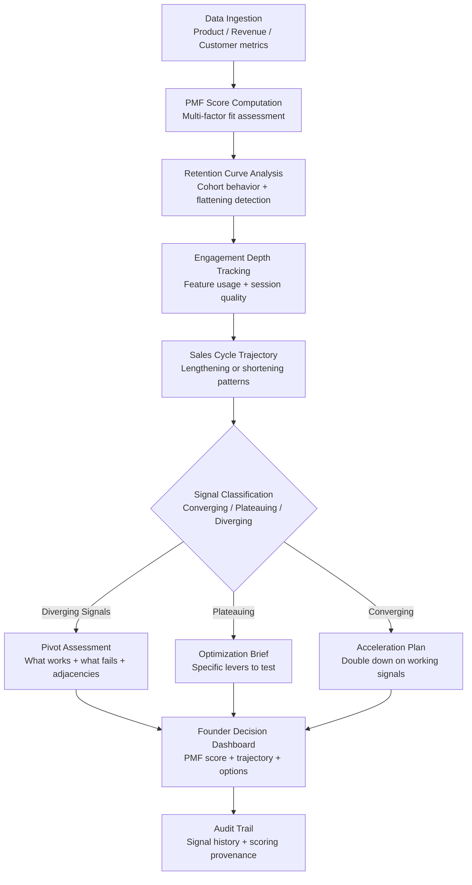

# Pivot Signal Detector

Frankmax

NAICS 541511

> **High-Power Founders & Operators** — Strategy Module

## Objective & Purpose

The most expensive decision a founder makes is whether to persist or pivot, and they almost always make it too late. Research consistently shows that startups pivot an average of 2-3 times before finding product-market fit, yet most founders persist on failing approaches 6-12 months beyond the point where data indicated a change was necessary. The psychological drivers are powerful: sunk cost attachment, narrative commitment to investors, team morale concerns, and the genuine difficulty of distinguishing between "this needs more time" and "this will never work." Meanwhile, the founders who pivot successfully do so because they recognized weak signals early, not because they waited for definitive failure.

The Pivot Signal Detector monitors the quantitative and qualitative indicators that distinguish companies converging on product-market fit from those diverging from it. It tracks retention curves, engagement depth, sales cycle trajectories, customer acquisition cost trends, NPS evolution, churn patterns, and competitive dynamics to compute a Product-Market Fit Score that updates weekly. When the score deteriorates across multiple dimensions simultaneously, the system generates a structured pivot assessment: what is working, what is failing, where adjacent opportunities exist, and what a pivot would cost in time and capital.

The tool does not make the pivot decision -- founders must. But it provides the analytical scaffolding that removes the most dangerous variable from the equation: the founder's own emotional attachment to their current path. By making the data visible and the analysis structured, it compresses the time between "something is wrong" and "here is what we can do about it."

## Business Context

| Attribute | Value |
|---|---|
| **Business Process** | Product-market fit analysis |
| **Business Function** | Strategy |
| **Category** | Analytics |
| **Target Audience** | 14. High-Power Founders & Operators |
| **Bundle** | Founder/Operator Sprint Pack ($499/mo) |
| **Monthly Cost of Inaction** | $50K-$200K (persisting on wrong trajectory) |

## BPMN Workflow

## Features

1. **Product-Market Fit Score** — Computes a weekly composite score across 12+ indicators: retention (D1/D7/D30/D90), engagement depth (DAU/MAU ratio, session duration, feature breadth), revenue quality (expansion revenue, net dollar retention), and market pull (inbound vs. outbound ratio, organic growth rate). The score is calibrated against benchmarks for the company's stage and sector.

2. **Cohort Retention Analysis** — Tracks retention curves by cohort with automatic curve-type classification: improving (each cohort retains better), stable (consistent retention), degrading (worsening cohorts), or fragmented (inconsistent patterns). Degrading retention is the strongest pivot signal.

3. **Sales Cycle Trajectory Monitoring** — Measures sales cycle length, conversion rates, and average deal size over time. Lengthening sales cycles with stable or declining deal sizes signal market resistance. Shortening cycles with increasing deal sizes signal product-market pull.

4. **Adjacent Opportunity Scanner** — When pivot signals emerge, the system identifies adjacent opportunities based on existing assets: current technology capabilities, existing customer relationships, team expertise, and market adjacencies where the company's unfair advantages transfer.

5. **Competitive Dynamics Monitor** — Tracks competitive landscape changes that affect the pivot calculus: new well-funded entrants, incumbent feature releases, market consolidation, and regulatory shifts that open or close opportunities.

6. **Runway Impact Modeling** — Models the financial impact of pivot scenarios: time to ramp new approach, capital required, team restructuring costs, and remaining runway under each scenario. Ensures pivot decisions are made with clear-eyed financial reality.

7. **Investor Communication Framework** — Provides structured frameworks for communicating pivot decisions to investors: data-driven narrative, before/after thesis comparison, capital requirements, and timeline expectations. Reduces the founder's fear of the pivot conversation.

## Workflow & Automation

**Step 1: Metric Integration** — Connect product analytics (Mixpanel, Amplitude, Segment), revenue systems (Stripe, HubSpot), and customer data (Intercom, Zendesk). The system begins baseline computation immediately with whatever data depth is available.

**Step 2: Weekly PMF Score Update** — Every week, the PMF score is recomputed across all dimensions. Founders receive a brief: score, trend, top improving signals, and top deteriorating signals. No interpretation required -- the system highlights what matters.

**Step 3: Signal Pattern Recognition** — The system classifies signal patterns: convergence (multiple indicators improving), divergence (multiple indicators worsening), mixed (some improving, some worsening), or plateau (all indicators flat). Pattern classification drives the response recommendation.

**Step 4: Pivot Assessment Generation** — When divergence persists across three or more consecutive scoring periods, the system generates a full pivot assessment: what is working (preserve these), what is failing (abandon these), adjacent opportunities (explore these), and financial impact (expect these costs).

**Step 5: Scenario Modeling** — The founder can model specific pivot scenarios: new target market, different product form factor, altered pricing model, or channel shift. Each scenario shows projected timeline, capital requirements, and probability of improved PMF based on available signal data.

**Step 6: Decision Documentation** — Whatever the founder decides (persist, pivot, or adjust), the decision is documented with supporting data. This creates an accountability trail and a learning dataset for the founder's own decision-making improvement.

## Input/Output Specifications

| Direction | Data | Format | Description |
|---|---|---|---|
| Input | Product analytics | API (Mixpanel / Amplitude) | User behavior, retention, engagement metrics |
| Input | Revenue data | API (Stripe / HubSpot) | MRR, churn, expansion, sales cycle data |
| Input | Customer feedback | API (Intercom / Zendesk / NPS) | Support tickets, satisfaction scores, feature requests |
| Input | Competitive data | API / RSS | Competitor funding, product launches, pricing changes |
| Output | PMF score and trend | JSON + UI dashboard | Weekly composite score with dimensional breakdown |
| Output | Pivot assessment | PDF / Markdown | Structured analysis with adjacent opportunities |
| Output | Scenario models | JSON + UI | Financial and timeline projections for pivot options |
| Output | Audit trail | JSON (immutable log) | Signal history, scoring methodology, decision log |

## Integration Points

| System | Integration Type | Data Flow |
|---|---|---|
| **Burn Rate Optimizer** | Bidirectional | Runway data contextualizes pivot urgency; pivot scenarios affect burn projections |
| **Customer Discovery Accelerator** | Inbound feed | Customer interview patterns inform PMF scoring |
| **Competitive Intelligence Feed** | Inbound feed | Competitive dynamics affect pivot calculus |
| **Stakeholder Communication Engine** | Outbound feed | Pivot decisions feed investor update generation |
| **Execution Velocity Dashboard** | Inbound metrics | Execution data contributes to PMF assessment |
| **Mixpanel / Amplitude** | Inbound API | Product analytics data |
| **Stripe / HubSpot** | Inbound API | Revenue and sales data |

## Pricing & Revenue Model

| Component | Pricing | Notes |
|---|---|---|
| **Founder/Operator Sprint Pack** | $499/month | Includes Pivot Signal + Burn Rate + Execution Velocity |
| **Standalone** | $299/month | PMF scoring and pivot assessment |
| **With Advisory Layer** | $799/month | Includes monthly pivot review session with AI-generated brief |
| **Accelerator / Studio License** | Custom pricing | Multi-company monitoring, portfolio-level PMF tracking |
| **Governance add-on** | +$150/month | Board-ready PMF reporting, decision audit trail |

**Revenue model**: Pivot Signal Detector targets the most consequential decision in a startup's life. The cost of persisting 6 months too long on a failing approach exceeds $500K for most funded startups. At $499/month bundled, the tool pays for itself if it accelerates the pivot decision by even one month. The "fries" attach through advisory layers, board reporting, and decision documentation at 80-90% margin.

## NAICS/SIC Mapping

| NAICS Code | SIC Code | Industry | Relevance |
|---|---|---|---|
| 541511 | 7371 | Custom Computer Programming Services | Software startup strategy analysis |
| 541512 | 7372 | Computer Systems Design Services | Tech company product-market fit |
| 541519 | 7379 | Other Computer Related Services | Technology services strategy |
| 511210 | 7372 | Software Publishers | Software product strategy |
| 541611 | 7371 | Administrative Management Consulting | Startup strategy consulting |
| 541720 | 8732 | Research and Development in Social Sciences | Product-market research methodology |
