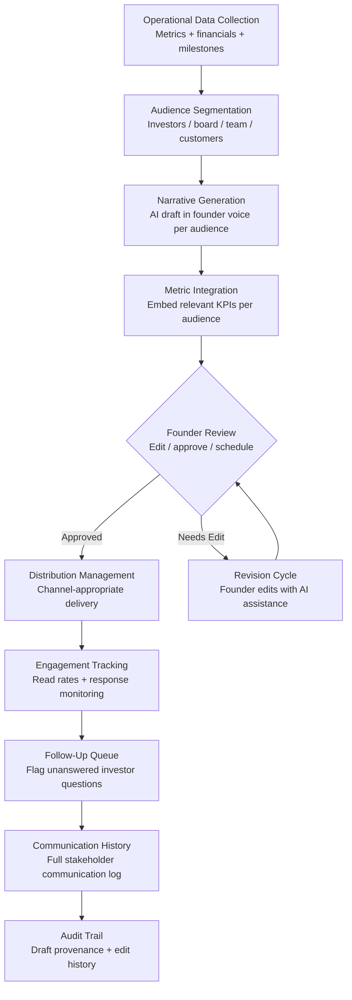

# Stakeholder Communication Engine

Frankmax

NAICS 541511

> **High-Power Founders & Operators** — Communications Module

## Objective & Purpose

Investor updates, board memos, team all-hands decks, and customer newsletters -- the communication obligations of a founder grow with every stakeholder relationship, and each audience requires a different lens on the same underlying data. Monthly investor updates alone consume 4-8 hours of founder time: gathering metrics, drafting narrative, reviewing with co-founders, and managing distribution. Multiply by quarterly board decks, weekly team updates, and ad hoc stakeholder communications, and founders spend 15-25% of their time on communication rather than execution. Worse, when communication slips (as it inevitably does under execution pressure), stakeholder trust erodes silently.

The Stakeholder Communication Engine generates audience-appropriate communications directly from operational data. It connects to the company's operational tools (analytics, CRM, financial systems, project management) and generates draft communications tailored to each stakeholder audience: investors receive metrics-focused updates with narrative context, board members receive strategic summaries with decision items, team members receive execution-focused updates with context, and customers receive product and roadmap communications. Each draft is generated in the founder's voice, calibrated from prior communications.

The compounding value is consistency. When stakeholder communications are generated from live data on a regular cadence, stakeholders receive a continuous information stream rather than sporadic updates. This consistency builds trust, reduces surprise, and creates the information foundation that makes high-stakes conversations (fundraising, board decisions, customer renewals) significantly smoother.

## Business Context

| Attribute | Value |
|---|---|
| **Business Process** | Investor/board/team communication |
| **Business Function** | Communications |
| **Category** | Relations |
| **Target Audience** | 14. High-Power Founders & Operators |
| **Bundle** | Founder/Operator Sprint Pack ($499/mo) |
| **Monthly Cost of Inaction** | $15K-$50K (founder time + stakeholder trust erosion) |

## BPMN Workflow

## Features

1. **Multi-Audience Communication Generation** — Generates distinct communications for each stakeholder group from the same underlying data: investor updates (metrics + narrative + ask), board memos (strategic + decision items + risk), team all-hands (execution + context + recognition), and customer updates (product + roadmap + value). Each audience receives the information most relevant to their relationship.

2. **Voice Calibration Engine** — Learns the founder's communication style from prior updates, emails, and presentations. Generated drafts match the founder's tone, vocabulary, and structural preferences. The result reads like the founder wrote it, not like AI generated it.

3. **Metric Auto-Embedding** — Pulls current metrics directly from connected tools and embeds them in communications with appropriate context. MRR growth, burn rate, pipeline, NPS, and other KPIs appear with trend arrows and brief explanations, eliminating the manual metric-gathering process.

4. **Cadence Management** — Maintains a communication calendar for each stakeholder group with configurable frequency: monthly investor updates, quarterly board packages, weekly team updates, and milestone-triggered customer communications. Reminders fire when updates are due, and drafts are pre-generated.

5. **Sensitive Topic Framing** — When metrics show negative trends (revenue miss, churn spike, key departure), the system drafts framing language that is honest, contextualized, and forward-looking. It does not hide bad news -- it helps the founder present it constructively with root cause analysis and remediation plans.

6. **Distribution and Engagement Tracking** — Distributes communications through appropriate channels (email for investors, Notion/Slack for team, portal for board) and tracks engagement: open rates, read time, forwarding, and response. Flags when key stakeholders have not engaged with an important update.

7. **Question and Follow-Up Management** — Captures stakeholder responses and questions, routes them to appropriate team members, and tracks resolution. Ensures that investor questions do not go unanswered and board action items are tracked to completion.

## Workflow & Automation

**Step 1: Communication Calendar Setup** — Define stakeholder groups, communication cadence, preferred channels, and content depth for each audience. The system establishes the communication rhythm.

**Step 2: Data Integration** — Connect operational tools that feed communication content: analytics, CRM, financial system, and project management. The system begins tracking metrics that will populate communications.

**Step 3: Automated Draft Generation** — When a communication is due per the calendar, the system generates a draft using current operational data, calibrated to the appropriate audience and the founder's voice. Drafts appear in the founder's review queue.

**Step 4: Founder Review and Edit** — The founder reviews, edits as needed, and approves. Most routine updates require less than 15 minutes of review. Significant updates (fundraising, major pivot, bad quarter) receive more founder attention with AI-assisted drafting support.

**Step 5: Distribution** — Approved communications are distributed through configured channels. The system manages distribution lists, handles opt-outs, and confirms delivery.

**Step 6: Engagement and Follow-Up** — The system monitors engagement and captures responses. Unengaged key stakeholders receive gentle follow-ups. Questions are routed for response. The full communication history is maintained for reference.

## Input/Output Specifications

| Direction | Data | Format | Description |
|---|---|---|---|
| Input | Operational metrics | API (analytics / CRM / finance) | KPIs for communication embedding |
| Input | Prior communications | Email / PDF / Markdown | Historical updates for voice calibration |
| Input | Stakeholder lists | JSON / CSV | Contact information, preferences, segments |
| Input | Communication templates | Markdown / UI | Audience-specific structure and emphasis |
| Output | Communication drafts | Markdown / Email | Audience-tailored updates in founder voice |
| Output | Distribution tracking | JSON + UI | Delivery confirmation and engagement metrics |
| Output | Follow-up queue | REST API / UI | Unresolved questions and action items |
| Output | Audit trail | JSON (immutable log) | Draft generation, edits, approvals, distribution |

## Integration Points

| System | Integration Type | Data Flow |
|---|---|---|
| **Burn Rate Optimizer** | Inbound feed | Financial metrics auto-populate investor updates |
| **Execution Velocity Dashboard** | Inbound feed | Execution metrics feed team and board communications |
| **Pivot Signal Detector** | Inbound feed | PMF data contextualizes strategic communications |
| **Customer Discovery Accelerator** | Inbound feed | Discovery insights inform customer communications |
| **Decision Fatigue Reducer** | Inbound triggers | Decision outcomes feed stakeholder communication |
| **Personal Operating System** | Bidirectional | Communication tasks scheduled in founder OS; POS sends reminders |
| **Gmail / Outlook / Slack** | Outbound API | Communication distribution channels |

## Pricing & Revenue Model

| Component | Pricing | Notes |
|---|---|---|
| **Founder/Operator Sprint Pack** | $499/month | Includes Stakeholder Comms + Decision Fatigue + Personal OS |
| **Standalone** | $249/month | Multi-audience generation, cadence management |
| **With Communications Advisory** | $599/month | Includes monthly narrative strategy session |
| **Growth-Stage License** | Custom pricing | Multi-author, department-level communications |
| **Governance add-on** | +$100/month | Board communication compliance, audit trail |

**Revenue model**: Stakeholder Communication Engine recovers 15-25% of founder time currently spent on communication production. At 4-8 hours per monthly investor update alone, the time savings justify the subscription within the first month. The "fries" attach through voice calibration depth, sensitive topic advisory, and board-level compliance at 80-90% margin.

## NAICS/SIC Mapping

| NAICS Code | SIC Code | Industry | Relevance |
|---|---|---|---|
| 541511 | 7371 | Custom Computer Programming Services | Tech founder communications |
| 541512 | 7372 | Computer Systems Design Services | Technology company stakeholder relations |
| 541519 | 7379 | Other Computer Related Services | Technology services communications |
| 511210 | 7372 | Software Publishers | Software company investor relations |
| 541820 | 7311 | Public Relations Agencies | Stakeholder communication methodology |
| 541611 | 7371 | Administrative Management Consulting | Communication strategy consulting |
