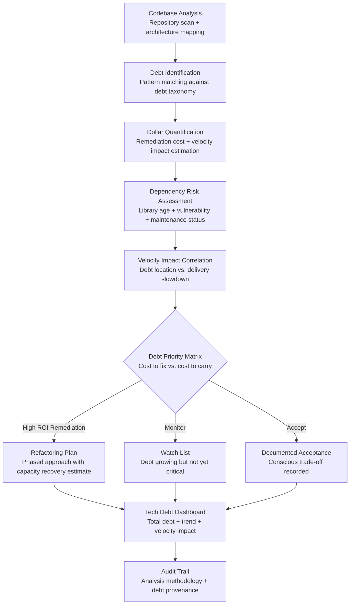

# Technical Debt Quantifier

Frankmax

NAICS 541511

> **High-Power Founders & Operators** — Engineering Module

## Objective & Purpose

Technical debt is the silent killer of engineering velocity. Every startup accumulates it -- shortcuts taken to ship faster, architectural decisions made with incomplete information, libraries chosen for convenience rather than longevity, test coverage sacrificed for speed. The debt itself is not the problem; the problem is invisibility. Founders and CTOs cannot see technical debt in financial statements, sprint metrics, or customer dashboards. It manifests only as a gradual, unexplained slowdown: features that used to take one sprint now take three, bug rates creep upward, onboarding new engineers takes longer, and deployment confidence declines.

The Technical Debt Quantifier makes the invisible visible. It analyzes codebases, CI/CD pipelines, dependency trees, test coverage, and engineering velocity metrics to compute a dollar-denominated technical debt estimate. Not a vague "we have some tech debt" assessment, but a specific quantification: "This codebase carries approximately $340K in technical debt, concentrated in the authentication module ($120K), the billing integration ($95K), and the data pipeline ($75K). At current velocity trends, debt is growing at $15K/month and reducing feature delivery capacity by 22%."

This quantification transforms technical debt from an engineering-only conversation into a business decision. When a founder can see that investing $120K in authentication refactoring will recover 15% of engineering capacity (equivalent to 1.5 engineers at $180K/year), the ROI calculation is straightforward. The tool bridges the communication gap between technical teams who feel the debt and business leaders who fund the remediation.

## Business Context

| Attribute | Value |
|---|---|
| **Business Process** | Engineering management and technical operations |
| **Business Function** | Engineering |
| **Category** | Operations |
| **Target Audience** | 14. High-Power Founders & Operators |
| **Bundle** | Founder/Operator Sprint Pack ($499/mo) |
| **Monthly Cost of Inaction** | $20K-$80K (compounding velocity loss) |

## BPMN Workflow

## Features

1. **Automated Codebase Scanning** — Connects to source repositories (GitHub, GitLab, Bitbucket) and performs deep analysis: code complexity metrics (cyclomatic complexity, cognitive complexity), duplication detection, dependency analysis, test coverage mapping, and architectural pattern recognition. Scanning is non-intrusive and operates on read-only repository access.

2. **Dollar-Denominated Debt Estimation** — Translates technical debt into business language. Each identified debt item is assigned a remediation cost (estimated engineering hours multiplied by loaded cost) and a carrying cost (ongoing velocity drag, bug probability increase, and onboarding overhead). Founders see technical debt the same way they see financial debt: a balance with interest payments.

3. **Module-Level Debt Mapping** — Breaks debt down by code module, service, or component. Shows which parts of the system carry the most debt and which are clean. Identifies debt hotspots where multiple debt types (complexity + low coverage + stale dependencies) overlap.

4. **Dependency Health Assessment** — Evaluates every third-party dependency: version currency, known vulnerabilities (CVE database), maintenance activity, community health, and license compliance. Flags dependencies that are abandoned, compromised, or approaching end-of-life.

5. **Velocity Impact Correlation** — Correlates technical debt locations with engineering velocity metrics: which modules have the slowest PR cycle times, the highest bug rates, the most rollbacks, and the longest code review durations. Proves the specific velocity cost of debt in each area.

6. **Refactoring ROI Calculator** — For each identified debt hotspot, computes the ROI of remediation: cost to refactor vs. velocity recovery over 6, 12, and 24 months. Prioritizes refactoring investments by ROI, ensuring limited engineering capacity is deployed for maximum velocity recovery.

7. **Trend Monitoring** — Tracks technical debt over time: is it growing, stable, or being paid down? Alerts when debt growth rate accelerates, when new debt types emerge, or when previously clean modules begin accumulating debt. Enables proactive management rather than crisis response.

## Workflow & Automation

**Step 1: Repository Connection** — Grant read-only access to source code repositories. The system performs initial analysis within 24-48 hours depending on codebase size. No code is stored -- only analysis metadata and metrics.

**Step 2: Baseline Assessment** — The initial scan establishes a technical debt baseline: total estimated debt, breakdown by module and type, velocity impact correlation, and dependency health summary. This baseline becomes the reference for trend tracking.

**Step 3: Continuous Monitoring** — After baseline, the system monitors code changes, dependency updates, and velocity metrics continuously. Each merge triggers incremental analysis to track whether new code is adding or reducing debt.

**Step 4: Priority Ranking** — Debt items are ranked by a combined score: remediation ROI, risk severity (security vulnerabilities rank highest), velocity impact, and growth rate. The ranking produces a clear "fix this first" priority list.

**Step 5: Refactoring Planning** — For prioritized debt items, the system generates refactoring plans: scope definition, estimated effort, capacity recovery projection, and suggested sprint allocation. Plans are designed to be phased so debt remediation can run alongside feature development.

**Step 6: Board and Investor Communication** — Technical debt metrics are translated into business language for board consumption: engineering capacity currently lost to debt, investment required for remediation, and expected velocity recovery. This enables informed funding decisions.

## Input/Output Specifications

| Direction | Data | Format | Description |
|---|---|---|---|
| Input | Source code repositories | API (GitHub / GitLab / Bitbucket) | Read-only codebase access for analysis |
| Input | CI/CD pipeline data | API (Jenkins / CircleCI / GitHub Actions) | Build times, test results, deployment frequency |
| Input | Project management data | API (Jira / Linear / Shortcut) | Sprint velocity, bug rates, cycle time |
| Input | Engineering cost data | JSON / CSV | Loaded engineer cost for dollar quantification |
| Output | Debt dashboard | JSON + UI | Total debt, module breakdown, trend graphs |
| Output | Refactoring plans | PDF / Markdown | Prioritized remediation with ROI projections |
| Output | Dependency health report | PDF / JSON | Library assessment with vulnerability flags |
| Output | Audit trail | JSON (immutable log) | Analysis methodology, metrics provenance |

## Integration Points

| System | Integration Type | Data Flow |
|---|---|---|
| **Execution Velocity Dashboard** | Bidirectional | Velocity metrics correlate with debt; debt remediation improves velocity |
| **Burn Rate Optimizer** | Outbound context | Refactoring investment affects cash deployment planning |
| **Hiring Signal Analyzer** | Outbound context | Debt severity informs engineering hiring priorities |
| **Stakeholder Communication Engine** | Outbound feed | Tech debt metrics included in board updates |
| **GitHub / GitLab / Bitbucket** | Inbound API | Source code and commit history |
| **Jira / Linear / Shortcut** | Inbound API | Sprint and velocity data |
| **Failure Intelligence Library** | Outbound anonymized | Tech debt patterns feed cross-startup engineering intelligence |

## Pricing & Revenue Model

| Component | Pricing | Notes |
|---|---|---|
| **Founder/Operator Sprint Pack** | $499/month | Includes Tech Debt + Execution Velocity + Burn Rate |
| **Standalone** | $349/month | Codebase analysis, debt quantification, trend tracking |
| **With Engineering Advisory** | $699/month | Includes quarterly refactoring strategy review |
| **Enterprise License** | Custom pricing | Multi-repository, multi-team analysis |
| **Governance add-on** | +$150/month | Board-ready engineering health reports |

**Revenue model**: Technical Debt Quantifier converts an invisible engineering problem into a visible business metric. The compounding cost of unaddressed technical debt typically exceeds $200K/year for Series A+ companies. At $499/month bundled, the tool pays for itself if it recovers even 5% of engineering capacity through prioritized refactoring. The "fries" attach through engineering advisory, refactoring planning, and cross-company benchmarking at 80-90% margin.

## NAICS/SIC Mapping

| NAICS Code | SIC Code | Industry | Relevance |
|---|---|---|---|
| 541511 | 7371 | Custom Computer Programming Services | Software engineering management |
| 541512 | 7372 | Computer Systems Design Services | System architecture assessment |
| 541519 | 7379 | Other Computer Related Services | Technology operations optimization |
| 511210 | 7372 | Software Publishers | Software quality management |
| 541690 | 7389 | Other Scientific and Technical Consulting | Engineering consulting methodology |
| 518210 | 7374 | Data Processing, Hosting, and Related Services | Infrastructure optimization |
