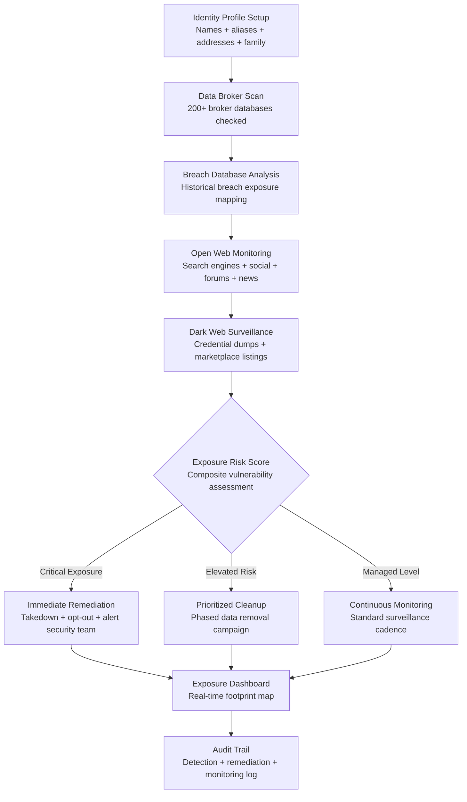

# Digital Footprint Monitor

Frankmax

NAICS 561611

> **High-Risk Individuals** — Personal Security Module

## Objective & Purpose

High-net-worth individuals, public figures, political operatives, and executives with threat profiles leave digital footprints across hundreds of systems they have never directly interacted with. Data brokers aggregate and sell personal information -- home addresses, family member names, financial indicators, travel patterns, vehicle registrations, and property records -- that is openly available to anyone willing to pay $50 for a background check. Data breaches compound the exposure: the average HNW individual's personal data has been compromised in 12-15 breaches across financial services, healthcare, hospitality, and consumer platforms. Each exposed data point is a potential attack vector for social engineering, identity theft, physical targeting, or reputational manipulation.

The Digital Footprint Monitor provides continuous, comprehensive monitoring of an individual's digital exposure across the open web, deep web, dark web, data broker databases, and breach databases. It maps every instance of personal data exposure -- name, addresses (current and historical), phone numbers, email addresses, family member information, financial indicators, and social media presence -- and computes an exposure risk score. The system does not merely detect exposure; it provides remediation workflows: data broker opt-out submissions, breach notification analysis, social media privacy hardening, and domain/email monitoring for impersonation attempts.

The value proposition is asymmetric: the cost of monitoring is trivial relative to the cost of a single identity theft incident ($50K-$500K), physical security breach enabled by address exposure, or reputational attack using leaked personal information. For individuals whose exposure creates risk not just for themselves but for their families, employees, and organizations, digital footprint management is not optional -- it is baseline operational security.

## Business Context

| Attribute | Value |
|---|---|
| **Business Process** | Online presence monitoring and exposure management |
| **Business Function** | Personal Security |
| **Category** | Security |
| **Target Audience** | 15. High-Risk Individuals |
| **Bundle** | Custom Personal Security Pack ($8,000-$15,000/mo) |
| **Monthly Cost of Inaction** | $50K-$500K (identity theft + physical security + reputational risk) |

## BPMN Workflow

## Features

1. **Comprehensive Data Broker Scanning** — Scans over 200 data broker and people-search databases (Spokeo, BeenVerified, Whitepages, Intelius, and similar) for the individual's personal data. Identifies every listing with its data completeness: name-only, name-plus-address, full profile with family members. Initiates automated opt-out requests for each detected listing.

2. **Breach Exposure Analysis** — Cross-references the individual's email addresses, phone numbers, and usernames against known breach databases (aggregating over 15 billion breach records). Identifies which credentials were exposed, in which breaches, and whether the exposed data has been observed in active exploitation.

3. **Dark Web Monitoring** — Continuously monitors dark web marketplaces, forums, and paste sites for the individual's personal data: credential listings, identity packages, financial data offerings, and targeted discussions. Alerts when the individual's data appears in active trading channels.

4. **Social Media Privacy Assessment** — Audits the individual's social media profiles (and family members' profiles, with consent) for privacy configuration weaknesses: public location sharing, tagged photos revealing habits, check-in patterns, and connection lists that expose the individual's network.

5. **Domain and Email Impersonation Detection** — Monitors for domain registrations similar to the individual's name, business, or personal brand. Detects lookalike domains, email impersonation attempts, and social media impersonation accounts that could be used for phishing or reputational damage.

6. **Automated Remediation Workflows** — Generates and submits data removal requests to data brokers, manages the follow-up cycle (many brokers require multiple requests), tracks removal confirmation, and re-scans to verify data was actually removed. Typical removal campaigns address 50-150 broker listings.

7. **Family and Household Extension** — Extends monitoring to family members and household staff whose exposure creates indirect risk for the primary individual. A spouse's unprotected social media or a child's location-sharing habits can compromise the entire family's security.

8. **Exposure Trend Reporting** — Tracks the individual's digital footprint over time: is exposure growing, stable, or shrinking? Identifies new exposure sources, evaluates remediation effectiveness, and benchmarks against baseline targets for acceptable exposure levels.

## Workflow & Automation

**Step 1: Identity Profile Construction** — Build a comprehensive identity profile: all names and aliases, current and historical addresses, phone numbers, email addresses, family member identifiers, and business affiliations. This profile defines the monitoring scope.

**Step 2: Initial Exposure Assessment** — The system performs a full-scope scan across all monitoring channels: data brokers, breach databases, open web, dark web, social media, and domain registrations. The initial assessment typically reveals 100-500 exposure points.

**Step 3: Risk Scoring and Prioritization** — Each exposure point is scored by risk: a home address on a data broker is higher risk than a name in a 10-year-old conference attendee list. Exposures are prioritized for remediation based on risk score and remediation feasibility.

**Step 4: Automated Remediation Launch** — Opt-out requests are submitted to all identified data brokers. Breach exposure is documented with credential change recommendations. Social media hardening recommendations are generated. Domain monitoring alerts are activated.

**Step 5: Remediation Tracking** — The system tracks each remediation request through completion: submission date, follow-up dates, confirmation status, and verification scan results. Brokers that do not comply are flagged for escalation (legal notice or regulatory complaint).

**Step 6: Continuous Monitoring** — After initial remediation, the system enters continuous monitoring mode: daily dark web scans, weekly data broker re-scans (data re-appears as brokers re-aggregate), monthly comprehensive exposure assessments, and real-time alerts for new breach inclusions.

## Input/Output Specifications

| Direction | Data | Format | Description |
|---|---|---|---|
| Input | Identity profile | JSON / UI (encrypted) | Names, addresses, emails, phones, family data |
| Input | Social media accounts | API / URL | Profiles to monitor for privacy configuration |
| Input | Domain watchlist | JSON / UI | Domains and brand names to protect |
| Input | Risk tolerance parameters | JSON / UI | Acceptable exposure thresholds by category |
| Output | Exposure dashboard | REST API / UI (encrypted) | Real-time digital footprint visualization |
| Output | Remediation status | JSON + UI | Opt-out request tracking and verification |
| Output | Threat alerts | Encrypted push / SMS / Email | New exposure detection notifications |
| Output | Audit trail | JSON (immutable, encrypted) | Complete monitoring and remediation history |

## Integration Points

| System | Integration Type | Data Flow |
|---|---|---|
| **Threat Intelligence Feed** | Outbound enrichment | Digital exposure data informs threat assessment |
| **Privacy Architecture Designer** | Bidirectional | Footprint data informs privacy design; privacy controls reduce footprint |
| **Media Narrative Tracker** | Outbound correlation | Digital exposure correlated with media mention patterns |
| **Legal Exposure Analyzer** | Outbound context | Digital exposure may create legal vulnerability |
| **Relationship Network Analyzer** | Inbound reference | Network data identifies family and associates for extended monitoring |
| **Dark web monitoring services** | Inbound API | Breach and marketplace data feeds |
| **Data broker APIs** | Bidirectional | Scan for exposure; submit removal requests |

## Pricing & Revenue Model

| Component | Pricing | Notes |
|---|---|---|
| **Personal Security Pack** | $8,000-$15,000/month | Includes Digital Footprint + Threat Intel + Travel Risk |
| **Standalone — Individual** | $2,500/month | Single individual, full monitoring and remediation |
| **Standalone — Family** | $5,000/month | Primary individual plus up to 5 family members |
| **Executive Protection Program** | Custom pricing | C-suite team, integrated with physical security |
| **Governance add-on** | +$1,500/month | Compliance documentation, regulatory reporting |

**Revenue model**: Digital Footprint Monitor is the entry point for the High-Risk Individual segment. The immediate value is measurable exposure reduction: from hundreds of data broker listings to near-zero. The ongoing value is continuous monitoring that prevents re-exposure. The "fries" attach through family extension, dark web premium monitoring, legal escalation support, and compliance documentation at 70-85% margin.

## NAICS/SIC Mapping

| NAICS Code | SIC Code | Industry | Relevance |
|---|---|---|---|
| 561611 | 7382 | Investigation Services | Personal digital investigation and monitoring |
| 561612 | 7382 | Security Guards and Patrol Services | Digital security monitoring extension |
| 561621 | 7382 | Security Systems Services | Digital security system implementation |
| 541512 | 7372 | Computer Systems Design Services | Cybersecurity system design |
| 541519 | 7379 | Other Computer Related Services | Digital privacy services |
| 519190 | 7379 | All Other Information Services | Personal information monitoring |
