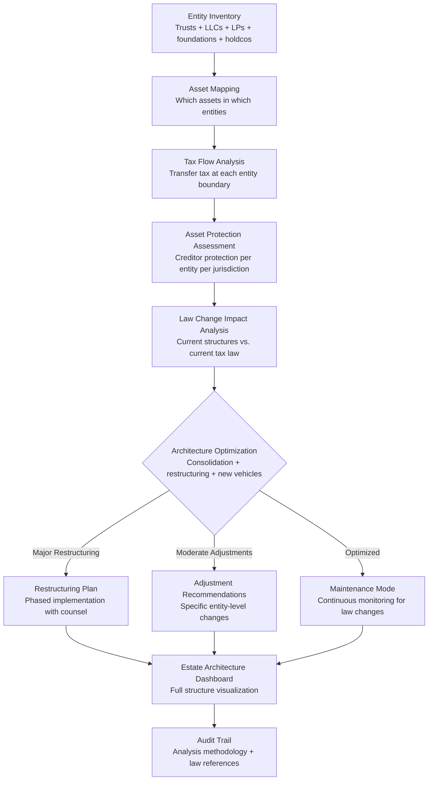

# Estate Architecture Optimizer

Frankmax

NAICS 525920

> **High-Risk Individuals** — Wealth Transfer Module

## Objective & Purpose

Estate planning for high-net-worth individuals is not a document -- it is an architecture. A typical HNW estate involves 10-50 legal entities (trusts, LLCs, LPs, foundations, holding companies) across multiple jurisdictions, each with different tax treatment, asset protection characteristics, governance structures, and compliance requirements. This architecture was typically built incrementally over decades: a trust created for asset protection in 2005, an LLC structured for a real estate portfolio in 2010, a foundation established for charitable giving in 2015, an international holding company for cross-border investments in 2020. Each structure was optimal at the time of creation, but the interactions between structures, the evolution of tax law, and changes in personal circumstances mean the overall architecture is almost certainly suboptimal today.

The Estate Architecture Optimizer models the individual's complete estate structure as an integrated system, not a collection of independent entities. It maps asset flows between entities, tax implications at each transfer point, asset protection characteristics of each structure, and the governance requirements across the full architecture. Then it identifies optimization opportunities: structures that could be consolidated, entities that are no longer tax-efficient due to law changes, asset protection gaps, and transfer pathways that minimize tax leakage across generations.

The tool does not replace estate attorneys or tax advisors -- it provides the analytical layer they need to make informed recommendations. Most estate planning firms optimize individual entities in isolation because they lack the tools to model the full architecture as a system. The Estate Architecture Optimizer provides that system-level view, enabling holistic optimization that is impossible with document-by-document review.

## Business Context

| Attribute | Value |
|---|---|
| **Business Process** | Estate planning and wealth transfer optimization |
| **Business Function** | Wealth Transfer |
| **Category** | Legal/Finance |
| **Target Audience** | 15. High-Risk Individuals |
| **Bundle** | Custom Personal Security Pack ($8,000-$15,000/mo) |
| **Monthly Cost of Inaction** | $200K-$5M (tax leakage + structural inefficiency + asset exposure) |

## BPMN Workflow

## Features

1. **Complete Entity Graph** — Maps every entity in the estate architecture: trusts (revocable, irrevocable, GRATs, QTIPs, dynasty), business entities (LLCs, LPs, C-corps, S-corps), charitable vehicles (foundations, DAFs, CRTs), and international structures (foreign trusts, holdcos, IBCs). Visualizes the ownership hierarchy and asset flow pathways.

2. **Multi-Jurisdiction Tax Modeling** — Computes the tax impact of asset transfers between entities across all relevant jurisdictions: federal estate tax, state estate and inheritance taxes, gift tax, generation-skipping transfer tax, and international tax treaties. Identifies transfer pathways that minimize aggregate tax leakage.

3. **Asset Protection Scoring** — Evaluates the creditor protection offered by each entity in the architecture, considering jurisdiction-specific law: domestic asset protection trusts, foreign trust protections, LLC charging order protection, and homestead exemptions. Identifies assets inadequately protected and structures providing less protection than assumed.

4. **Legislative Change Impact Analysis** — When tax law changes (estate tax exemption adjustments, trust taxation reforms, international reporting requirements), the system models the impact on the entire estate architecture. Shows which structures become more or less efficient under new law and recommends adaptations.

5. **Generation Transfer Optimization** — Models wealth transfer across generations: current to children, children to grandchildren, and beyond for dynasty trust structures. Optimizes the use of lifetime gift exemptions, annual exclusion gifts, GRAT annuity structures, and intentionally defective grantor trusts (IDGTs) to maximize transferred wealth.

6. **Charitable Planning Integration** — Models the interaction between charitable giving vehicles and the overall estate architecture: charitable remainder trust income streams, foundation minimum distribution requirements, donor-advised fund strategies, and the estate tax deduction impact of charitable bequests.

7. **Compliance Calendar** — Maintains all compliance requirements across the estate architecture: trust tax return filing deadlines, foundation distribution requirements, international reporting obligations (FBAR, Form 3520, FATCA), and state-specific registration requirements. Ensures no deadline is missed.

## Workflow & Automation

**Step 1: Architecture Documentation** — Catalog all entities with their formation documents, governing documents, asset holdings, and jurisdictional nexus. This typically requires coordination with the individual's attorney, CPA, and financial advisor.

**Step 2: Current State Analysis** — The system models the current estate architecture: entity graph, tax flow analysis, asset protection scoring, and compliance requirements. This produces the baseline against which optimizations are measured.

**Step 3: Optimization Analysis** — The system identifies optimization opportunities: entities that could be consolidated, structures that no longer serve their original purpose, transfer pathways with unnecessary tax friction, and asset protection gaps. Each opportunity is quantified in dollar terms.

**Step 4: Implementation Planning** — For approved optimizations, the system generates implementation plans: legal steps required, tax filings triggered, timing considerations (some restructurings are time-sensitive), and responsible counsel for each step.

**Step 5: Continuous Monitoring** — After optimization, the system monitors for changes requiring architecture adjustments: new tax legislation, court decisions affecting trust or entity law, changes in personal circumstances (marriage, divorce, births, deaths), and asset value changes that affect planning thresholds.

**Step 6: Annual Architecture Review** — Annually, the system generates a comprehensive architecture review: current structure assessment, optimization opportunities identified since last review, law change impacts, and compliance status. The review is formatted for discussion with the individual's advisory team.

## Input/Output Specifications

| Direction | Data | Format | Description |
|---|---|---|---|
| Input | Entity documents | PDF / JSON | Trust instruments, operating agreements, bylaws |
| Input | Asset inventories | JSON / CSV | Assets by entity with current values |
| Input | Tax returns | PDF / JSON | Prior year entity and individual tax returns |
| Input | Tax law databases | API | Federal and state tax code, regulations, rulings |
| Output | Architecture visualization | REST API / UI | Interactive entity graph with asset flows |
| Output | Optimization recommendations | PDF (encrypted) | Quantified restructuring opportunities |
| Output | Compliance calendar | JSON + UI | Filing deadlines with escalating reminders |
| Output | Audit trail | JSON (immutable, encrypted) | Analysis methodology, law references, optimization history |

## Integration Points

| System | Integration Type | Data Flow |
|---|---|---|
| **Legal Exposure Analyzer** | Bidirectional | Estate structure affects legal exposure; legal risks affect estate design |
| **Privacy Architecture Designer** | Outbound reference | Estate entity structures provide privacy layering |
| **Relationship Network Analyzer** | Inbound context | Family relationships define beneficiary structures |
| **Digital Footprint Monitor** | Inbound reference | Entity exposure in public records affects privacy |
| **Health Optimization Engine** | Inbound triggers | Health events may require estate architecture changes |
| **Tax preparation software** | Bidirectional API | Tax data import; filing requirement export |
| **Financial advisory platforms** | Inbound API | Asset valuation and investment data |

## Pricing & Revenue Model

| Component | Pricing | Notes |
|---|---|---|
| **Personal Security Pack** | $8,000-$15,000/month | Includes Estate Architecture + Legal Exposure + Privacy Design |
| **Standalone — Standard** | $4,000/month | Up to 20 entities, single jurisdiction focus |
| **Standalone — Complex** | $8,000/month | Unlimited entities, multi-jurisdiction, international structures |
| **Family Office Integration** | Custom pricing | Multi-generational, multi-family branch analysis |
| **Governance add-on** | +$2,000/month | Fiduciary compliance documentation, attorney coordination |

**Revenue model**: Estate Architecture Optimizer addresses the largest single financial optimization opportunity for HNW individuals: estate tax efficiency. The difference between an optimized and unoptimized estate architecture for a $50M+ estate routinely exceeds $5M-$20M in tax savings over two generations. The "fries" attach through legislative change monitoring, compliance calendar management, and fiduciary documentation at 70-85% margin.

## NAICS/SIC Mapping

| NAICS Code | SIC Code | Industry | Relevance |
|---|---|---|---|
| 525920 | 6726 | Trusts, Estates, and Agency Accounts | Estate structure management |
| 541110 | 8111 | Offices of Lawyers | Estate planning legal support |
| 541211 | 8721 | Offices of Certified Public Accountants | Estate tax planning |
| 541219 | 8721 | Other Accounting Services | Multi-entity tax coordination |
| 523920 | 6199 | Portfolio Management and Investment Advice | Wealth transfer advisory |
| 523991 | 6726 | Trust, Fiduciary, and Custody Activities | Fiduciary estate administration |
