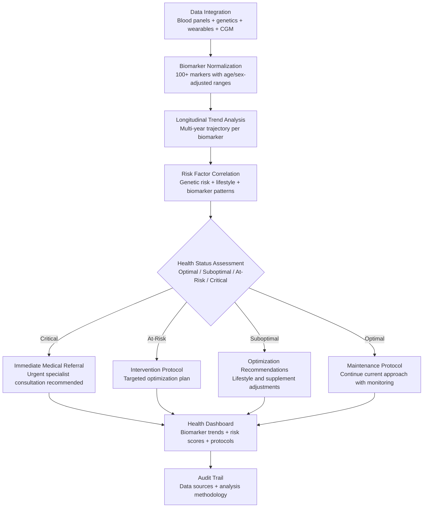

# Health Optimization Engine

Frankmax

NAICS 621999

> **High-Risk Individuals** — Health Module

## Objective & Purpose

The standard healthcare model is reactive: wait for symptoms, visit a doctor, treat the condition. For high-risk individuals whose cognitive function, physical capability, and longevity directly affect multi-million or multi-billion dollar outcomes, reactive healthcare is an unacceptable risk management strategy. A CEO's cardiac event affects not just their health but their company's stock price, succession planning, and deal pipeline. A principal investor's cognitive decline affects portfolio decisions worth hundreds of millions. Yet most HNW individuals manage their health with annual physicals that check a dozen basic biomarkers -- the medical equivalent of monitoring a nuclear plant with a thermometer.

The Health Optimization Engine integrates comprehensive biomarker data -- from advanced blood panels, genetic testing, continuous glucose monitors, wearable biometrics (HRV, sleep architecture, activity), cognitive performance testing, and specialist assessments -- into a unified health model. The system tracks over 100 biomarkers longitudinally, identifies trends before they become clinical conditions, and generates personalized optimization protocols: nutrition, exercise, sleep, supplementation, stress management, and screening recommendations calibrated to the individual's genetic profile, lifestyle, and risk factors.

The system bridges the gap between concierge medicine (which provides access) and health optimization (which provides intelligence). Most concierge physicians lack the data infrastructure to track 100+ biomarkers longitudinally and identify subtle trend changes. The Health Optimization Engine provides that infrastructure, ensuring the individual's medical team has the analytical foundation for truly proactive, personalized care.

## Business Context

| Attribute | Value |
|---|---|
| **Business Process** | Personal health management and optimization |
| **Business Function** | Health |
| **Category** | Wellness |
| **Target Audience** | 15. High-Risk Individuals |
| **Bundle** | Custom Personal Security Pack ($8,000-$15,000/mo) |
| **Monthly Cost of Inaction** | $100K-$10M+ (health-related productivity loss + succession risk) |

## BPMN Workflow

## Features

1. **Comprehensive Biomarker Tracking** — Integrates data from over 100 biomarkers: standard metabolic panels, advanced lipid profiles, inflammatory markers (hs-CRP, IL-6, TNF-alpha), hormonal panels, micronutrient levels, genetic risk scores (APOE, MTHFR, BRCA), continuous glucose monitoring, and organ-specific markers (liver, kidney, thyroid, cardiac).

2. **Longitudinal Trend Detection** — Tracks each biomarker over time, identifying trends that are clinically insignificant in a single test but meaningful longitudinally. A fasting glucose increasing from 85 to 95 to 102 over three years is within "normal range" each time but represents a clear trajectory toward insulin resistance.

3. **Genetic Risk Integration** — Incorporates genetic testing data to personalize risk assessment and optimization protocols. Genetic variants affecting drug metabolism, disease risk, nutrient requirements, and exercise response are factored into every recommendation.

4. **Wearable Biometric Analysis** — Integrates continuous data from wearable devices: heart rate variability (HRV) trends, sleep architecture (deep sleep, REM, latency), resting heart rate trajectory, activity levels, and stress indicators. Wearable data provides daily health intelligence between periodic lab tests.

5. **Personalized Optimization Protocols** — Generates evidence-based optimization protocols across five domains: nutrition (macro/micronutrient targets based on biomarkers and genetics), exercise (type, intensity, and frequency based on fitness markers and goals), sleep (hygiene protocols based on sleep data), supplementation (targeted based on deficiency and genetic data), and stress management (based on HRV and cortisol patterns).

6. **Medical Team Coordination** — Formats health data and analysis for consumption by the individual's medical team: concierge physician, specialists, and integrative medicine practitioners. Ensures all providers have access to the same comprehensive data, preventing the fragmented care that results from siloed medical relationships.

7. **Screening Schedule Optimizer** — Based on age, sex, genetic risk, and biomarker trends, generates a personalized screening schedule: when to get specific tests, which advanced screenings are warranted (coronary calcium score, full-body MRI, cognitive baseline testing), and which routine screenings can be skipped or delayed.

## Workflow & Automation

**Step 1: Health Data Integration** — Connect all health data sources: lab testing portals (Quest, LabCorp, specialty labs), genetic testing results (23andMe, Nebula, clinical whole genome), wearable devices (Oura, Whoop, Apple Watch, CGM), and medical records (patient portals, specialist reports).

**Step 2: Baseline Assessment** — The system establishes a comprehensive health baseline from all available data. Missing data categories are identified, and testing recommendations are generated to fill gaps. The baseline typically requires 2-4 weeks to compile.

**Step 3: Risk Profiling** — Genetic risk factors are combined with biomarker data and lifestyle factors to produce personalized risk profiles for major health categories: cardiovascular, metabolic, neurological, oncological, and musculoskeletal. Each risk category includes current status, trajectory, and modifiable factors.

**Step 4: Protocol Generation** — Based on risk profiles and current biomarker status, the system generates personalized optimization protocols. Protocols are specific and actionable: not "exercise more" but "30 minutes of zone 2 cardio 4x/week with 2 strength sessions targeting compound movements, based on your HRV recovery patterns."

**Step 5: Continuous Monitoring** — Wearable data is analyzed daily. Lab results are integrated as they arrive. The system tracks adherence to protocols (when self-reported or measurable through wearables) and adjusts recommendations based on response.

**Step 6: Quarterly Health Review** — Every 90 days, the system generates a comprehensive health review: biomarker trend analysis, protocol effectiveness assessment, updated risk profiles, and adjusted recommendations. The review is formatted for discussion with the individual's physician.

## Input/Output Specifications

| Direction | Data | Format | Description |
|---|---|---|---|
| Input | Lab results | API (lab portals) / PDF / CSV | Blood panels, metabolic markers, specialty tests |
| Input | Genetic data | VCF / JSON | Genetic variant data from testing providers |
| Input | Wearable biometrics | API (Oura / Whoop / Apple Health) | HRV, sleep, activity, heart rate, CGM |
| Input | Medical records | API (patient portals) / PDF | Physician notes, specialist reports, imaging |
| Output | Health dashboard | REST API / UI (encrypted) | Biomarker trends, risk scores, protocol adherence |
| Output | Optimization protocols | PDF (encrypted) / App | Personalized nutrition, exercise, sleep, supplement plans |
| Output | Physician reports | PDF (encrypted) | Quarterly health review for medical team |
| Output | Audit trail | JSON (immutable, encrypted) | Data sources, analysis methodology, protocol rationale |

## Integration Points

| System | Integration Type | Data Flow |
|---|---|---|
| **Travel Risk Advisor** | Bidirectional | Health data informs medical planning for travel; travel affects health protocols |
| **Personal Operating System (if applicable)** | Outbound feed | Health recommendations integrated into daily scheduling |
| **Estate Architecture Optimizer** | Outbound triggers | Health events may require estate architecture changes |
| **Legacy Memoir Engine** | Outbound context | Health trajectory informs legacy planning urgency |
| **Oura / Whoop / Apple Health** | Inbound API | Continuous biometric data |
| **Lab testing portals** | Inbound API | Lab result integration |
| **Concierge medical platforms** | Bidirectional API | Medical record sharing and appointment coordination |

## Pricing & Revenue Model

| Component | Pricing | Notes |
|---|---|---|
| **Personal Security Pack** | $8,000-$15,000/month | Includes Health Optimization + Travel Risk + other tools |
| **Standalone — Standard** | $3,000/month | 50+ biomarkers tracked, quarterly review |
| **Standalone — Comprehensive** | $6,000/month | 100+ biomarkers, genetic integration, weekly insights |
| **Family Program** | Custom pricing | Multi-family member health tracking and optimization |
| **Governance add-on** | +$1,000/month | HIPAA-compliant documentation, insurance coordination |

**Revenue model**: Health Optimization Engine targets the most personal and highest-stakes category for HNW individuals: their health and longevity. The economic value of extending productive years for an individual managing $100M+ in assets is measured in the tens of millions. The "fries" attach through genetic integration, specialist coordination, and advanced screening scheduling at 70-85% margin.

## NAICS/SIC Mapping

| NAICS Code | SIC Code | Industry | Relevance |
|---|---|---|---|
| 621999 | 8099 | All Other Miscellaneous Ambulatory Health Care | Personal health optimization services |
| 621991 | 8099 | Blood and Organ Banks | Advanced biomarker testing services |
| 621610 | 8049 | Home Health Care Services | Personalized health monitoring |
| 541711 | 8731 | Research and Development in Biotechnology | Genetic and biomarker research application |
| 541714 | 8734 | Research and Development in Physical Sciences | Health data analytics |
| 621511 | 8071 | Medical Laboratories | Laboratory data integration |
