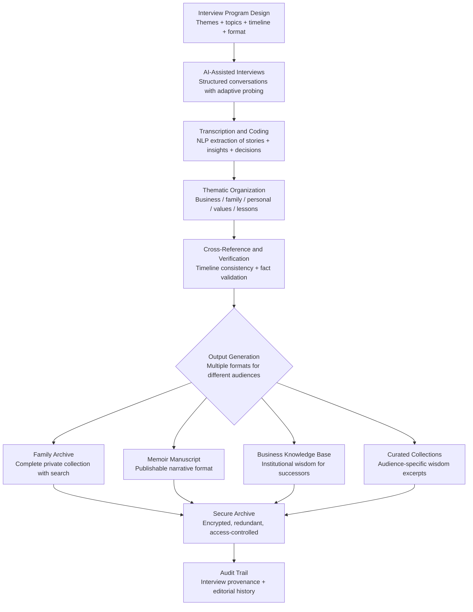

# Legacy & Memoir Engine

Frankmax

NAICS 519190

> **High-Risk Individuals** — Knowledge/Heritage Module

## Objective & Purpose

Every high-profile individual carries irreplaceable knowledge: the decision-making frameworks that built a business empire, the relationship patterns that navigated political landscapes, the lessons from failures that were never publicly discussed, and the personal stories that define a family's identity across generations. This knowledge exists almost entirely in the individual's memory, vulnerable to the biological reality that memory degrades and individuals are mortal. When a patriarch, matriarch, founder, or leader dies, decades of institutional knowledge, personal wisdom, and family history die with them.

The Legacy & Memoir Engine captures, structures, preserves, and makes accessible the individual's accumulated knowledge and life story. It conducts AI-assisted narrative interviews, extracts structured insights from conversations, organizes material into thematic archives, and produces multiple output formats: private family archives, publishable memoir manuscripts, institutional knowledge bases for businesses, and curated wisdom collections for specific audiences (children, grandchildren, business successors, charitable foundations).

This is not a ghostwriting service. The engine preserves the individual's authentic voice, decision-making patterns, and lived experience in a format that can be accessed, searched, and built upon by future generations. It converts ephemeral memory into durable, structured knowledge. For families managing multi-generational wealth, the cultural and value framework preserved by the Legacy Engine is often more valuable than the financial inheritance itself -- it provides the context and wisdom that enables the next generation to steward wealth responsibly rather than dissipate it.

## Business Context

| Attribute | Value |
|---|---|
| **Business Process** | Legacy documentation and knowledge preservation |
| **Business Function** | Knowledge/Heritage |
| **Category** | Archive |
| **Target Audience** | 15. High-Risk Individuals |
| **Bundle** | Custom Personal Security Pack ($8,000-$15,000/mo) |
| **Monthly Cost of Inaction** | Irreplaceable (knowledge lost permanently upon incapacity or death) |

## BPMN Workflow

## Features

1. **Structured Interview Program** — Designs a comprehensive interview program covering all dimensions of the individual's life: early life and formation, education and mentorship, career decisions and turning points, business building and leadership, family and relationships, values and philosophy, failures and lessons, and future hopes and concerns. The program spans 20-50 sessions over 6-18 months.

2. **AI-Assisted Narrative Interviewing** — During each session, AI assists the interviewer with adaptive follow-up probes: when the individual mentions a pivotal decision, the system prompts for the decision framework used; when a key relationship is mentioned, it probes for the dynamics and lessons; when a failure is described, it explores what was learned and how behavior changed.

3. **Multi-Format Output Generation** — Produces multiple output formats from the same source material: a complete private archive (searchable, indexed, multimedia), a publishable memoir manuscript (narrative structure, edited prose), a business knowledge base (decision frameworks, institutional memory, successor guidance), and curated collections (letters to grandchildren, foundation values statements, leadership principles).

4. **Voice and Authenticity Preservation** — The system is calibrated to preserve the individual's authentic voice: vocabulary, cadence, humor, regional expressions, and storytelling style. Output reads as the individual speaking, not as a ghostwriter's interpretation.

5. **Timeline and Fact Verification** — Cross-references stories against public records, news archives, and other interviews to build a verified timeline. Identifies discrepancies (common in decades-old memories) and presents them for the individual's resolution, ensuring the archive is as factually accurate as memory permits.

6. **Multimedia Integration** — Incorporates photographs, documents, audio recordings, video footage, and artifacts into the digital archive. Each media item is tagged, contextualized, and linked to relevant narrative sections, creating a rich multimedia heritage collection.

7. **Access Control and Distribution** — Implements granular access controls: some material is for family only, some for business successors, some for public publication, and some is embargoed until after the individual's death. Distribution rules are configurable and enforceable through the archive platform.

8. **Living Document Updates** — The archive is not a one-time project. It is designed for ongoing updates: new stories, revised perspectives, additional interviews, and evolving family context. The individual can add to their legacy throughout their lifetime.

## Workflow & Automation

**Step 1: Program Design** — Collaborate with the individual to design the interview program: which life dimensions to cover, preferred session format (in-person, video, audio), session frequency and duration, and timeline for completion. The program is structured to cover the most important material first.

**Step 2: Interview Execution** — Sessions are conducted on the agreed schedule. Each session is recorded (audio and/or video), transcribed in real-time, and coded for thematic content. The AI assists with follow-up probes and gap identification.

**Step 3: Content Processing** — After each session, transcripts are processed: key stories are extracted, insights are coded, timeline events are mapped, and connections to prior sessions are identified. The individual reviews processed content for accuracy and comfort.

**Step 4: Archive Assembly** — As material accumulates, the archive takes shape: thematic sections fill in, the timeline becomes comprehensive, and cross-references emerge between different life dimensions. The system identifies gaps in coverage and recommends additional session topics.

**Step 5: Output Production** — Once sufficient material is captured, output formats are produced. Memoir manuscripts go through editorial cycles with the individual's review at each stage. Business knowledge bases are structured for successor consumption. Family archives are organized for multi-generational access.

**Step 6: Ongoing Maintenance** — The archive remains active for updates: new interviews, revised content, additional media, and evolving access controls. The system prompts for periodic updates on an annual or semi-annual basis.

## Input/Output Specifications

| Direction | Data | Format | Description |
|---|---|---|---|
| Input | Interview recordings | Audio / Video | Session recordings for transcription and analysis |
| Input | Historical documents | PDF / Image | Photographs, letters, business documents, awards |
| Input | Timeline reference data | JSON / CSV | Dates, events, relationships for cross-referencing |
| Input | Access control rules | JSON / UI | Distribution and embargo rules by audience |
| Output | Private family archive | Encrypted web platform | Searchable, indexed, multimedia heritage collection |
| Output | Memoir manuscript | DOCX / PDF | Publication-ready narrative with editorial notes |
| Output | Business knowledge base | JSON + UI | Structured institutional wisdom for successors |
| Output | Audit trail | JSON (immutable, encrypted) | Interview provenance, editorial history, access log |

## Integration Points

| System | Integration Type | Data Flow |
|---|---|---|
| **Estate Architecture Optimizer** | Inbound context | Estate structure informs distribution and inheritance of legacy materials |
| **Relationship Network Analyzer** | Inbound reference | Network data identifies key relationships to explore in interviews |
| **Health Optimization Engine** | Inbound triggers | Health trajectory may accelerate legacy capture urgency |
| **Privacy Architecture Designer** | Outbound constraint | Privacy requirements constrain publication and distribution options |
| **Media Narrative Tracker** | Outbound reference | Public narrative may inform which stories need private correction in archive |
| **Secure cloud storage** | Outbound integration | Encrypted, redundant archive storage |
| **Publishing platforms** | Outbound integration | Memoir manuscript production and distribution |

## Pricing & Revenue Model

| Component | Pricing | Notes |
|---|---|---|
| **Personal Security Pack** | $8,000-$15,000/month | Includes Legacy Engine + Health Optimization + other tools |
| **Standalone — Interview Program** | $5,000/month (12-month minimum) | 20-session program with archive and one output format |
| **Standalone — Comprehensive** | $10,000/month | 50-session program, all output formats, multimedia integration |
| **Family Heritage Program** | Custom pricing | Multi-generational, multi-principal capture and integration |
| **Governance add-on** | +$2,000/month | Legal access control framework, estate integration |

**Revenue model**: Legacy & Memoir Engine addresses the one asset category that cannot be recovered after loss: personal knowledge and family heritage. The irreversibility of knowledge loss creates urgency that increases with the individual's age and health status. The "fries" attach through multimedia production, multiple output formats, ongoing updates, and family heritage program management at 65-80% margin. This tool has the longest customer lifetime in the portfolio -- a legacy program can run for 5-15 years.

## NAICS/SIC Mapping

| NAICS Code | SIC Code | Industry | Relevance |
|---|---|---|---|
| 519190 | 7379 | All Other Information Services | Knowledge preservation and archiving |
| 711510 | 7922 | Independent Artists, Writers, and Performers | Memoir and narrative production |
| 519130 | 7375 | Internet Publishing and Broadcasting | Digital archive publishing |
| 541810 | 7311 | Advertising Agencies | Narrative and brand storytelling |
| 519120 | 7374 | Libraries and Archives | Personal and family archive management |
| 541430 | 7336 | Graphic Design Services | Multimedia archive design and production |
