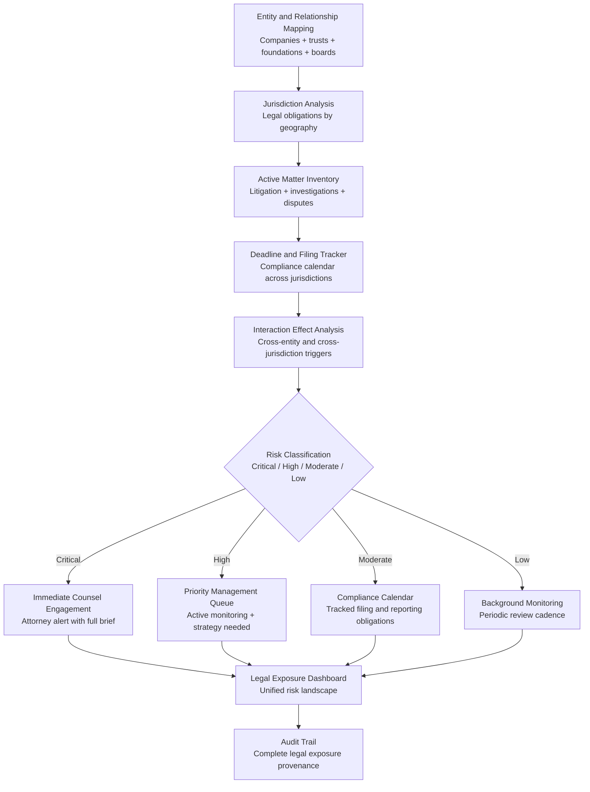

# Legal Exposure Analyzer

Frankmax

NAICS 561611

> **High-Risk Individuals** — Legal Affairs Module

## Objective & Purpose

High-net-worth and high-profile individuals carry legal exposure across multiple jurisdictions, entity structures, business relationships, and personal activities -- often without a unified view of their aggregate risk. A real estate portfolio in three states creates tax exposure in three jurisdictions. A board seat at a publicly traded company creates SEC filing obligations and insider trading restrictions. A charitable foundation creates fiduciary duties and regulatory compliance requirements. An offshore holding company creates international tax reporting obligations. Each exposure exists in isolation within a different attorney's file; no single system integrates the full picture.

The Legal Exposure Analyzer aggregates and maps the individual's complete legal exposure landscape across all jurisdictions, entities, relationships, and activities. It identifies active litigation, regulatory investigations, contractual obligations with exposure implications, filing deadlines, compliance requirements, and potential future liabilities. The system produces a unified risk map that shows not just current legal exposure but the interaction effects between different exposure types: how a regulatory investigation in one entity could trigger disclosure obligations in another, or how a personal legal matter could create liability for an affiliated business.

For individuals with complex affairs, the analyzer serves as the integration layer between multiple law firms, jurisdictions, and legal domains. It ensures nothing falls through the cracks -- a missed filing deadline, an overlooked disclosure obligation, or an unreported beneficial ownership change -- that could transform a manageable legal matter into a crisis.

## Business Context

| Attribute | Value |
|---|---|
| **Business Process** | Legal risk assessment and exposure management |
| **Business Function** | Legal Affairs |
| **Category** | Legal |
| **Target Audience** | 15. High-Risk Individuals |
| **Bundle** | Custom Personal Security Pack ($8,000-$15,000/mo) |
| **Monthly Cost of Inaction** | $100K-$5M (unmanaged legal exposure + missed deadlines) |

## BPMN Workflow

## Features

1. **Multi-Entity Legal Map** — Maps every legal entity the individual controls, directs, or has beneficial interest in: corporations, LLCs, trusts, foundations, partnerships, and international structures. For each entity, identifies the jurisdictions of formation, operation, and tax obligation, creating a comprehensive legal entity graph.

2. **Active Matter Tracking** — Inventories all active legal matters: pending litigation (plaintiff and defendant), regulatory investigations, arbitration proceedings, contract disputes, and family law matters. Each matter is tracked with status, next action, deadline, estimated exposure, and responsible counsel.

3. **Cross-Jurisdiction Compliance Calendar** — Maintains a unified calendar of filing deadlines, reporting obligations, and compliance requirements across all jurisdictions and entities. Alerts fire with sufficient lead time for counsel preparation. Deadline misses are prevented through escalating reminder workflows.

4. **Interaction Effect Detection** — Identifies how legal matters in one domain or entity could trigger obligations or exposure in another. A lawsuit against a business entity may trigger D&O insurance obligations, SEC disclosure requirements, or trust reporting obligations. The system maps these cascading effects.

5. **Regulatory Monitoring** — Tracks regulatory changes that affect the individual's legal obligations: new reporting requirements, changed filing thresholds, evolving enforcement priorities, and sanctions list updates. Ensures the individual's compliance posture adapts to changing regulatory landscapes.

6. **Statute of Limitations Tracking** — Monitors statute of limitations for potential claims both by and against the individual. Identifies windows for filing claims that may otherwise expire and monitors exposure to claims that are approaching their filing deadlines.

7. **Attorney Coordination Layer** — Provides a unified view across multiple law firms working on different matters. Identifies when matters being handled by different firms interact, preventing the common problem of one firm's strategy creating unintended consequences for another firm's matter.

## Workflow & Automation

**Step 1: Entity and Relationship Inventory** — Catalog all legal entities, board positions, trust relationships, foundation roles, and business affiliations. This inventory defines the scope of legal exposure to monitor.

**Step 2: Jurisdiction Mapping** — For each entity and relationship, identify all relevant jurisdictions and their specific legal obligations: tax filings, regulatory reports, beneficial ownership disclosures, and compliance certifications.

**Step 3: Active Matter Integration** — Catalog all active legal matters with status, exposure estimates, and responsible counsel. The system begins tracking deadlines, next actions, and escalation triggers.

**Step 4: Cross-Reference Analysis** — The system analyzes interactions between entities, jurisdictions, and matters. It identifies cascade risks: situations where an action or outcome in one domain triggers obligations or exposure in another.

**Step 5: Continuous Monitoring** — Regulatory changes, new filings (court records, SEC filings, UCC filings), and news about counterparties are monitored continuously. New exposures are classified and added to the risk map.

**Step 6: Periodic Risk Review** — Monthly, the system generates a comprehensive legal exposure summary: active matters, upcoming deadlines, new risks identified, and recommended actions. The summary is formatted for review with primary counsel.

## Input/Output Specifications

| Direction | Data | Format | Description |
|---|---|---|---|
| Input | Entity documents | PDF / JSON | Formation documents, operating agreements, trust instruments |
| Input | Active matter files | PDF / JSON | Litigation status, investigation details, contract disputes |
| Input | Regulatory databases | API | Filing requirements, enforcement actions, sanctions lists |
| Input | Court records | API / Database | Case filings, docket entries, judgment records |
| Output | Legal exposure dashboard | REST API / UI (encrypted) | Unified risk landscape visualization |
| Output | Compliance calendar | JSON + UI | Filing deadlines with escalating reminders |
| Output | Risk assessment reports | PDF (encrypted) | Monthly legal exposure summary |
| Output | Audit trail | JSON (immutable, encrypted) | Complete legal exposure tracking history |

## Integration Points

| System | Integration Type | Data Flow |
|---|---|---|
| **Estate Architecture Optimizer** | Bidirectional | Estate structure affects legal exposure; legal exposure affects estate design |
| **Digital Footprint Monitor** | Inbound context | Digital exposure may create legal vulnerability |
| **Threat Intelligence Feed** | Inbound reference | Threats with legal dimensions feed exposure analysis |
| **Media Narrative Tracker** | Inbound context | Media narratives may foreshadow legal actions |
| **Relationship Network Analyzer** | Outbound enrichment | Legal exposure informs relationship risk assessment |
| **Court record databases** | Inbound API | Real-time case filing and docket monitoring |
| **Regulatory databases** | Inbound API | Filing requirement and enforcement data |

## Pricing & Revenue Model

| Component | Pricing | Notes |
|---|---|---|
| **Personal Security Pack** | $8,000-$15,000/month | Includes Legal Exposure + Estate Architecture + Privacy Design |
| **Standalone — Individual** | $3,500/month | Single individual, full jurisdictional coverage |
| **Standalone — Complex Affairs** | $7,000/month | Multi-entity, international jurisdictions, attorney coordination |
| **Family Office Integration** | Custom pricing | Family-wide legal exposure management |
| **Governance add-on** | +$2,000/month | Attorney privilege management, compliance certification |

**Revenue model**: Legal Exposure Analyzer prevents the most expensive category of personal risk for HNW individuals: unmanaged legal exposure. A single missed filing deadline can trigger penalties ranging from $10K to $1M+. The "fries" attach through attorney coordination, regulatory monitoring, and compliance certification at 70-85% margin.

## NAICS/SIC Mapping

| NAICS Code | SIC Code | Industry | Relevance |
|---|---|---|---|
| 561611 | 7382 | Investigation Services | Legal exposure investigation |
| 541110 | 8111 | Offices of Lawyers | Legal risk assessment support |
| 541199 | 8111 | All Other Legal Services | Multi-jurisdictional compliance |
| 541211 | 8721 | Offices of Certified Public Accountants | Tax exposure coordination |
| 523920 | 6199 | Portfolio Management and Investment Advice | Investment-related legal exposure |
| 525920 | 6726 | Trusts, Estates, and Agency Accounts | Fiduciary legal obligations |
