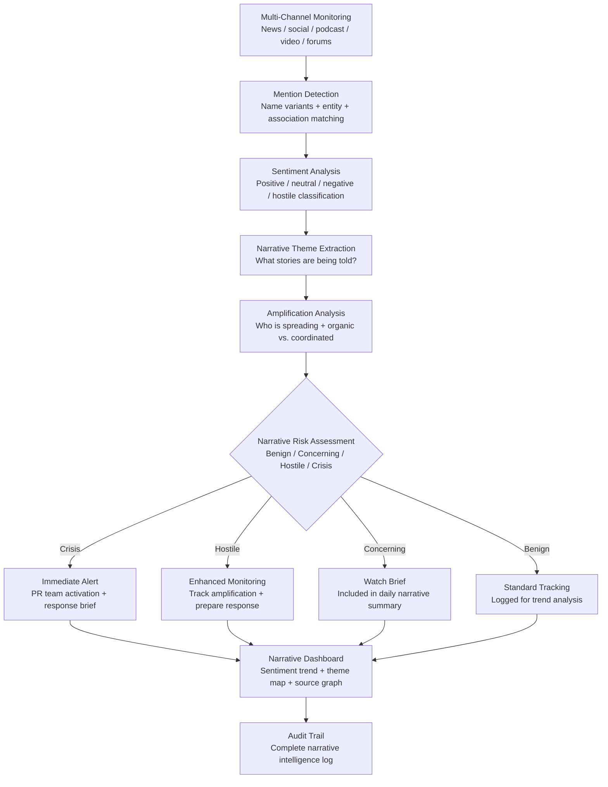

# Media Narrative Tracker

Frankmax

NAICS 561611

> **High-Risk Individuals** — Communications Module

## Objective & Purpose

Reputation destruction in the digital age operates on a timeline measured in hours, not weeks. A single viral social media post, an investigative article, or a coordinated narrative attack can fundamentally alter public perception before the subject is even aware it is happening. For high-profile individuals -- executives, political figures, public investors, and family office principals -- reputational damage translates directly to financial consequences: stock price impact, deal collapse, board removal, regulatory scrutiny, and litigation. The cost of reputational recovery, when recovery is possible, typically exceeds 10x the cost of proactive monitoring.

The Media Narrative Tracker provides continuous monitoring of how an individual is discussed across all media channels: mainstream news, digital news, social media platforms, podcasts, video platforms, blogs, forums, and comment sections. Beyond simple mention monitoring, the system performs narrative analysis: what themes are being associated with the individual, how sentiment is trending, which narratives are gaining traction, who is amplifying negative narratives, and where coordinated attacks originate. The system distinguishes between organic criticism (genuine public sentiment) and manufactured narratives (coordinated campaigns designed to damage reputation).

The strategic value is early detection and response window creation. When a negative narrative begins to form -- before it reaches mainstream media, before it trends on social platforms, before it becomes the dominant association with the individual's name -- there is a window of opportunity for response, correction, or counter-narrative. The Media Narrative Tracker is designed to detect narratives in their formation stage and provide the intelligence needed for effective response.

## Business Context

| Attribute | Value |
|---|---|
| **Business Process** | Reputation monitoring and narrative management |
| **Business Function** | Communications |
| **Category** | PR |
| **Target Audience** | 15. High-Risk Individuals |
| **Bundle** | Custom Personal Security Pack ($8,000-$15,000/mo) |
| **Monthly Cost of Inaction** | $500K-$50M (reputational damage + financial consequences) |

## BPMN Workflow

## Features

1. **Comprehensive Multi-Channel Monitoring** — Monitors mentions across all significant media channels: AP/Reuters/wire services, national and local news outlets, industry publications, social media platforms (X, LinkedIn, Facebook, Instagram, TikTok, Reddit), podcasts (transcript analysis), YouTube, blogs, forums, and comment sections on major publications.

2. **Advanced Sentiment Analysis** — Goes beyond binary positive/negative classification to measure sentiment intensity, sarcasm detection, implicit criticism, and evolving tone across conversation threads. Tracks sentiment trajectory: is coverage becoming more or less hostile over time?

3. **Narrative Theme Mapping** — Identifies the specific narratives being constructed around the individual: "CEO enriched at expense of employees," "political donor with controversial ties," "family wealth built on questionable practices." Themes are tracked across sources to show narrative formation and propagation.

4. **Coordination Detection** — Distinguishes between organic public sentiment and coordinated narrative attacks. Analyzes timing patterns, cross-platform coordination, bot amplification, and source network analysis to identify manufactured campaigns. Coordination detection provides the evidence base for platform takedown requests and legal action.

5. **Influencer and Amplifier Mapping** — Identifies who is creating and amplifying narratives about the individual: journalists, activists, competitors, disgruntled employees, political opponents, or anonymous accounts. Maps the influence network to understand narrative propagation paths.

6. **Response Strategy Engine** — When a concerning or hostile narrative is detected, the system generates response strategy options: ignore (narrative will not reach critical mass), correct (factual error that can be addressed), counter-narrative (proactive positive messaging), legal response (defamatory content requiring takedown), or direct engagement (appropriate for specific platforms).

7. **Historical Narrative Archive** — Maintains a complete archive of all narratives about the individual over time. Enables pattern analysis: seasonal reputation cycles, recurring attack vectors, and the long-term effectiveness of different response strategies.

## Workflow & Automation

**Step 1: Monitoring Profile Setup** — Define monitoring parameters: all name variants, associated entities, key topics, and known adversaries. Configure alert thresholds for different narrative risk levels.

**Step 2: Baseline Establishment** — The system establishes a baseline of normal mention volume, sentiment distribution, and narrative themes over the first 2-4 weeks. This baseline enables anomaly detection for emerging narratives.

**Step 3: Continuous Monitoring** — Media channels are monitored continuously with mentions processed through the full analysis pipeline: detection, sentiment, theme extraction, amplification analysis, and risk classification. Processing latency is under 15 minutes for most channels.

**Step 4: Alert and Brief Generation** — Crisis-level narratives trigger immediate alerts with response briefs. Hostile narratives generate enhanced monitoring reports. Daily narrative summaries are generated for routine review.

**Step 5: Response Coordination** — When a response is warranted, the system provides the intelligence foundation: narrative origin, propagation path, key amplifiers, factual basis (or lack thereof), and recommended response strategy. Response execution involves the individual's PR team or counsel.

**Step 6: Effectiveness Tracking** — After response actions, the system tracks narrative trajectory to evaluate response effectiveness: did sentiment improve, did amplification slow, did the narrative lose traction? Results inform future response strategy.

## Input/Output Specifications

| Direction | Data | Format | Description |
|---|---|---|---|
| Input | Individual profile | JSON / UI | Name variants, entities, topics, adversaries |
| Input | News and media feeds | API / RSS | Multi-source media content streams |
| Input | Social media data | API (platform-specific) | Posts, comments, shares, engagement metrics |
| Input | Response actions | JSON / Manual | PR responses, legal actions, platform reports |
| Output | Narrative dashboard | REST API / UI (encrypted) | Sentiment trends, theme maps, source graphs |
| Output | Alert notifications | Encrypted push / SMS / Email | Crisis and hostile narrative alerts |
| Output | Response strategy briefs | PDF (encrypted) | Recommended response with supporting intelligence |
| Output | Audit trail | JSON (immutable, encrypted) | Complete media intelligence and response history |

## Integration Points

| System | Integration Type | Data Flow |
|---|---|---|
| **Digital Footprint Monitor** | Inbound correlation | Digital exposure data enriches narrative source analysis |
| **Threat Intelligence Feed** | Bidirectional | Hostile narratives may indicate threat escalation; threats may generate media |
| **Legal Exposure Analyzer** | Outbound feed | Defamatory narratives feed legal action assessment |
| **Relationship Network Analyzer** | Inbound context | Network data identifies narrative sources and amplifiers |
| **Privacy Architecture Designer** | Outbound triggers | Media exposure may require privacy posture changes |
| **News aggregation APIs** | Inbound API | Real-time news content feeds |
| **Social media APIs** | Inbound API | Platform-specific mention and engagement data |

## Pricing & Revenue Model

| Component | Pricing | Notes |
|---|---|---|
| **Personal Security Pack** | $8,000-$15,000/month | Includes Media Narrative + Digital Footprint + Threat Intel |
| **Standalone — Standard** | $3,000/month | Full monitoring, daily briefs, basic response support |
| **Standalone — Crisis-Ready** | $6,000/month | Enhanced monitoring, coordination detection, response strategy |
| **Corporate Executive Program** | Custom pricing | Multi-executive, corporate brand integration |
| **Governance add-on** | +$1,500/month | Legal documentation for defamation, compliance reporting |

**Revenue model**: Media Narrative Tracker addresses the most expensive intangible risk for high-profile individuals: reputation. The cost of a single reputational crisis (stock impact, deal loss, legal defense) routinely exceeds $1M-$50M. Proactive monitoring at $8K-$15K/month is rounding error in the insurance analogy. The "fries" attach through coordination detection, response strategy, and legal documentation at 70-85% margin.

## NAICS/SIC Mapping

| NAICS Code | SIC Code | Industry | Relevance |
|---|---|---|---|
| 561611 | 7382 | Investigation Services | Media and narrative investigation |
| 541820 | 7311 | Public Relations Agencies | Reputation management support |
| 541910 | 7323 | Marketing Research and Public Opinion Polling | Sentiment and opinion analysis |
| 519130 | 7375 | Internet Publishing and Broadcasting | Digital media monitoring |
| 541519 | 7379 | Other Computer Related Services | AI-driven media analysis |
| 519190 | 7379 | All Other Information Services | Information monitoring and intelligence |
