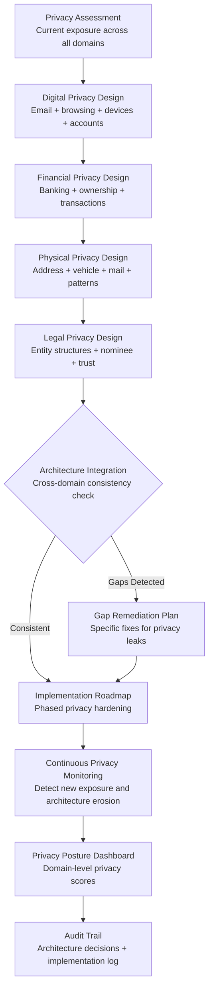

# Privacy Architecture Designer

Frankmax

NAICS 561611

> **High-Risk Individuals** — Privacy Module

## Objective & Purpose

Privacy for high-risk individuals is not a setting to toggle -- it is an architecture to design, build, and maintain. Every digital interaction, financial transaction, property purchase, vehicle registration, corporate filing, and travel booking creates data that can be aggregated to build a comprehensive profile of the individual's life: where they live, how they travel, what they own, who they associate with, and what their daily patterns look like. This aggregated profile is available to adversaries, journalists, litigants, and stalkers through a combination of public records, data broker databases, and digital tracking.

The Privacy Architecture Designer creates a comprehensive privacy framework across all domains of the individual's life: digital (email, browsing, device management, social media), financial (banking, investments, property ownership), physical (residential address protection, vehicle registration, mail handling), and legal (entity structuring for privacy, trust-based ownership, nominee services). The system designs layered privacy defenses where no single layer must be perfect because multiple layers provide redundant protection.

The architectural approach is critical because privacy measures that are not coordinated can create gaps or even contradict each other. Using a privacy-focused email service but registering it with a public domain defeats the purpose. Owning property through an LLC but listing that LLC at a personal address creates a traceable path. Filing for a data broker removal but keeping the same public voter registration exposes the same address through a different channel. The Privacy Architecture Designer ensures all privacy measures work together as a coherent system.

## Business Context

| Attribute | Value |
|---|---|
| **Business Process** | Personal data protection and privacy management |
| **Business Function** | Privacy |
| **Category** | Security |
| **Target Audience** | 15. High-Risk Individuals |
| **Bundle** | Custom Personal Security Pack ($8,000-$15,000/mo) |
| **Monthly Cost of Inaction** | $50K-$500K (privacy breach enabling physical or financial attack) |

## BPMN Workflow

## Features

1. **Four-Domain Privacy Assessment** — Evaluates the individual's current privacy posture across four domains: digital (email providers, device security, browser fingerprinting, account proliferation), financial (bank account traceability, property records, investment account visibility), physical (address exposure, vehicle registration, mail routing, pattern predictability), and legal (entity structures, trust ownership, nominee arrangements, court filing exposure).

2. **Layered Defense Architecture** — Designs privacy protections in layers so that failure of any single layer does not compromise overall privacy. For example: property owned by a trust, trust managed by a nominee company, company registered at a virtual address, virtual address in a different state from residence. Each layer adds protection.

3. **Digital Hygiene Framework** — Designs the individual's digital infrastructure for privacy: separate email domains for different purposes, privacy-focused service providers, device management protocols, VPN and encrypted communication standards, and social media privacy configurations for the individual and family members.

4. **Financial Privacy Structuring** — Designs financial arrangements that minimize traceability: privacy-compatible banking relationships, entity-based property ownership, vehicle registration through appropriate structures, investment account structuring, and payment method management (reducing credit card data exposure).

5. **Address Protection System** — Implements comprehensive address protection: virtual office for registered agent services, mail forwarding through intermediary addresses, voter registration and DMV address management (where legally permitted), and utility account structuring through entities.

6. **Privacy Architecture Erosion Monitoring** — Continuously monitors for erosion of the privacy architecture: new public records creating exposure, data broker re-listing after removal, service provider data breaches affecting privacy-critical accounts, and family or associate activities that create indirect exposure.

7. **Jurisdiction-Specific Compliance** — Ensures privacy measures comply with all applicable laws: different states have different requirements for entity disclosure, trust registration, and address usage. The system designs architectures that maximize privacy within legal constraints, never recommending measures that cross legal boundaries.

## Workflow & Automation

**Step 1: Comprehensive Privacy Audit** — Assess the individual's current privacy posture across all four domains. Identify every point of exposure: public records, data broker listings, digital accounts, financial traceability paths, and physical exposure points. This audit typically reveals 50-200 exposure points.

**Step 2: Architecture Design** — Based on the audit, design a comprehensive privacy architecture: entity structures for asset ownership, digital infrastructure recommendations, financial restructuring for privacy, and physical address protection measures. The architecture is documented as a blueprint with specific implementation steps.

**Step 3: Prioritized Implementation** — Implement privacy measures in priority order: highest-risk exposures first. Some measures are immediate (data broker removals, digital account hardening), while others require weeks or months (entity formation, property title transfers, bank relationship changes).

**Step 4: Cross-Domain Consistency Verification** — After implementation, verify that all privacy measures work together as a coherent system. Check for gaps where one domain's protection is undermined by another domain's exposure. Address any inconsistencies.

**Step 5: Ongoing Maintenance** — Privacy architectures require maintenance: data brokers re-list information, new accounts create new exposure, service providers change privacy policies, and laws change. The system monitors for erosion and recommends maintenance actions.

**Step 6: Annual Architecture Review** — Annually, review the entire privacy architecture against the current threat landscape, legal environment, and individual circumstances. Recommend upgrades, simplifications, or restructuring as needed.

## Input/Output Specifications

| Direction | Data | Format | Description |
|---|---|---|---|
| Input | Privacy audit data | JSON / PDF | Current exposure assessment across all domains |
| Input | Asset inventory | JSON / CSV (encrypted) | Properties, vehicles, accounts, entities for privacy structuring |
| Input | Digital account inventory | JSON (encrypted) | Email, social, financial, and service accounts |
| Input | Legal and regulatory data | API | Jurisdiction-specific privacy law and requirements |
| Output | Privacy architecture blueprint | PDF (encrypted) | Comprehensive privacy design with implementation steps |
| Output | Implementation tracker | JSON + UI (encrypted) | Phased implementation status by domain |
| Output | Privacy posture dashboard | REST API / UI (encrypted) | Domain-level privacy scores with trend tracking |
| Output | Audit trail | JSON (immutable, encrypted) | Architecture decisions, implementation log, maintenance history |

## Integration Points

| System | Integration Type | Data Flow |
|---|---|---|
| **Digital Footprint Monitor** | Bidirectional | Footprint data informs privacy design; privacy controls reduce footprint |
| **Estate Architecture Optimizer** | Bidirectional | Estate entities provide privacy layering; privacy needs inform entity design |
| **Legal Exposure Analyzer** | Inbound constraint | Legal obligations constrain privacy architecture options |
| **Travel Risk Advisor** | Inbound triggers | Travel creates device and data exposure requiring privacy measures |
| **Media Narrative Tracker** | Inbound triggers | Media exposure may require privacy posture changes |
| **Data broker databases** | Outbound automation | Removal requests and monitoring |
| **Entity formation services** | Outbound coordination | Privacy entity creation and maintenance |

## Pricing & Revenue Model

| Component | Pricing | Notes |
|---|---|---|
| **Personal Security Pack** | $8,000-$15,000/month | Includes Privacy Architecture + Digital Footprint + Legal Exposure |
| **Standalone — Assessment Only** | $5,000 (one-time) | Comprehensive privacy audit with architecture blueprint |
| **Standalone — Managed** | $3,500/month | Design + implementation + ongoing maintenance |
| **Standalone — Premium** | $7,000/month | Full architecture management, family extension, continuous monitoring |
| **Governance add-on** | +$1,500/month | Compliance documentation, legal coordination |

**Revenue model**: Privacy Architecture Designer provides the foundational protection layer for the entire High-Risk Individual toolkit. Without privacy architecture, all other security measures (threat monitoring, digital footprint management, travel risk) operate on a compromised foundation. The "fries" attach through ongoing maintenance, family extension, jurisdiction-specific compliance, and annual architecture reviews at 70-85% margin.

## NAICS/SIC Mapping

| NAICS Code | SIC Code | Industry | Relevance |
|---|---|---|---|
| 561611 | 7382 | Investigation Services | Privacy investigation and assessment |
| 561621 | 7382 | Security Systems Services | Privacy system design and implementation |
| 541512 | 7372 | Computer Systems Design Services | Digital privacy architecture |
| 541519 | 7379 | Other Computer Related Services | Privacy technology services |
| 541110 | 8111 | Offices of Lawyers | Legal privacy structuring |
| 541199 | 8111 | All Other Legal Services | Multi-jurisdictional privacy compliance |
