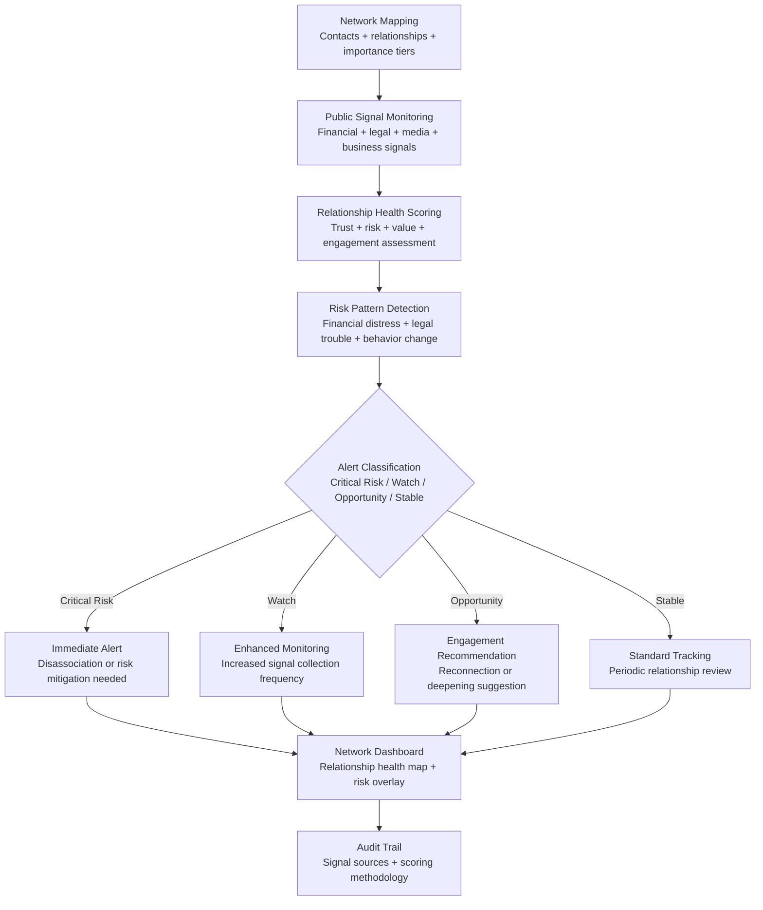

# Relationship Network Analyzer

Frankmax

NAICS 561611

> **High-Risk Individuals** — Relationship Intelligence Module

## Objective & Purpose

High-risk individuals operate within relationship networks that are simultaneously their greatest asset and their greatest vulnerability. Business partners, advisors, employees, associates, and even family members create a web of dependencies where each relationship carries both opportunity and risk. A trusted advisor who is secretly overleveraged becomes a fraud risk. A business partner whose political exposure changes creates regulatory contagion. A household staff member who is approached by media or adversaries becomes a security breach. The individual cannot monitor these dynamics manually across a network that typically spans 200-500 meaningful relationships.

The Relationship Network Analyzer provides continuous intelligence on the health, risk profile, and dynamics of the individual's relationship network. It monitors public signals about key contacts -- financial distress indicators, legal proceedings, media exposure, political affiliations, business difficulties, and social behavior changes -- to detect relationship risks before they materialize into personal consequences. The system does not surveil contacts; it monitors publicly available information and known risk indicators to maintain situational awareness.

The strategic value is in two dimensions. Defensively, it detects relationship risks: a financial advisor under SEC investigation, a business partner whose other ventures are failing, a board colleague whose public statements create association risk. Offensively, it identifies relationship opportunities: dormant connections who have entered relevant positions, network contacts who could facilitate important introductions, and relationship investments that warrant renewal. For individuals whose network is their primary competitive advantage, systematic relationship intelligence is not optional -- it is operational infrastructure.

## Business Context

| Attribute | Value |
|---|---|
| **Business Process** | Personal network management and relationship intelligence |
| **Business Function** | Relationship Intelligence |
| **Category** | Intelligence |
| **Target Audience** | 15. High-Risk Individuals |
| **Bundle** | Custom Personal Security Pack ($8,000-$15,000/mo) |
| **Monthly Cost of Inaction** | $50K-$2M (relationship risk + missed opportunities) |

## BPMN Workflow

## Features

1. **Comprehensive Network Mapping** — Maps the individual's relationship network across tiers: inner circle (family, close advisors, key partners), professional network (board colleagues, industry contacts, service providers), extended network (political contacts, social connections, alumni networks), and organizational connections (employees, vendors, institutional relationships).

2. **Public Signal Monitoring** — For each contact in the network, monitors publicly available signals: court filings, SEC investigations, corporate filings, news mentions, social media activity, property transactions, and business entity changes. Monitoring intensity scales with relationship tier -- inner circle contacts receive the most comprehensive monitoring.

3. **Relationship Health Scoring** — Computes a health score for each significant relationship across four dimensions: trust (reliability indicators, consistency of behavior), risk (financial stability, legal exposure, reputational risk), value (current and potential strategic value), and engagement (interaction recency, reciprocity, depth).

4. **Financial Distress Detection** — Monitors contacts for indicators of financial difficulty: UCC filings, tax liens, judgment filings, property foreclosure notices, and business entity dissolution. Financial distress in contacts creates fraud risk, borrowing requests, and potential desperation behavior.

5. **Contagion Risk Analysis** — Assesses how a contact's problems could affect the individual: a partner's legal trouble that could trigger disclosure obligations, an advisor's regulatory issues that could taint associated transactions, or a board colleague's scandal that creates guilt-by-association risk.

6. **Dormant Relationship Activation** — Identifies valuable relationships that have gone dormant (no interaction in the last 6-12 months) and suggests renewal touchpoints: congratulating a promotion, commenting on a published article, or proposing a catch-up meeting when travel aligns.

7. **Introduction Pathway Mapping** — When the individual needs to reach a specific person, the system maps the most effective introduction pathway through existing network connections, considering relationship strength, willingness to introduce, and social capital required.

## Workflow & Automation

**Step 1: Network Import** — Import the individual's contact network from CRM, email contacts, phone contacts, and social media connections. Contacts are categorized by relationship tier and importance.

**Step 2: Prioritized Monitoring Setup** — Configure monitoring intensity by tier: inner circle (daily monitoring across all signal types), professional network (weekly monitoring, key signals), extended network (monthly monitoring, critical signals only).

**Step 3: Baseline Establishment** — Over the first 2-4 weeks, the system establishes baseline health scores for all monitored contacts. This baseline enables anomaly detection for emerging risks and opportunities.

**Step 4: Continuous Intelligence** — The system monitors signals continuously and updates health scores as new information emerges. Alerts are generated when scores change significantly or when specific risk patterns are detected.

**Step 5: Periodic Network Review** — Monthly, the system generates a network health summary: contacts with declining health scores, emerging risks, dormant relationships worth renewing, and network composition analysis (too concentrated in one sector, insufficient geographic diversity).

**Step 6: Strategic Network Planning** — Quarterly, the system generates a network strategy brief: relationship investments to make, introductions to pursue, relationships to distance from, and network gaps to fill.

## Input/Output Specifications

| Direction | Data | Format | Description |
|---|---|---|---|
| Input | Contact network | API (CRM) / CSV / vCard | Contact identifiers and relationship metadata |
| Input | Public records | API / Database | Court filings, corporate records, property transactions |
| Input | News and media | API / RSS | Contact mentions in media |
| Input | Relationship interaction data | API / Manual | Meeting logs, communication frequency, reciprocity |
| Output | Network health dashboard | REST API / UI (encrypted) | Relationship map with health scores and risk overlay |
| Output | Risk alerts | Encrypted push / Email | Contact risk escalation notifications |
| Output | Engagement recommendations | Markdown / Email | Dormant relationship renewal and introduction suggestions |
| Output | Audit trail | JSON (immutable, encrypted) | Signal sources, scoring methodology, alert history |

## Integration Points

| System | Integration Type | Data Flow |
|---|---|---|
| **Threat Intelligence Feed** | Outbound enrichment | Network data identifies associates requiring threat monitoring |
| **Legal Exposure Analyzer** | Bidirectional | Contact legal issues may create individual exposure; legal exposure identifies risky contacts |
| **Digital Footprint Monitor** | Inbound reference | Digital exposure of network contacts affects individual risk |
| **Media Narrative Tracker** | Inbound feed | Media about contacts informs relationship health scoring |
| **Estate Architecture Optimizer** | Outbound context | Relationship data informs beneficiary and fiduciary decisions |
| **Public record databases** | Inbound API | Court, property, and corporate filing data |
| **CRM systems** | Bidirectional API | Contact data import; relationship insights export |

## Pricing & Revenue Model

| Component | Pricing | Notes |
|---|---|---|
| **Personal Security Pack** | $8,000-$15,000/month | Includes Relationship Network + Threat Intel + Digital Footprint |
| **Standalone — Core Network** | $2,500/month | Up to 100 monitored contacts, inner circle focus |
| **Standalone — Extended** | $5,000/month | Up to 500 contacts, full-tier monitoring |
| **Family Office Integration** | Custom pricing | Multi-principal network analysis with overlap detection |
| **Governance add-on** | +$1,000/month | Compliance documentation, fiduciary relationship tracking |

**Revenue model**: Relationship Network Analyzer provides intelligence on the most consequential asset class for HNW individuals: their relationships. A single undetected relationship risk (fraudulent advisor, compromised partner, exposed associate) can cost $500K-$10M. The "fries" attach through introduction pathway mapping, strategic network planning, and compliance documentation at 75-85% margin.

## NAICS/SIC Mapping

| NAICS Code | SIC Code | Industry | Relevance |
|---|---|---|---|
| 561611 | 7382 | Investigation Services | Relationship intelligence and monitoring |
| 561612 | 7382 | Security Guards and Patrol Services | Personal security network analysis |
| 541612 | 7361 | Human Resources Consulting Services | Executive relationship assessment |
| 541910 | 7323 | Marketing Research and Public Opinion Polling | Network analysis methodology |
| 519190 | 7379 | All Other Information Services | Relationship intelligence services |
| 541519 | 7379 | Other Computer Related Services | AI-driven network analysis |
