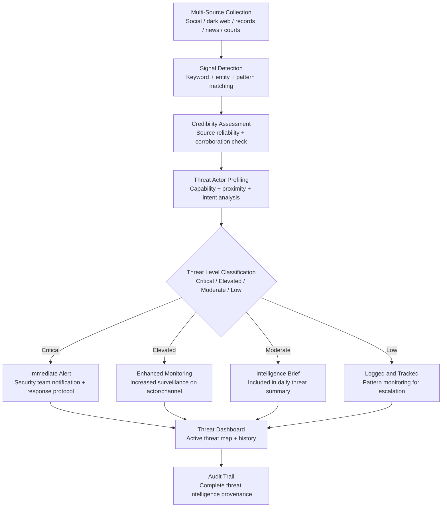

# Threat Intelligence Feed

Frankmax

NAICS 561611

> **High-Risk Individuals** — Security Module

## Objective & Purpose

High-net-worth individuals, politically exposed persons, and executives in controversial industries face threat landscapes that evolve daily. Physical threats, cyberstalking, extortion attempts, kidnapping planning, and targeted harassment campaigns are not hypothetical risks for this audience -- they are operational realities that require continuous monitoring. Traditional security services provide physical protection (bodyguards, secure transport, residential security) but lack the intelligence layer that detects threats before they materialize. By the time a physical security team responds to a threat, the threat has already progressed from ideation to planning to execution.

The Threat Intelligence Feed provides continuous, multi-source threat monitoring tailored to the specific risk profile of each individual. It ingests data from social media platforms, dark web forums, public records, news media, court filings, protest planning sites, and specialized threat databases to detect and assess threats at the earliest possible stage. Each detected signal is evaluated for credibility, capability, proximity, and intent -- the four factors that distinguish an actual threat from background noise. Only credible threats with assessed capability are escalated; the system filters thousands of noise signals to surface the handful that warrant human attention.

The intelligence value is in the time it creates between detection and potential action. A threat detected in the planning phase -- when someone is researching the individual's schedule, purchasing materials, or coordinating with others -- provides days to weeks of response time. A threat detected at the point of execution provides seconds to minutes. The Threat Intelligence Feed is designed to maximize the former and prevent the latter.

## Business Context

| Attribute | Value |
|---|---|
| **Business Process** | Personal threat assessment and monitoring |
| **Business Function** | Security |
| **Category** | Intelligence |
| **Target Audience** | 15. High-Risk Individuals |
| **Bundle** | Custom Personal Security Pack ($8,000-$15,000/mo) |
| **Monthly Cost of Inaction** | $100K-$10M+ (physical security breach + extortion + litigation) |

## BPMN Workflow

## Features

1. **Multi-Channel Threat Collection** — Monitors social media platforms (X, Facebook, Instagram, TikTok, Reddit, 4chan), dark web forums and marketplaces, public court records, protest and activism planning sites, news media, and specialized threat databases. Coverage spans the full spectrum of channels where threats originate and escalate.

2. **Entity-Specific Monitoring** — Threat detection is tailored to the specific individual: name variants, family members, business entities, residential addresses, frequent locations, vehicle descriptions, and known associates. Monitoring scope is precisely defined to minimize false positives while ensuring comprehensive coverage.

3. **Four-Factor Threat Assessment** — Each detected signal is evaluated across four dimensions: credibility (is the source reliable, is the threat specific), capability (does the actor have means to execute), proximity (geographic and temporal closeness), and intent (stated vs. inferred willingness to act). Only signals meeting thresholds across multiple dimensions are escalated.

4. **Threat Actor Profiling** — When a credible threat actor is identified, the system builds a profile: online activity history, geographic indicators, known associations, escalation trajectory, and behavioral pattern analysis. Profiles enable physical security teams to assess and respond effectively.

5. **Escalation Pattern Detection** — Monitors individuals and groups who have previously made low-level threats for escalation patterns: increasing frequency, increasing specificity, behavioral changes (purchasing equipment, researching locations), and coordination with others. Escalation detection provides the longest possible response window.

6. **Physical Security Team Integration** — Alert output is formatted for direct consumption by physical security teams: threat summary, actor profile, recommended response level, and geographic relevance. Integration with executive protection protocols ensures intelligence translates to action without delay.

7. **Periodic Threat Landscape Reports** — Weekly and monthly reports summarize the threat landscape: active threats, resolved threats, emerging risk patterns, and recommendations for security posture adjustments. Reports are suitable for briefing the individual, their family office, or their corporate security team.

## Workflow & Automation

**Step 1: Risk Profile Development** — Build a comprehensive risk profile: the individual's public exposure, known adversaries, industry-specific risks, geographic risk factors, and historical threat incidents. The profile defines monitoring parameters and alert thresholds.

**Step 2: Monitoring Activation** — The system activates monitoring across all configured channels with entity-specific search parameters. Baseline noise levels are established over the first 1-2 weeks to calibrate alert thresholds.

**Step 3: Continuous Signal Processing** — Incoming signals are processed through the four-factor assessment pipeline. Critical and elevated threats trigger immediate notifications. Moderate and low signals are logged, tracked, and included in periodic reports.

**Step 4: Threat Investigation** — For escalated threats, the system conducts deeper investigation: expanding the search scope around the identified actor, checking for corroborating signals across other channels, and building the actor profile. Investigation results are shared with the security team.

**Step 5: Response Coordination** — The system coordinates with the individual's security team to ensure appropriate response: increased protective detail, route changes, temporary location changes, or law enforcement engagement. Response recommendations are calibrated to threat level.

**Step 6: Continuous Calibration** — Threat assessment thresholds are continuously refined based on resolved outcomes: threats that materialized, threats that were neutralized, and false positives that wasted security resources. Calibration improves signal-to-noise ratio over time.

## Input/Output Specifications

| Direction | Data | Format | Description |
|---|---|---|---|
| Input | Risk profile | JSON / UI (encrypted) | Individual identity, threat history, risk factors |
| Input | Social media feeds | API / Web scraping | Platform-specific monitoring data |
| Input | Dark web data | API (specialized providers) | Forum posts, marketplace listings, paste sites |
| Input | Public records | API / Database | Court filings, property records, corporate records |
| Output | Threat alerts | Encrypted push / SMS / Phone | Critical and elevated threat notifications |
| Output | Threat dashboard | REST API / UI (encrypted) | Active threat visualization with actor profiles |
| Output | Intelligence reports | PDF (encrypted) | Weekly and monthly threat landscape summaries |
| Output | Audit trail | JSON (immutable, encrypted) | Complete intelligence collection and assessment log |

## Integration Points

| System | Integration Type | Data Flow |
|---|---|---|
| **Digital Footprint Monitor** | Inbound enrichment | Exposed personal data informs threat vector analysis |
| **Travel Risk Advisor** | Outbound feed | Threat data informs travel risk assessment |
| **Media Narrative Tracker** | Bidirectional | Media narratives may generate threats; threats may generate media |
| **Legal Exposure Analyzer** | Outbound context | Threats with legal dimensions feed legal risk assessment |
| **Relationship Network Analyzer** | Inbound reference | Network data identifies associates requiring protection |
| **Physical security providers** | Outbound API | Alert integration with executive protection systems |
| **Law enforcement liaison** | Outbound reports | Formatted threat reports for law enforcement engagement |

## Pricing & Revenue Model

| Component | Pricing | Notes |
|---|---|---|
| **Personal Security Pack** | $8,000-$15,000/month | Includes Threat Intel + Digital Footprint + Travel Risk |
| **Standalone — Standard** | $4,000/month | Full multi-channel monitoring, standard response |
| **Standalone — Premium** | $8,000/month | Dark web premium, actor profiling, security team integration |
| **Family / Household Program** | Custom pricing | Extended monitoring for family and staff |
| **Governance add-on** | +$2,000/month | Law enforcement liaison, legal documentation, compliance |

**Revenue model**: Threat Intelligence Feed is the highest-value tool in the High-Risk Individual segment. The cost of a single undetected threat can be catastrophic and irreversible. Clients in this segment are not price-sensitive; they are outcome-sensitive. The "fries" attach through actor profiling depth, security team integration, law enforcement liaison, and legal documentation at 65-80% margin.

## NAICS/SIC Mapping

| NAICS Code | SIC Code | Industry | Relevance |
|---|---|---|---|
| 561611 | 7382 | Investigation Services | Personal threat investigation |
| 561612 | 7382 | Security Guards and Patrol Services | Intelligence-driven physical security |
| 561621 | 7382 | Security Systems Services | Threat detection systems |
| 541512 | 7372 | Computer Systems Design Services | Cybersecurity intelligence |
| 541519 | 7379 | Other Computer Related Services | Digital threat monitoring |
| 922190 | 9229 | Other Justice, Public Order, and Safety | Security intelligence services |
