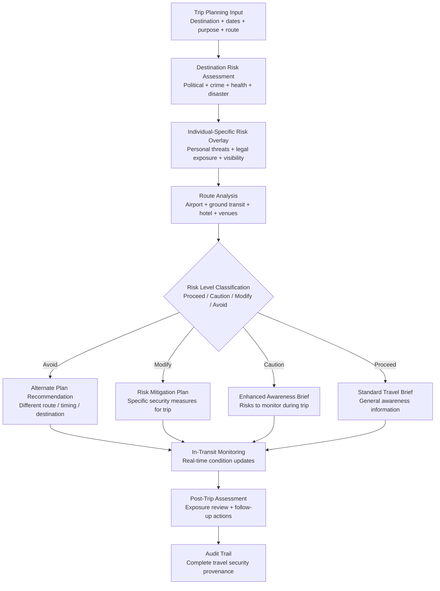

# Travel Risk Advisor

Frankmax

NAICS 561611

> **High-Risk Individuals** — Personal Security Module

## Objective & Purpose

Travel is the most predictable vulnerability for high-risk individuals. Fixed schedules, published itineraries, airport transit patterns, and hotel stays create windows of exposure that adversaries can exploit. For executives traveling to politically unstable regions, politicians visiting contentious areas, or HNW individuals transiting through kidnap-for-ransom zones, the risk is not theoretical -- it is actuarial. Insurance underwriters for kidnap and ransom policies price travel risk down to the city and neighborhood level because the data is that granular.

The Travel Risk Advisor provides pre-trip, in-transit, and post-trip security intelligence for every journey. Before departure, the system assesses destination risk across multiple dimensions: political stability, crime rates, terrorism indicators, health risks, natural disaster probability, and individual-specific threats (known adversaries in the region, pending legal matters in the jurisdiction, local media coverage of the individual). During transit, it monitors real-time conditions along the planned route: breaking security incidents, civil unrest, transportation disruptions, and weather events. Post-trip, it assesses any exposure created during travel and recommends follow-up security measures.

The differentiator from generic travel security services is personalization. A generic travel advisory rates Bogota as "high risk." The Travel Risk Advisor rates Bogota as "moderate risk for this individual traveling on these dates to this hotel via this route, with specific risks related to their industry visibility in the region and a pending contract dispute with a local partner." Personalized risk assessment transforms travel security from generic caution into actionable intelligence.

## Business Context

| Attribute | Value |
|---|---|
| **Business Process** | Travel security assessment and monitoring |
| **Business Function** | Personal Security |
| **Category** | Security |
| **Target Audience** | 15. High-Risk Individuals |
| **Bundle** | Custom Personal Security Pack ($8,000-$15,000/mo) |
| **Monthly Cost of Inaction** | $50K-$5M (kidnap + assault + medical emergency + legal exposure) |

## BPMN Workflow

## Features

1. **Multi-Dimensional Destination Analysis** — Assesses every destination across seven risk dimensions: political stability (government stability, civil unrest indicators), security (crime rates, terrorism index, kidnap risk), health (disease outbreaks, medical infrastructure quality), natural hazards (seismic, weather, flood risk), infrastructure (transportation reliability, communication coverage), legal environment (rule of law, judicial risk, corruption index), and cultural risk (sensitivity factors relevant to the individual).

2. **Individual-Specific Risk Overlay** — Personalizes generic destination risk with individual-specific factors: known adversaries in the region, pending litigation in the jurisdiction, industry-specific risks (extractive industry executives in resource-rich regions), public profile visibility, and historical threat data from the Threat Intelligence Feed.

3. **Route-Level Vulnerability Analysis** — Analyzes the specific planned route: airport of arrival (some airports have higher transit risk), ground transportation options (armored vehicle requirement assessment), hotel security posture, venue security for meetings and events, and transit between locations. Identifies choke points and alternate routes.

4. **Real-Time In-Transit Monitoring** — During travel, monitors conditions along the planned route in real-time: breaking security incidents, civil unrest, transportation disruptions, extreme weather, and local emergency declarations. Push alerts notify the individual and their security team of conditions requiring route changes or shelter-in-place.

5. **Medical and Evacuation Planning** — For every trip, identifies the nearest appropriate medical facilities, confirms medical evacuation coverage, and pre-plans evacuation routes for medical and security emergencies. For remote destinations, assesses whether the individual's medical needs can be met locally.

6. **Secure Communication Recommendations** — Assesses the communication security environment at each destination: surveillance risk, network monitoring, device search probability at borders, and recommended communication protocols (VPN, encrypted messaging, burner devices).

7. **Post-Trip Exposure Assessment** — After return, assesses any new exposure created during travel: were photos taken that reveal location patterns, were devices potentially compromised, were new digital footprints created in databases accessible to adversaries. Recommends follow-up security measures.

## Workflow & Automation

**Step 1: Trip Registration** — The individual or their assistant registers an upcoming trip: destination, dates, purpose, planned accommodations, and key meetings. The system begins risk assessment immediately.

**Step 2: Pre-Trip Assessment** — Within 24 hours, the system generates a comprehensive travel risk assessment: destination analysis, individual-specific overlay, route analysis, and risk classification. For high-risk trips, specific mitigation recommendations are provided.

**Step 3: Security Team Coordination** — For trips classified as Modify or Avoid, the system briefs the individual's security team with specific risk factors and recommended protective measures. The security team confirms their operational plan, which is logged.

**Step 4: Day-Before Update** — 24 hours before departure, the system updates the assessment with the latest intelligence: recent incidents, current threat level changes, weather forecasts, and any new individual-specific risk factors.

**Step 5: In-Transit Monitoring** — During the trip, the system monitors conditions and provides real-time updates. The individual's security team has dashboard access to track conditions along the planned itinerary.

**Step 6: Post-Trip Review** — Within 48 hours of return, the system generates a post-trip exposure assessment and recommends any follow-up actions: digital hygiene measures, device security checks, or privacy remediation.

## Input/Output Specifications

| Direction | Data | Format | Description |
|---|---|---|---|
| Input | Trip details | JSON / UI | Destination, dates, purpose, route, accommodations |
| Input | Individual risk profile | API (internal) | Threat data, legal exposure, public visibility |
| Input | Geopolitical data | API (specialized providers) | Country risk indices, incident databases, health alerts |
| Input | Real-time incident feeds | API / RSS | Breaking security events, civil unrest, weather |
| Output | Travel risk assessment | PDF (encrypted) / UI | Pre-trip risk analysis with recommendations |
| Output | In-transit alerts | Encrypted push / SMS | Real-time condition changes requiring action |
| Output | Post-trip exposure report | PDF (encrypted) | Travel-created exposure with remediation steps |
| Output | Audit trail | JSON (immutable, encrypted) | Complete travel security intelligence log |

## Integration Points

| System | Integration Type | Data Flow |
|---|---|---|
| **Threat Intelligence Feed** | Inbound enrichment | Active threats inform travel risk for specific destinations |
| **Digital Footprint Monitor** | Outbound triggers | Travel may create new digital exposure requiring monitoring |
| **Legal Exposure Analyzer** | Inbound context | Legal exposure in destination jurisdictions affects risk |
| **Privacy Architecture Designer** | Outbound context | Travel creates device and data exposure requiring privacy measures |
| **Health Optimization Engine** | Bidirectional | Health data informs medical planning; travel affects health protocols |
| **Geopolitical risk providers** | Inbound API | Country and city risk data |
| **Physical security providers** | Outbound integration | Security team coordination for protected travel |

## Pricing & Revenue Model

| Component | Pricing | Notes |
|---|---|---|
| **Personal Security Pack** | $8,000-$15,000/month | Includes Travel Risk + Threat Intel + Digital Footprint |
| **Standalone — Standard** | $2,000/month | Pre-trip assessment, basic in-transit monitoring |
| **Standalone — Premium** | $5,000/month | Real-time monitoring, security team integration, medical planning |
| **Per-Trip Assessment** | $1,500/trip | Individual trip assessment without subscription |
| **Governance add-on** | +$1,000/month | Insurance documentation, compliance reporting |

**Revenue model**: Travel Risk Advisor converts the highest-vulnerability moments for HNW individuals into managed, intelligence-driven experiences. The cost of a single kidnap incident (ransom + recovery + trauma + business disruption) routinely exceeds $1M. K&R insurance premiums alone often exceed the annual subscription cost. The "fries" attach through security team integration, medical evacuation planning, and insurance documentation at 70-85% margin.

## NAICS/SIC Mapping

| NAICS Code | SIC Code | Industry | Relevance |
|---|---|---|---|
| 561611 | 7382 | Investigation Services | Travel threat investigation |
| 561612 | 7382 | Security Guards and Patrol Services | Travel security planning |
| 561510 | 4724 | Travel Agencies | Security-enhanced travel planning |
| 561520 | 4725 | Tour Operators | Secure travel operations |
| 541519 | 7379 | Other Computer Related Services | AI-driven risk assessment |
| 524298 | 6399 | All Other Insurance Related Activities | Travel risk insurance support |
