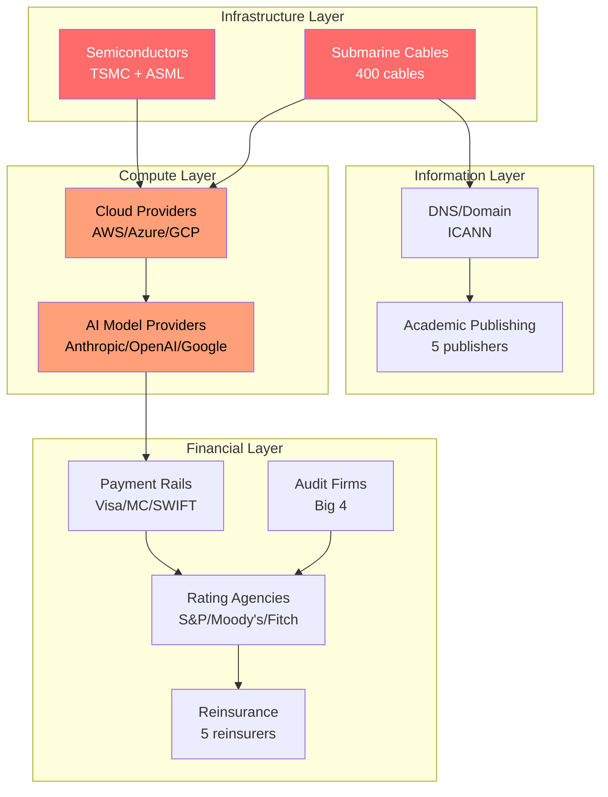

# Chokepoints -- Single Points of Failure

Chokepoints are concentrations of control where a small number of entities control critical infrastructure. Unlike [Bottlenecks](/cross-audience/bottlenecks) (which constrain flow), chokepoints represent existential dependencies -- if the controlling entity fails, is compromised, or weaponizes its position, entire systems collapse. The marketplace must navigate around these chokepoints while helping customers identify and mitigate their own.

## Chokepoint Matrix

| # | Chokepoint | Who Controls It | Strategic Implication |
|---|---|---|---|
| 1 | **Cloud Provider Concentration** | AWS / Azure / GCP (65%+ of cloud) | All digital infrastructure depends on 3 entities |
| 2 | **AI Model Provider Concentration** | Anthropic / OpenAI / Google | Strategic dependency on model access |
| 3 | **Payment Rail Control** | Visa / Mastercard / SWIFT | Financial exclusion as a weapon |
| 4 | **Domain/DNS Control** | ICANN + registrars | Internet censorship point |
| 5 | **Semiconductor Supply** | TSMC + ASML | National security dependency |
| 6 | **Rating Agency Power** | S&P / Moody's / Fitch | Funding dependent on 3 opinions |
| 7 | **Audit Firm Concentration** | Big 4 audit 99% of S&P 500 | Systemic risk in assurance |
| 8 | **Insurance Reinsurance** | 5 reinsurers control global risk transfer | Catastrophe concentration |
| 9 | **Academic Publishing** | 5 publishers control scientific knowledge | Knowledge access control |
| 10 | **Submarine Cable Infrastructure** | 400 cables carry 99% of intercontinental data | Physical destruction = digital collapse |

## Chokepoint Details

### 1. Cloud Provider Concentration

**Who controls it:** Amazon Web Services, Microsoft Azure, Google Cloud Platform collectively control 65%+ of global cloud infrastructure spending.

**Strategic implication:** Every marketplace tool, every enterprise AI deployment, every SaaS product runs on infrastructure controlled by three companies. These companies are also AI model providers (Chokepoint 2), creating vertical integration that allows them to favor their own products. A pricing change, a terms-of-service update, or a service outage at any one of these providers cascades across the global economy.

**Weaponization risk:** Cloud providers have deplatformed customers based on content policies. They can raise prices with limited competitive constraint. They can throttle or deprioritize competitor workloads.

**Marketplace positioning:**
- Multi-Model AI Orchestrator abstracts model access across providers, reducing single-provider dependency
- Provider-agnostic architecture ensures the marketplace can migrate between cloud providers
- National Data Sovereignty Vault enables on-premise deployment for sovereignty-sensitive customers

### 2. AI Model Provider Concentration

**Who controls it:** Anthropic (Claude), OpenAI (GPT), Google (Gemini) produce the frontier models that power most enterprise AI applications.

**Strategic implication:** This is the marketplace's most direct chokepoint. The "Burger" (discounted AI model access) depends on model providers maintaining API access at predictable pricing. If providers vertically integrate downstream (building their own governance, compliance, and industry tools), the marketplace loses its supply chain.

**Weaponization risk:** Providers can increase API pricing (compressing marketplace margins), restrict API access (eliminating supply), or build competing products (vertical integration).

**Marketplace positioning:**
- Provider-agnostic architecture (orchestrate across Claude/GPT/Gemini/open-source)
- The "Fries" (governance layers) and "Kitchen" (data moat) are provider-independent -- they retain value regardless of which model powers the "Burger"
- Open-source model support provides a floor price that commercial providers must compete against
- See [Failure Mode 1](/risk-governance/failure-modes) for detailed mitigation

### 3. Payment Rail Control

**Who controls it:** Visa and Mastercard process 85%+ of non-cash consumer payments globally. SWIFT handles 95%+ of cross-border interbank messaging.

**Strategic implication:** Financial services depend on these rails. Exclusion from payment rails (as applied to Russia's banks in 2022) is equivalent to economic isolation. For the marketplace's customers in banking and insurance (Audience 9), payment rail dependency is existential.

**Weaponization risk:** Payment rails have been used as geopolitical weapons. Access can be revoked for compliance violations, political reasons, or regulatory pressure. Alternative payment rails (crypto, CIPS, SPFS) exist but lack the liquidity and network effects of incumbents.

**Marketplace positioning:**
- Sanctions Compliance Engine helps customers maintain payment rail access through proactive compliance
- Cross-Border Obligation Router enables obligation settlement across alternative rails
- The marketplace's billing infrastructure should support multiple payment methods to avoid single-rail dependency

### 4. Domain/DNS Control

**Who controls it:** ICANN governs the domain name system. A small number of registrars control domain registration. National governments can order DNS seizure.

**Strategic implication:** Any internet-accessible service depends on DNS resolution. Domain seizure (as applied to Silk Road, Megaupload, and various political dissident sites) instantly makes a service unreachable to all users.

**Weaponization risk:** Government-ordered domain seizure can occur without judicial review in some jurisdictions. Registrar terms of service allow suspension for arbitrary reasons.

**Marketplace positioning:**
- Cyber Threat Hunting Platform monitors DNS-level threats
- Multi-domain, multi-registrar architecture reduces single-registrar risk
- Critical infrastructure customers should maintain DNS independence

### 5. Semiconductor Supply

**Who controls it:** TSMC (Taiwan) fabricates ~90% of the world's most advanced semiconductors. ASML (Netherlands) is the sole manufacturer of EUV lithography machines required for advanced chip production.

**Strategic implication:** Every AI model runs on hardware that originates from two companies in two geographically vulnerable locations. A Taiwan Strait crisis or an ASML export restriction would collapse global AI compute capacity within 6-12 months.

**Weaponization risk:** Export controls (US CHIPS Act, Netherlands export restrictions) already restrict semiconductor supply to certain countries. A military conflict involving Taiwan would eliminate 90% of advanced chip production.

**Marketplace positioning:**
- Supply Chain Risk Neural Network models semiconductor dependency exposure
- The marketplace does not manufacture hardware and cannot mitigate this directly
- Customers should be advised to plan for compute scarcity scenarios

### 6. Rating Agency Power

**Who controls it:** S&P Global, Moody's, and Fitch Ratings provide credit ratings that determine borrowing costs for governments, corporations, and financial institutions.

**Strategic implication:** Three companies' opinions determine the cost of capital for the global economy. A one-notch downgrade can increase borrowing costs by 50-100 basis points, costing billions. Rating methodologies are opaque, and rating agencies face minimal accountability for errors (see: 2008 crisis).

**Weaponization risk:** Rating agencies can be influenced by the entities they rate (issuer-pays model creates conflicts of interest). Sovereign downgrades can be politically motivated. Rating mistakes compound through the financial system.

**Marketplace positioning:**
- ESG Compliance & Reporting Engine provides independent data that challenges rating agency narratives
- Board Decision Intelligence gives boards independent analysis beyond rating agency reports
- Enterprise Mortality Tables (Systemic Gap 10) represent a long-term alternative to rating agency assessments for AI-native enterprises

### 7. Audit Firm Concentration

**Who controls it:** Deloitte, PwC, EY, and KPMG audit 99% of S&P 500 companies and the vast majority of listed companies globally.

**Strategic implication:** The global assurance system depends on four firms. An Arthur Andersen-style collapse of any Big 4 firm would leave thousands of companies without auditors, creating a systemic crisis in financial markets.

**Weaponization risk:** Audit firms can resign clients (as they did with Wirecard -- too late). Regulatory sanctions against one firm cascade across the system. Audit quality is difficult to verify externally.

**Marketplace positioning:**
- Internal Fraud Pattern Detector provides continuous monitoring that does not depend on external auditors
- Billing Leakage Detector and Internal Fraud Pattern Detector reduce dependence on annual audit cycles
- ETLB Protocol creates immutable audit trails that any qualified auditor can verify

### 8. Insurance Reinsurance

**Who controls it:** Munich Re, Swiss Re, Hannover Re, SCOR, and Berkshire Hathaway Reinsurance control the majority of global reinsurance capacity.

**Strategic implication:** Primary insurers transfer catastrophic risk to reinsurers. If reinsurance capacity contracts (due to climate events, pandemic losses, or cyber catastrophe), primary insurers cannot write new policies. This cascades: without insurance, construction stops, lending stops, commerce stops.

**Weaponization risk:** Reinsurers can withdraw from markets, classes of business, or geographies, making insurance unavailable. Climate change is already causing reinsurance retreat from certain regions.

**Marketplace positioning:**
- Claims Processing Accelerator reduces insurer operational costs, making policies more viable
- Climate Resilience Modeler helps infrastructure operators reduce insurable risk
- Enterprise Mortality Tables (long-term) create the actuarial basis for AI-specific insurance products

### 9. Academic Publishing

**Who controls it:** Elsevier, Springer Nature, Wiley, Taylor & Francis, and SAGE control the majority of scientific journal publications.

**Strategic implication:** Scientific knowledge is produced by publicly funded researchers, given to publishers for free, peer-reviewed by unpaid volunteers, and sold back to the institutions that funded the research at $10,000-$30,000 per journal subscription. This creates a knowledge access chokepoint that disproportionately affects institutions in developing countries.

**Weaponization risk:** Publishers can restrict access to critical research. Paywall barriers slow the diffusion of knowledge. Publisher consolidation reduces editorial independence.

**Marketplace positioning:**
- The marketplace's open governance standards approach deliberately avoids academic publishing chokepoints
- Knowledge market tools (Systemic Gap 9) create alternative distribution channels for applied knowledge
- Education/R&D audience tools (Audience 11) provide direct access to analysis without publisher intermediation

### 10. Submarine Cable Infrastructure

**Who controls it:** Approximately 400 submarine cables carry 99% of intercontinental data. Ownership is concentrated among telecom consortiums and, increasingly, cloud providers (Google and Meta own significant cable capacity).

**Strategic implication:** Cutting or tapping submarine cables is a proven attack vector (NSA TEMPORA, Russian submarine activity near cables). A coordinated attack on cables in a single region could sever entire continents from the internet for weeks to months.

**Weaponization risk:** State actors have demonstrated both the capability and willingness to target submarine cables. Cloud provider ownership of cables creates a feedback loop with Chokepoint 1 (cloud concentration).

**Marketplace positioning:**
- Telecom Network Resilience Engine models cable dependency and rerouting options
- Emergency Response Coordinator includes communications infrastructure scenarios
- Customers dependent on cross-border connectivity should be advised on cable path diversity

## Chokepoint Concentration Map

## Marketplace Chokepoint Exposure

The marketplace itself is exposed to Chokepoints 1, 2, and 4 as direct operational dependencies. Mitigations:

| Chokepoint | Marketplace Exposure | Mitigation |
|---|---|---|
| Cloud Provider Concentration | Runs on cloud infrastructure | Multi-cloud architecture; containerized deployment |
| AI Model Provider Concentration | Core product depends on model APIs | Provider-agnostic orchestration; open-source fallback |
| Domain/DNS Control | Website and API depend on DNS | Multi-registrar; enterprise customers get IP-direct access |
| Payment Rail Control | Revenue collection | Multiple payment processors; crypto option for sanctioned markets |

## Related

- [Bottlenecks -- Flow Constraints](/cross-audience/bottlenecks)
- [Failure Mode Analysis](/risk-governance/failure-modes)
- [Strategic Moat Recommendations](/risk-governance/strategic-moat)
- [Agent Recovery Prompt](/recovery)
