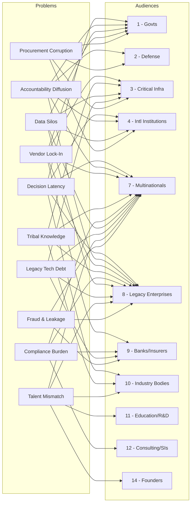

# Problems -- Explicit Pain Points

The 10 explicit pain points below surface repeatedly across the marketplace's 15 audience segments. Each problem represents measurable economic damage -- lost revenue, wasted time, or systemic risk -- that specific marketplace tools are designed to eliminate.

## Problem Matrix

| # | Problem | Audiences Affected | Severity |
|---|---|---|---|
| 1 | **Decision Latency** -- decisions that should take hours take months | 1, 4, 7, 8, 10 | Critical |
| 2 | **Accountability Diffusion** -- no single owner for outcomes | 1, 2, 4, 7, 8 | Critical |
| 3 | **Vendor Lock-In** -- trapped by legacy contracts and switching costs | 1, 3, 7, 8, 9 | High |
| 4 | **Tribal Knowledge Concentration** -- expertise locked in aging individuals | 3, 7, 8, 10 | Critical |
| 5 | **Compliance Burden** -- regulatory costs consuming 10-15% of revenue | 7, 8, 9, 12 | High |
| 6 | **Data Silos** -- information trapped in departmental/agency boundaries | 1, 3, 4, 7, 8 | Critical |
| 7 | **Legacy Technical Debt** -- 20-40 year old systems cannot integrate | 3, 7, 8, 9 | Critical |
| 8 | **Talent Mismatch** -- wrong skills for emerging requirements | 7, 8, 10, 11, 14 | High |
| 9 | **Fraud & Leakage** -- 2-7% revenue lost to billing errors, fraud | 7, 8, 9 | High |
| 10 | **Procurement Corruption** -- bid-rigging, kickbacks, relationship-based awards | 1, 2, 3, 4 | High |

## Problem-to-Audience Mapping

## Problem Concentration by Audience

Audiences 7 (Multinationals) and 8 (Legacy Enterprises) appear in 9 of 10 problems -- the highest concentration. This validates the marketplace's mid-market enterprise focus as the broadest addressable pain surface.

| Audience | Problems Affected | Count |
|---|---|---|
| 7 -- Multinationals | 1, 2, 3, 4, 5, 6, 7, 8, 9 | 9 |
| 8 -- Legacy Enterprises | 1, 2, 3, 4, 5, 6, 7, 8, 9 | 9 |
| 1 -- Governments | 1, 2, 3, 6, 10 | 5 |
| 9 -- Banks/Insurers | 3, 5, 7, 9 | 4 |
| 3 -- Critical Infra | 3, 4, 6, 7, 10 | 5 |
| 4 -- Intl Institutions | 1, 2, 6, 10 | 4 |
| 10 -- Industry Bodies | 1, 4, 8 | 3 |
| 2 -- Defense | 2, 10 | 2 |
| 11 -- Education/R&D | 8 | 1 |
| 12 -- Consulting/SIs | 5 | 1 |
| 14 -- Founders | 8 | 1 |

## Marketplace Tools Addressing Each Problem

### 1. Decision Latency

Decisions that should take hours take months because information is scattered, stakeholders are misaligned, and approval chains are sequential.

**Marketplace tools that attack this problem:**
- **Board Decision Intelligence** (Audience 7) -- synthesizes 500-page board decks into decision-ready briefings
- **Policy Compiler Engine** (Audience 1) -- converts policy intent into machine-executable rules, eliminating interpretation delays
- **Multilateral Negotiation Simulator** (Audience 4) -- models negotiation outcomes in advance, compressing weeks of back-and-forth
- **Inter-Ministry Coordination Platform** (Audience 1) -- breaks cross-departmental deadlock with shared decision surfaces
- **Chokepoint Intelligence Engine** (Audience 7) -- maps exactly where decisions stall and quantifies the cost of delay

### 2. Accountability Diffusion

No single owner for outcomes. When AI recommends an action and it fails, blame diffuses across the org chart. Nobody signs, nobody owns, nobody learns.

**Marketplace tools that attack this problem:**
- **ETLB Protocol** -- binds a human to every AI action at execution time with cryptographic signatures
- **AI Deployment Authorization System** (Audience 1) -- requires explicit human authorization before AI systems deploy
- **Autonomous System Kill-Chain Auditor** (Audience 2) -- ensures every autonomous action has a traceable decision owner
- **Operator Performance Analytics** (Audience 7) -- measures individual output against assigned responsibilities

### 3. Vendor Lock-In

Organizations trapped by legacy contracts, proprietary data formats, and switching costs that exceed annual budgets.

**Marketplace tools that attack this problem:**
- **Multi-Model AI Orchestrator** (Audience 7) -- provider-agnostic layer across Claude, GPT, Gemini, open-source models
- **Legacy System Migration Planner** (Audience 8) -- maps dependencies and generates migration paths
- **Mainframe-to-Cloud Bridge** (Audience 8) -- incremental modernization without rip-and-replace
- **Grid Stability Predictor** (Audience 3) -- replaces vendor-locked SCADA analytics with open alternatives

### 4. Tribal Knowledge Concentration

The most dangerous knowledge lives in the heads of people approaching retirement. When they leave, the organization loses decades of context overnight.

**Marketplace tools that attack this problem:**
- **Tribal Knowledge Extractor** (Audience 8) -- captures undocumented expertise into structured, searchable knowledge bases
- **Enterprise Knowledge Graph** (Audience 7) -- builds organizational memory that persists beyond individuals
- **Dynasty Knowledge Vault** (Audience 5) -- preserves generational knowledge for multi-century institutions
- **Process Mining & Optimization Engine** (Audience 8) -- makes implicit processes explicit

### 5. Compliance Burden

Regulatory costs consuming 10-15% of revenue across banking, insurance, healthcare, and multinational operations. Every new regulation adds cost; none are ever repealed.

**Marketplace tools that attack this problem:**
- **Regulatory Change Tracker** (Audience 7) -- monitors regulatory changes across jurisdictions in real time
- **Regulatory Compliance Automator** (Audience 3) -- automates compliance evidence collection and reporting
- **ESG Compliance & Reporting Engine** (Audience 7) -- automates sustainability reporting mandates
- **Constitutional Compliance Checker** (Audience 1) -- validates legislation against constitutional constraints
- **Sanctions Compliance Engine** (Audience 4) -- automates cross-border sanctions screening

### 6. Data Silos

Information trapped in departmental, agency, or jurisdictional boundaries. The same data is collected multiple times, never reconciled, and never connected.

**Marketplace tools that attack this problem:**
- **Enterprise Knowledge Graph** (Audience 7) -- connects data across organizational boundaries
- **National Data Sovereignty Vault** (Audience 1) -- secure cross-agency data sharing with sovereignty controls
- **Member State Reporting Harmonizer** (Audience 4) -- standardizes data formats across reporting entities
- **Consolidated Reporting Platform** (Audience 6) -- aggregates data across custodians, managers, and entities

### 7. Legacy Technical Debt

20-40 year old systems that cannot integrate with modern AI infrastructure. COBOL mainframes, proprietary protocols, undocumented APIs.

**Marketplace tools that attack this problem:**
- **Legacy System Migration Planner** (Audience 8) -- generates incremental modernization roadmaps
- **Mainframe-to-Cloud Bridge** (Audience 8) -- API wrappers for legacy systems without replacement
- **SCADA/ICS Security Monitor** (Audience 3) -- secures legacy industrial control systems
- **Asset Lifecycle Optimizer** (Audience 3) -- extends useful life of aging infrastructure with predictive maintenance

### 8. Talent Mismatch

Organizations have the wrong skills for emerging requirements. The workforce was hired for yesterday's problems and cannot be retrained fast enough.

**Marketplace tools that attack this problem:**
- **Talent-to-Task Matching Engine** (Audience 7) -- matches existing skills to emerging requirements
- **Workforce Planning Simulator** (Audience 7) -- models workforce needs against business scenarios
- **LevelUpMax Bootcamp** (Operations) -- trains operators in AI governance and deployment skills
- **Skill Valuation Standard** (Systemic Gap) -- machine-readable credentials for verifiable capabilities

### 9. Fraud & Leakage

2-7% of revenue lost to billing errors, duplicate payments, contract non-compliance, and outright fraud. Most organizations do not even know they are losing it.

**Marketplace tools that attack this problem:**
- **Billing Leakage Detector** (Audience 7) -- identifies leakage patterns across millions of transactions
- **Internal Fraud Pattern Detector** (Audience 7) -- detects anomalous patterns in transactions and behavior
- **Grant & Subsidy Fraud Detector** (Audience 1) -- catches fraudulent claims in government disbursements
- **Claims Processing Accelerator** (Audience 9) -- automates claims validation with fraud detection

### 10. Procurement Corruption

Bid-rigging, kickbacks, and relationship-based awards that drain public and institutional budgets. Estimated at 10-25% of procurement spend in emerging markets.

**Marketplace tools that attack this problem:**
- **Public Procurement Intelligence** (Audience 1) -- detects bid-rigging patterns and anomalous award distributions
- **Supply Chain Integrity Verifier** (Audience 2) -- verifies supplier legitimacy and flags shell entities
- **Cross-Border Obligation Router** (Audience 4) -- enforces procurement obligations across jurisdictions
- **Supplier Dependency Risk Scorer** (Audience 8) -- scores supplier relationships for concentration and corruption risk

## Severity Distribution

- **Critical (5 problems):** Decision Latency, Accountability Diffusion, Tribal Knowledge Concentration, Data Silos, Legacy Technical Debt
- **High (5 problems):** Vendor Lock-In, Compliance Burden, Talent Mismatch, Fraud & Leakage, Procurement Corruption

Every "Critical" problem is one where inaction leads to organizational failure within 3-5 years. Every "High" problem is one where inaction leads to competitive disadvantage within 1-3 years.

## Related

- [Challenges -- Structural Difficulties](/cross-audience/challenges)
- [Systemic Gaps -- Missing Infrastructure](/cross-audience/systemic-gaps)
- [Economic Model -- Bundles](/economic-model/bundles)
- [Agent Recovery Prompt](/_recovery)
