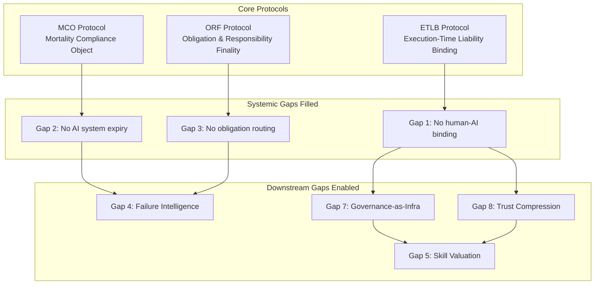

# Systemic Gaps -- Missing Infrastructure

Systemic gaps are not problems to solve or challenges to manage. They are **missing infrastructure** -- things that should exist but do not. The marketplace's three core protocols (ORF, ETLB, MCO) were designed specifically to fill gaps 1-3. The remaining gaps represent the marketplace's medium-term product roadmap.

## Gap Matrix

| # | Gap | Description | Audiences |
|---|---|---|---|
| 1 | **ETLB** | No mechanism to bind a human to an AI action at execution time | All |
| 2 | **MCO** | No enforced death/expiry for AI systems granted authority | 1, 2, 3, 4, 7, 9 |
| 3 | **Obligation Routing Infrastructure** | No system for routing cross-border obligations with enforcement | 4, 7, 9 |
| 4 | **Failure Intelligence Market** | No marketplace for anonymized failure data | 7, 8, 9, 10 |
| 5 | **Skill Valuation Standard** | No verifiable, machine-readable credential for capabilities | 7, 8, 10, 11, 12, 14 |
| 6 | **Power Asymmetry Detection** | No system to detect disproportionate control accumulation | 1, 2, 4, 5 |
| 7 | **Governance-as-Infrastructure** | Governance treated as overhead, not infrastructure | All |
| 8 | **Trust Compression** | No mechanism for portable, verifiable trust at machine speed | All |
| 9 | **Time-Indexed Knowledge Markets** | No pricing system for knowledge with temporal decay | 7, 11, 13 |
| 10 | **Enterprise Mortality Tables** | No actuarial equivalent for AI enterprise lifespan | 9, 13 |

## Protocol Alignment

The ecosystem's three core protocols directly fill the first three systemic gaps. This is not coincidental -- the protocols were designed by working backward from the gap analysis.

## Gap Details

### Gap 1: ETLB -- Execution-Time Liability Binding

**Audiences affected:** All 15

**The gap:** When an AI system recommends an action -- approve a loan, flag a threat, route a payment -- no mechanism exists to bind a specific human to that action at the moment it executes. Accountability is assigned retroactively (after something goes wrong) rather than proactively (at the moment of execution).

**Why it matters:** Without execution-time binding, organizations face the accountability diffusion problem at scale. As AI systems make more decisions, the gap between "who the system says is responsible" and "who actually authorized the action" widens. Litigation, regulatory enforcement, and insurance all require knowing who signed off on what, when.

**Protocol response:** ETLB creates a cryptographic binding between a human operator and an AI action at the exact moment of execution. The binding is non-repudiable, time-stamped, and carries the operator's explicit scope of authority.

### Gap 2: MCO -- Mortality Compliance Object

**Audiences affected:** 1 (Governments), 2 (Defense), 3 (Critical Infra), 4 (Intl Institutions), 7 (Multinationals), 9 (Banks/Insurers)

**The gap:** AI systems granted authority -- to trade, to screen, to approve, to target -- have no enforced expiry date. A model trained on 2023 data continues operating in 2026 with the same authority, even though its world model is obsolete. There is no equivalent of a "term limit" or "license renewal" for AI systems.

**Why it matters:** Stale models accumulate authority silently. A credit scoring model trained pre-pandemic continues scoring post-pandemic borrowers. A threat detection model trained on yesterday's adversary tactics misses today's attacks. The damage compounds because stale models do not announce they are stale -- they just get quietly wrong.

**Protocol response:** MCO enforces mandatory expiry on every AI system granted authority. When the mortality date arrives, the system must be re-validated, re-authorized, or decommissioned. No silent perpetuation.

### Gap 3: Obligation Routing Infrastructure

**Audiences affected:** 4 (Intl Institutions), 7 (Multinationals), 9 (Banks/Insurers)

**The gap:** Cross-border obligations -- regulatory requirements, contractual commitments, treaty provisions -- have no routing infrastructure. When a multinational must comply with conflicting requirements across 40 jurisdictions, there is no system that routes obligations to the correct entity, verifies compliance, and enforces consequences.

**Why it matters:** Organizations spend millions on legal counsel to manually route obligations. Errors create regulatory violations, fines, and market exclusion. The cost of getting it wrong exceeds the cost of compliance.

**Protocol response:** ORF (Obligation & Responsibility Finality) provides machine-readable obligation routing with enforcement guarantees. Obligations are classified, routed, acknowledged, and tracked to finality.

### Gap 4: Failure Intelligence Market

**Audiences affected:** 7 (Multinationals), 8 (Legacy Enterprises), 9 (Banks/Insurers), 10 (Industry Bodies)

**The gap:** When an AI system fails, the failure data stays locked inside the organization that experienced it. There is no marketplace for anonymized failure data -- no way for Organization B to learn from Organization A's failure without Organization A disclosing proprietary information.

**Why it matters:** Every organization repeats the same mistakes independently. The aviation industry solved this with anonymous incident reporting (ASRS). The AI industry has no equivalent. Failure data is the most valuable data in AI governance, and it is entirely wasted.

**Marketplace response:** The Failure Intelligence component of the "Kitchen" (data moat) collects, anonymizes, and distributes failure patterns. This is a compounding asset -- every failure makes the system more valuable.

### Gap 5: Skill Valuation Standard

**Audiences affected:** 7 (Multinationals), 8 (Legacy Enterprises), 10 (Industry Bodies), 11 (Education/R&D), 12 (Consulting/SIs), 14 (Founders/Operators)

**The gap:** No verifiable, machine-readable credential exists for capabilities. Degrees measure time spent, not competence acquired. Certifications proliferate until none are meaningful. Employers cannot verify what a candidate actually knows how to do.

**Why it matters:** The talent mismatch problem (see [Problems](/cross-audience/problems)) cannot be solved without a skill valuation standard. You cannot match talent to tasks if you cannot measure talent.

**Marketplace response:** LevelUpMax Bootcamp provides competency-based credentialing with machine-readable skill attestations. The Talent-to-Task Matching Engine consumes these credentials.

### Gap 6: Power Asymmetry Detection

**Audiences affected:** 1 (Governments), 2 (Defense), 4 (Intl Institutions), 5 (Dynasties)

**The gap:** No system detects when a single entity accumulates disproportionate control over critical systems. A cloud provider controlling 35% of cloud infrastructure, an AI company controlling model access, a dynasty controlling a nation's economic policy -- these accumulations happen gradually and are visible only in retrospect.

**Why it matters:** Power asymmetry precedes systemic failure. Every financial crisis, every monopoly abuse, every institutional capture followed a period of undetected power accumulation.

**Marketplace response:** Chokepoint Intelligence Engine maps control concentrations across supply chains and infrastructure dependencies.

### Gap 7: Governance-as-Infrastructure

**Audiences affected:** All 15

**The gap:** Governance is universally treated as overhead -- a cost center, a compliance burden, a friction layer. It is never treated as infrastructure -- a value-creating system that enables faster, safer, more scalable operations.

**Why it matters:** This mental model gap is the root cause of the marketplace's "Fries" revenue model. Organizations that treat governance as overhead will pay the minimum. Organizations that treat governance as infrastructure will pay for the premium. The marketplace must convert buyers from the first mindset to the second.

**Marketplace response:** The entire marketplace architecture embeds governance as default infrastructure. Every "Burger" (AI model access) comes with governance attached. The goal is to make ungoverned AI feel unsafe, the way unencrypted email now feels unsafe.

### Gap 8: Trust Compression

**Audiences affected:** All 15

**The gap:** Trust currently requires slow, expensive verification -- background checks, audits, reference calls, trial periods. No mechanism exists for portable, verifiable trust at machine speed. An organization verified as trustworthy in one context must re-verify from scratch in every new context.

**Why it matters:** Trust is the bottleneck for every cross-organizational interaction. M&A, partnerships, vendor selection, and regulatory approval all stall on trust verification.

**Marketplace response:** ETLB and ORF protocols create machine-verifiable trust artifacts. An organization's compliance history, failure record, and liability bindings become portable trust credentials.

### Gap 9: Time-Indexed Knowledge Markets

**Audiences affected:** 7 (Multinationals), 11 (Education/R&D), 13 (Investors/VCs)

**The gap:** Knowledge decays, but pricing does not reflect decay. A market analysis from 6 months ago is priced the same as one from yesterday, despite being worth a fraction. No pricing system accounts for the temporal decay of knowledge value.

**Why it matters:** Organizations overpay for stale knowledge and underpay for fresh knowledge. This creates perverse incentives: it is more profitable to sell old research than to generate new insights.

**Marketplace response:** The "Kitchen" data moat tracks knowledge freshness and adjusts value accordingly. MCO Protocol enforces expiry on knowledge artifacts, preventing stale data from being sold as current.

### Gap 10: Enterprise Mortality Tables

**Audiences affected:** 9 (Banks/Insurers), 13 (Investors/VCs)

**The gap:** Actuaries can predict human lifespan within narrow bands. No equivalent exists for AI-powered enterprises. Investors and insurers cannot price the expected lifespan of an AI-dependent business because the actuarial data does not exist.

**Why it matters:** Without mortality tables, insurance cannot be priced, loans cannot be underwritten, and investments cannot be valued. The entire financial infrastructure assumes we can predict organizational longevity, and for AI-native enterprises, we cannot.

**Marketplace response:** The Failure Intelligence Market (Gap 4) generates the raw data. Enterprise Mortality Tables are the actuarial product built on top of that data -- a medium-term marketplace offering targeting insurance and investment audiences.

## Coverage Summary

| Gap | Protocol/Product | Status |
|---|---|---|
| 1 -- ETLB | ETLB Protocol | Core protocol (defined) |
| 2 -- MCO | MCO Protocol | Core protocol (defined) |
| 3 -- Obligation Routing | ORF Protocol | Core protocol (defined) |
| 4 -- Failure Intelligence | Kitchen data moat | Compounding asset (build with usage) |
| 5 -- Skill Valuation | LevelUpMax | Operational (in-build) |
| 6 -- Power Asymmetry | Chokepoint Intelligence | Marketplace tool (available) |
| 7 -- Gov-as-Infrastructure | Marketplace architecture | Architectural default |
| 8 -- Trust Compression | ETLB + ORF combined | Protocol combination |
| 9 -- Knowledge Markets | Kitchen data moat | Medium-term roadmap |
| 10 -- Mortality Tables | Failure Intelligence | Long-term roadmap |

## Related

- [Protocols -- ETLB](/protocols)
- [Protocols -- MCO](/protocols)
- [Protocols -- ORF](/protocols)
- [Problems -- Explicit Pain Points](/cross-audience/problems)
- [Chokepoints -- Single Points of Failure](/cross-audience/chokepoints-spof)
- [Agent Recovery Prompt](/recovery)
