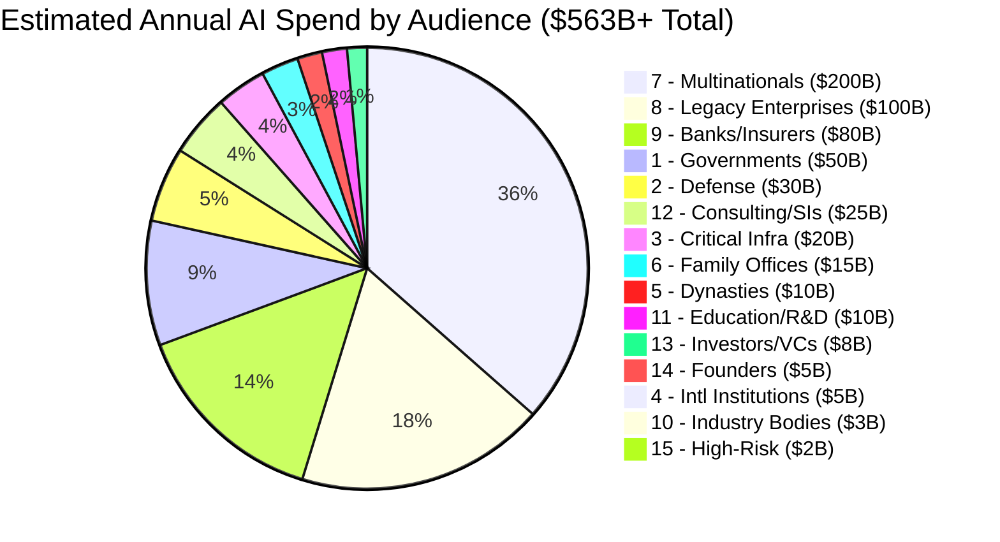
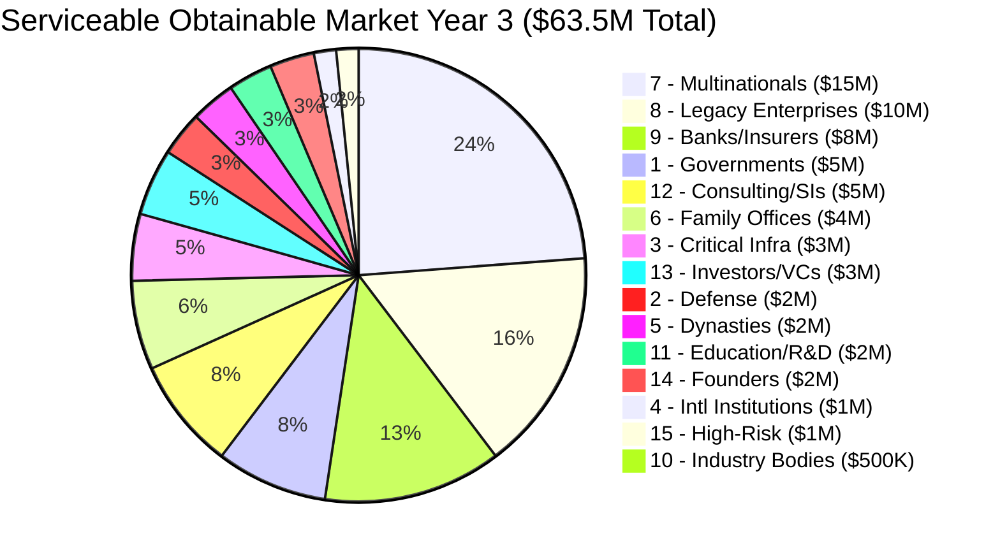

# TAM by Audience

Total Addressable Market (TAM) estimates for AI spend across all 15 audience segments, with Serviceable Obtainable Market (SOM) projections for Year 3. These figures size the addressable opportunity, not the build plan. The marketplace's execution priority is determined by the [Revenue Priority Stack](/risk-governance/revenue-priority), which optimizes for speed-to-revenue, not market size.

## Market Sizing Summary

| Audience | Estimated Annual AI Spend | Serviceable Obtainable (Y3) | Rationale |
|---|---|---|---|
| 1. Governments & Ministries | $50B+ | $5M | 1-2 ministries in Singapore/GCC |
| 2. Defense / Security / Intelligence | $30B+ | $2M | Requires clearances; slow entry |
| 3. National Critical Infrastructure | $20B+ | $3M | Utilities + transport early adopters |
| 4. International Institutions | $5B+ | $1M | UN agencies + regional bodies |
| 5. Dynasties & Royal Houses | $10B+ | $2M | 3-5 royal houses via advisory |
| 6. Family Offices | $15B+ | $4M | Direct sales; high ARPA |
| 7. Multinational Corporate Empires | $200B+ | $15M | Enterprise sales; longest cycle |
| 8. Legacy Enterprises | $100B+ | $10M | Mid-market sweet spot |
| 9. Banks, Insurers, Financial Foundations | $80B+ | $8M | Insurance wedge first |
| 10. National Industry Bodies | $3B+ | $500K | Low ARPA but network effects |
| 11. Education / R&D / Think Tanks | $10B+ | $2M | Grant-funded; price sensitive |
| 12. Consulting Firms & System Integrators | $25B+ | $5M | White-label opportunity |
| 13. Investors / VCs / Syndicates | $8B+ | $3M | Deal intelligence high-value |
| 14. High-Power Founders & Operators | $5B+ | $2M | Volume play; low ARPA |
| 15. High-Risk Individuals | $2B+ | $1M | Ultra-premium; low volume |
| **TOTAL** | **$563B+** | **$63.5M** | |

## TAM Distribution

## Y3 SOM Distribution

## Audience-Level Analysis

### Tier 1: Enterprise Core ($33M Y3 SOM)

These audiences represent the primary revenue engine. Longest sales cycles but highest contract values.

**Audience 7 -- Multinational Corporate Empires**
- **TAM:** $200B+ (35% of total)
- **Y3 SOM:** $15M
- **ARPA (Annual Revenue Per Account):** $500K-$2M
- **Target customers:** 10-15 multinationals
- **Entry wedge:** Billing Leakage Detector (immediate ROI proof), DocuFlow (document automation)
- **Upsell path:** Governance layers (ETLB, MCO), Board Decision Intelligence, Supply Chain Risk
- **Sales cycle:** 6-18 months
- **Key risk:** Build-vs-buy decision; enterprises with 1,000+ engineers may build internally

**Audience 8 -- Legacy Enterprises**
- **TAM:** $100B+ (18% of total)
- **Y3 SOM:** $10M
- **ARPA:** $200K-$800K
- **Target customers:** 20-30 mid-market enterprises
- **Entry wedge:** Tribal Knowledge Extractor (aging workforce crisis), Legacy System Migration Planner
- **Upsell path:** Process Mining, Predictive Maintenance, Inventory Optimization
- **Sales cycle:** 3-9 months (faster than multinationals)
- **Key risk:** Budget constraints; legacy enterprises are cost-sensitive

**Audience 9 -- Banks, Insurers, Financial Foundations**
- **TAM:** $80B+ (14% of total)
- **Y3 SOM:** $8M
- **ARPA:** $400K-$1.5M
- **Target customers:** 8-12 insurers and mid-tier banks
- **Entry wedge:** Claims Processing Accelerator (insurance), Billing Leakage Detector (banking)
- **Upsell path:** Regulatory Change Tracker, Internal Fraud Detection, ESG Compliance
- **Sales cycle:** 6-12 months (regulated procurement)
- **Key risk:** Regulatory approval requirements; compliance teams must sign off

### Tier 2: Specialized High-Value ($15M Y3 SOM)

High ARPA but small customer counts. Relationship-driven, advisory-led sales.

**Audience 1 -- Governments & Ministries**
- **TAM:** $50B+
- **Y3 SOM:** $5M
- **ARPA:** $1M-$5M
- **Target customers:** 1-2 ministries (Singapore, UAE, Saudi Arabia)
- **Entry wedge:** PIAR (Pre-Investment Architecture Review), Policy Compiler Engine
- **Upsell path:** Full governance stack, National Data Sovereignty Vault
- **Sales cycle:** 12-36 months (procurement cycles)
- **Key risk:** Procurement cycle time (Bottleneck 4); political changes reset relationships

**Audience 12 -- Consulting Firms & System Integrators**
- **TAM:** $25B+
- **Y3 SOM:** $5M
- **ARPA:** $500K-$2M
- **Target customers:** 5-8 mid-tier consulting firms
- **Entry wedge:** White-label governance tools (they resell under their brand)
- **Upsell path:** Industry-specific tool bundles, LevelUpMax training for their consultants
- **Sales cycle:** 3-6 months (consultants understand the value proposition fast)
- **Key risk:** Big 4 build their own tools; mid-tier firms lack the client base to drive volume

**Audience 6 -- Family Offices**
- **TAM:** $15B+
- **Y3 SOM:** $4M
- **ARPA:** $200K-$800K
- **Target customers:** 10-15 single-family offices
- **Entry wedge:** Consolidated Reporting Platform, Tax-Efficient Structuring Advisor
- **Upsell path:** Family Governance Facilitator, Next-Gen Education, Cybersecurity Shield
- **Sales cycle:** 1-3 months (principals decide fast)
- **Key risk:** Ultra-private; referral-only access; trust takes years to build

**Audience 5 -- Dynasties & Royal Houses**
- **TAM:** $10B+
- **Y3 SOM:** $2M
- **ARPA:** $500K-$2M
- **Target customers:** 3-5 royal houses
- **Entry wedge:** Advisory relationship via Succession Intelligence Platform
- **Upsell path:** Dynasty Knowledge Vault, Reputation Risk Sentinel, Political Landscape Navigator
- **Sales cycle:** 12-24 months (trust-based, multi-generational relationship)
- **Key risk:** Access is everything; no cold outreach possible

### Tier 3: Volume and Network ($9.5M Y3 SOM)

Lower ARPA, higher volume. Value comes from network effects and data accumulation.

**Audience 13 -- Investors / VCs / Syndicates**
- **TAM:** $8B+
- **Y3 SOM:** $3M
- **ARPA:** $100K-$500K
- **Target customers:** 15-25 VC firms and syndicates
- **Entry wedge:** Deal intelligence, portfolio monitoring
- **Upsell path:** Enterprise Mortality Tables, Co-Investment Network
- **Sales cycle:** 1-3 months

**Audience 3 -- National Critical Infrastructure**
- **TAM:** $20B+
- **Y3 SOM:** $3M
- **ARPA:** $300K-$1M
- **Target customers:** 5-8 utilities and transport operators
- **Entry wedge:** Grid Stability Predictor, Predictive Maintenance
- **Upsell path:** SCADA Security, Climate Resilience, Regulatory Compliance
- **Sales cycle:** 6-12 months

**Audience 2 -- Defense / Security / Intelligence**
- **TAM:** $30B+
- **Y3 SOM:** $2M
- **ARPA:** $500K-$2M
- **Target customers:** 2-3 defense agencies (allied nations)
- **Entry wedge:** Threat Pattern Recognition, Disinformation Detection
- **Upsell path:** Full intelligence stack
- **Sales cycle:** 12-36 months (clearance requirements)

**Audience 11 -- Education / R&D / Think Tanks**
- **TAM:** $10B+
- **Y3 SOM:** $2M
- **ARPA:** $50K-$200K
- **Target customers:** 15-25 universities and research institutions
- **Entry wedge:** Research analytics, grant-funded deployments
- **Upsell path:** Curriculum tools, research collaboration
- **Sales cycle:** 3-6 months (grant cycles)

**Audience 14 -- High-Power Founders & Operators**
- **TAM:** $5B+
- **Y3 SOM:** $2M
- **ARPA:** $10K-$50K
- **Target customers:** 100-200 operators
- **Entry wedge:** AI Cost Optimization Engine, operational tools
- **Upsell path:** Governance tools as they scale
- **Sales cycle:** Days to weeks (self-serve)

### Tier 4: Niche ($2.5M Y3 SOM)

Small markets with strategic value beyond revenue.

**Audience 4 -- International Institutions**
- **TAM:** $5B+
- **Y3 SOM:** $1M
- **ARPA:** $200K-$500K
- **Target customers:** 3-5 UN agencies or regional bodies
- **Entry wedge:** Treaty Compliance Monitor, SDG Progress Tracker
- **Strategic value:** Credibility signal; "used by the UN" is a sales accelerator

**Audience 15 -- High-Risk Individuals**
- **TAM:** $2B+
- **Y3 SOM:** $1M
- **ARPA:** $200K-$1M
- **Target customers:** 3-5 ultra-high-net-worth individuals
- **Entry wedge:** Cybersecurity, reputation monitoring, personal threat assessment
- **Strategic value:** Ultra-premium pricing validates brand positioning

**Audience 10 -- National Industry Bodies**
- **TAM:** $3B+
- **Y3 SOM:** $500K
- **ARPA:** $25K-$100K
- **Target customers:** 10-20 industry bodies
- **Entry wedge:** Standards Compiler, certification tools
- **Strategic value:** Network effects; industry body adoption creates downstream demand

## Key Metrics

| Metric | Value |
|---|---|
| **Total TAM** | $563B+ |
| **Y3 SOM** | $63.5M |
| **SOM as % of TAM** | 0.011% |
| **Average ARPA (blended)** | ~$200K |
| **Target customer count (Y3)** | ~300-400 |
| **Revenue concentration risk** | Top 3 audiences = 52% of SOM |

## Assumptions and Caveats

1. **TAM figures are gross market estimates.** They represent total AI spend, not addressable-by-this-marketplace spend. Actual addressable market is 5-15% of TAM (governance-adjacent spend).
2. **Y3 SOM assumes solo founder execution with operator pipeline.** If the operator pipeline (LevelUpMax) fails to produce qualified operators, SOM drops 40-60%.
3. **Enterprise segments (7, 8, 9) drive 52% of Y3 revenue.** Loss of any one enterprise segment requires compensating growth in others.
4. **Government and defense segments require 12-36 month sales cycles.** Revenue from these segments will not materialize until Y2 at earliest.
5. **The $63.5M Y3 target requires >40% attachment rate on governance layers.** Below 40%, the margin structure collapses. See [Sensitivity Analysis](/risk-governance/sensitivity-analysis).

## Related

- [Revenue Priority Stack](/risk-governance/revenue-priority)
- [Sensitivity Analysis](/risk-governance/sensitivity-analysis)
- [Economic Model -- Bundles](/economic-model/bundles)
- [Failure Mode Analysis](/risk-governance/failure-modes)
- [Agent Recovery Prompt](/recovery)
