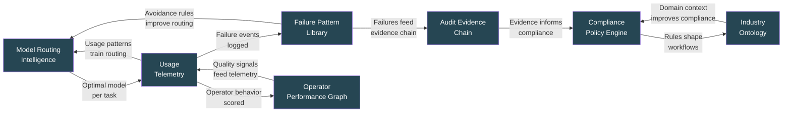
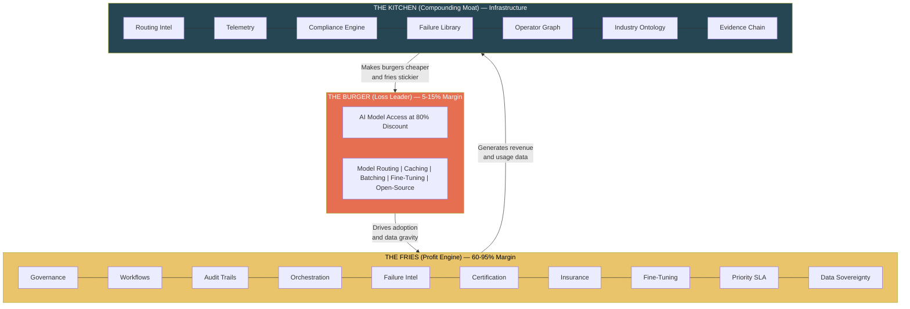

# Burger / Fries / Kitchen Framework

The FrankMax economic model is built on a three-layer architecture borrowed from fast food economics and applied to AI infrastructure. The model explains how a marketplace can sell AI models at 80% below provider pricing and still build a high-margin, defensible business.

---

## The Burger (Loss Leader)

**What it is**: Access to Claude, GPT, Gemini, Llama, Mistral, and other AI models at **$0.20 on the dollar** — 80% below direct provider pricing.

**Margin**: 5-15% (intentionally thin)

**Purpose**: Drive adoption and create **data gravity**. Every customer who processes their first document through the marketplace is generating usage data, compliance requirements, and workflow dependencies. The burger is not the business — it is the door.

### How 80% Discount Is Achieved

| Mechanism | Cost Reduction | How It Works |
|---|---|---|
| **Model Routing** | 20-40% | Route requests to the cheapest model that meets quality requirements; GPT-4 for complex tasks, Llama for simple extraction |
| **Semantic Caching** | 30-50% | 30-50% of enterprise requests are near-duplicates; cache responses and serve from cache instead of re-running inference |
| **Request Batching** | 10-20% | Batch non-urgent requests and process during off-peak pricing windows |
| **Fine-Tuned Small Models** | 40-60% | Train specialized small models that match large model quality for specific tasks at a fraction of the cost |
| **Open-Source Fallback** | 50-70% | Use Llama, Mistral, and other open-source models for commodity tasks where proprietary models add no value |

### Why Competitors Cannot Match This

The discount is not a pricing gimmick — it is an engineering system. Matching it requires:
1. Multi-model routing infrastructure (6+ months to build)
2. Semantic cache with domain-specific embeddings (requires usage data competitors do not have)
3. Fine-tuned models per industry vertical (requires labeled training data from customer workflows)
4. Batching system with SLA-aware scheduling (requires understanding customer latency requirements)

By the time a competitor builds this stack, FrankMax has 18 months of usage data training the routing and caching systems.

---

## The Fries (Profit Engine)

**What it is**: 10 high-margin attachment layers that customers buy alongside the cheap AI access.

**Margin**: 60-95% depending on layer

**Purpose**: Generate the actual revenue. The fries are where the money is. Every customer who buys a burger gets offered fries — and in regulated industries, many of these fries are not optional.

### The 10 Attachment Layers

| # | Layer | Gross Margin | Attachment Rate | Revenue Model |
|---|---|---|---|---|
| 1 | **Governance & Compliance Wrappers** | 70-85% | 60% | Per-transaction + subscription |
| 2 | **Industry-Specific Workflow Templates** | 80-90% | 45% | Per-template + customization fees |
| 3 | **Audit Trail & Traceability** | 75-85% | 55% (regulated) | Subscription + per-query |
| 4 | **Multi-Model Orchestration** | 65-75% | 40% | Usage-based |
| 5 | **Failure Intelligence Feeds** | 85-95% | 20% | Subscription |
| 6 | **Operator Certification** | 90%+ | 15% | Per-certification |
| 7 | **Insurance & Liability Products** | 60-70% | 30% | Premium-based |
| 8 | **Custom Fine-Tuning** | 70-80% | 25% | Project + hosting fees |
| 9 | **Priority SLA & Support** | 80-90% | 35% | Subscription tier |
| 10 | **Data Sovereignty & Residency** | 85-95% | 50% (gov/regulated) | Per-deployment |

### The Critical Threshold

**Below 40% average attachment rate = the business dies.** At 40% attachment, the fries margin covers the burger subsidy and funds kitchen development. Below 40%, the marketplace is just a discount AI reseller bleeding cash.

This is why [habit engineering](/economic-model/habit-engineering) and [structural switching costs](/economic-model/attachment-layers) are not nice-to-haves — they are survival requirements.

---

## The Kitchen (Compounding Moat)

**What it is**: 7 backend control systems that compound in value with every transaction, making the marketplace harder to replicate over time.

**Margin**: Not directly monetized (infrastructure)

**Purpose**: Create **irreversible competitive advantage**. The kitchen is what makes FrankMax defensible at year 3+. Every burger sold and every fry attached generates data that trains the kitchen systems, which in turn make the burgers cheaper and the fries stickier.

### The 7 Kitchen Systems

| System | What It Captures | Compounding Effect |
|---|---|---|
| **Model Routing Intelligence** | Which model works best for which task, industry, and context | Routing accuracy improves daily; cost optimization compounds |
| **Usage Telemetry** | How customers actually use AI across workflows | Predicts demand, identifies upsell opportunities, trains caching |
| **Compliance Policy Engine** | Regulatory requirements by jurisdiction, industry, and use case | New regulations auto-mapped to enforcement rules; coverage grows monotonically |
| **Failure Pattern Library** | Every AI failure, miscategorization, hallucination, and edge case | Failure avoidance improves with volume; competitors see failures FrankMax already solved |
| **Operator Performance Graph** | Which operators perform well on which tasks under which conditions | Enables certification, quality scoring, and operator matching |
| **Industry Ontology** | Domain-specific terminology, workflows, and decision trees per NAICS sector | Templates become more precise; new verticals are easier to enter |
| **Audit Evidence Chain** | Complete provenance for every AI decision in the ecosystem | Evidence packages become more comprehensive; legal defensibility improves |

### Why the Kitchen Cannot Be Replicated

The kitchen is a **data flywheel**. Each system feeds the others:

A competitor entering at year 2 would need to process the same volume of transactions across the same industries to build equivalent kitchen systems. By that point, FrankMax's kitchen is 2 years ahead and compounding daily.

---

## The Full Stack

---

## Related

- [Unit Economics Model](/economic-model/unit-economics) — Y1-Y3 projections and sensitivity analysis
- [High-Margin Attachment Layers](/economic-model/attachment-layers) — Deep dive into each of the 10 fries
- [Habit Engineering Strategy](/economic-model/habit-engineering) — How customers become dependent on the fries
- [Structural Dominance Strategy](/economic-model/structural-dominance) — How the kitchen becomes the industry infrastructure
