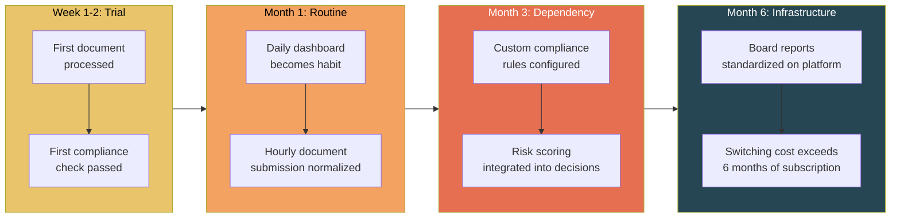

# Habit Engineering Strategy

Attachment rates do not happen by accident. They are engineered through deliberate behavioral design. The FrankMax marketplace embeds itself into customer workflows at multiple frequencies — from hourly document processing to quarterly board preparation — so that the platform becomes invisible infrastructure rather than a tool that can be evaluated and replaced.

The goal: after 90 days of usage, removing FrankMax from a customer's workflow would feel like removing email.

---

## The Habit Loop Framework

Every habit follows the same structure: **Trigger** (cue that initiates the behavior), **Behavior** (action taken on the platform), **Reward** (value received), **Repetition** (frequency that reinforces the habit). The more frequently the loop fires, the faster the habit forms and the higher the switching cost.

---

## Habit Engineering Table

| Trigger | Frequency | Behavior | Reward | Switching Cost |
|---|---|---|---|---|
| **Morning Briefing** | Daily | Open AI operations dashboard; review overnight processing results, compliance alerts, model performance metrics | Situational awareness in 2 minutes; confidence that nothing failed overnight | Losing the dashboard means building manual monitoring or flying blind; 30+ days of historical context lost |
| **Document Processing** | Hourly | Submit documents (contracts, claims, permits, reports) for AI extraction, classification, and routing | Processed documents returned in seconds with audit trail; 10x faster than manual processing | Workflow templates are customized over months; retraining staff on a new system takes 4-8 weeks |
| **Compliance Check** | Per-Transaction | AI output automatically checked against jurisdiction-specific compliance rules before delivery | Zero manual compliance review; regulatory risk eliminated at transaction level | 200+ custom compliance rules accumulated over months; reconfiguring on a new platform takes 3-6 months |
| **Risk Scoring** | Per-Decision | AI-assisted risk assessment with model explanation, confidence score, and precedent analysis | Faster, more consistent risk decisions with defensible audit trail | Risk models calibrated on organizational data; historical risk scores not portable |
| **Performance Review** | Weekly | Review AI system performance, operator scores, failure rates, and cost optimization metrics | Clear visibility into what is working and what needs adjustment; data-driven optimization | Performance baselines and trend data accumulated over months; starting fresh means losing all benchmarks |
| **Board Preparation** | Monthly / Quarterly | Generate AI governance reports, compliance summaries, risk dashboards, and audit packages for board review | Board-ready materials in hours instead of weeks; consistent format across reporting periods | Board has become accustomed to specific report formats and metrics; switching creates a reporting gap that boards will not tolerate |

---

## Habit Formation Timeline

---

## Behavioral Design Principles

### 1. Reduce Time-to-Value to Under 5 Minutes

The first habit loop must fire within the first session. A new customer should process their first document, see the compliance check pass, and receive a formatted output in under 5 minutes. If the first session requires configuration, training, or setup, the habit never forms.

**Implementation**: Pre-configured templates for the top 5 use cases per industry. Customer selects their industry, uploads a sample document, and gets results immediately.

### 2. Create Variable Rewards

Fixed rewards (same output every time) create utility but not habit. Variable rewards (the dashboard shows something new and interesting each morning) create engagement. The morning briefing includes:
- Overnight processing results (expected)
- Anomaly detection alerts (unexpected — what failed? what was unusual?)
- Cost optimization suggestions (variable — different recommendations each week)
- Industry failure intelligence updates (novel — what is happening across the ecosystem)

### 3. Increase Frequency Before Depth

A customer who uses the platform hourly for one simple task is more valuable than a customer who uses it weekly for a complex task. Hourly usage forms habits faster, generates more Kitchen data, and creates higher switching costs (hourly workflows are harder to migrate than weekly reports).

**Implementation**: Document processing (hourly) is offered before board reporting (monthly). Compliance checks (per-transaction) are activated before risk scoring (per-decision). Frequency drives lock-in.

### 4. Make the Platform Invisible

The end state of successful habit engineering is invisibility. The customer no longer "uses FrankMax" — they "process documents," "check compliance," and "prepare board reports." The platform is embedded in the verb, not evaluated as a noun.

**Implementation**: API-first architecture allows FrankMax to operate inside existing tools (Slack, email, ERP, CRM). The customer interacts with their familiar interface; FrankMax runs underneath.

### 5. Escalate Commitment Gradually

Never ask for full commitment upfront. The commitment ladder:

| Stage | Commitment | Reversibility |
|---|---|---|
| **Free trial** | Upload one document | Fully reversible |
| **First subscription** | Process documents regularly | Easy to cancel |
| **Template customization** | Configure workflows to organizational needs | Moderate effort to reverse (reconfigure elsewhere) |
| **Compliance integration** | Build compliance rules into AI workflows | Significant effort to reverse (months of reconfiguration) |
| **Board reporting** | Standardize governance reports on platform | Extremely difficult to reverse (board expectations set) |
| **Full integration** | Platform embedded in daily operations at all levels | Switching cost exceeds annual subscription cost |

---

## Measuring Habit Strength

| Metric | Definition | Target | Red Flag |
|---|---|---|---|
| **DAU/MAU Ratio** | Daily active users / monthly active users | > 60% | Below 40% = weak habits |
| **Time-to-First-Action** | Time from login to first meaningful action | < 30 seconds | Above 2 minutes = friction |
| **Session Frequency** | Average sessions per user per day | > 3 | Below 1 = peripheral tool, not habit |
| **Streak Length** | Consecutive days with at least one action | > 20 days median | Below 10 days median = habit not forming |
| **Feature Breadth** | Number of distinct features used per customer per month | > 4 | Below 2 = single-use tool risk |
| **Unprompted Return** | Sessions initiated without email/notification prompt | > 70% | Below 50% = dependent on reminders |

---

## Habit Engineering and Attachment Rates

The connection between habit formation and [attachment rates](/economic-model/attachment-layers) is direct:

| Habit Stage | Typical Attachment Rate | Layers Attached |
|---|---|---|
| **Trial** (Week 1-2) | 15% | Burger only + maybe 1 workflow template |
| **Routine** (Month 1) | 30% | Burger + governance wrapper + audit trail |
| **Dependency** (Month 3) | 45% | Above + compliance checks + priority SLA |
| **Infrastructure** (Month 6+) | 55-65% | Above + board reporting + risk scoring + fine-tuning |

This is why the [40% attachment threshold](/economic-model/unit-economics#the-40-attachment-rate-threshold) is achievable: by month 3, habit-engineered customers are already above 40%. The risk is customers who never progress past the trial stage — they buy the burger but never order fries.

**Mitigation**: Customers who have not attached a second layer within 30 days receive targeted intervention (onboarding call, industry-specific use case demonstration, compliance audit showing gaps).

---

## Related

- [Burger / Fries / Kitchen Framework](/economic-model/burger-fries-kitchen) — The economic model habits support
- [High-Margin Attachment Layers](/economic-model/attachment-layers) — What customers are being habituated to buy
- [Unit Economics Model](/economic-model/unit-economics) — How habits drive the 40% threshold
- [Structural Dominance Strategy](/economic-model/structural-dominance) — How habits compound into market control
