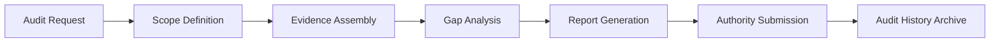

# Audit-as-a-Service (AaaS)

## Definition

Audit-as-a-Service (AaaS) provides continuous and on-demand auditing of AI systems, decisions, and outcomes. It generates the evidence trail that regulators, auditors, boards, and courts require: what model made what decision, with what inputs, at what confidence level, approved by whom, with what outcome. AaaS transforms AI from an opaque process into a fully auditable system of record.

AaaS is the evidentiary Fries layer. It exists because the question "why did the AI do that?" will be asked by regulators, lawyers, customers, and boards -- and "we don't know" is an unacceptable answer in any regulated or high-stakes context. Every AI action logged through the FrankMax platform automatically generates audit-ready documentation. AaaS packages, formats, and delivers that documentation in the structure required by the requesting authority.

## How It Works

1. All AI actions on the platform are logged with full input/output/context/approval chains
2. AaaS engine indexes logs by regulation, business function, time period, and risk level
3. Audit requests (scheduled or ad-hoc) trigger automated evidence assembly
4. Audit reports are generated in the format required by the requesting authority (SOC 2, ISO 27001, regulatory examination)
5. Gap analysis identifies missing evidence and triggers remediation before the audit deadline
6. Audit history feeds the Governance Pattern Libraries byproduct

## Target Audiences

- **Primary**: Audience 9 (Financial Services), Audience 1 (Government), Audience 10 (Healthcare)
- **Secondary**: Audience 3 (Critical Infrastructure), Audience 2 (Defense)
- **Attach Rate**: 58-82% across bundles; mandatory in regulated sectors

## Pricing Model

- **Continuous audit**: $900-$3,500/month subscription for ongoing audit trail maintenance
- **On-demand audit**: $2,500-$15,000 per audit engagement
- **Regulatory examination prep**: $5,000-$25,000 per examination cycle
- **Retainer**: $2,200/month for audit-readiness with guaranteed 48-hour response

## Revenue Economics

| Metric | Value |
|---|---|
| Gross Margin | 78-90% |
| AI Compute Cost | 5-10% of audit price |
| Evidence Assembly Overhead | 5-8% |
| Average Monthly Revenue per Customer | $900-$8,000 |
| Margin Expansion Trigger | Audit template reuse across similar organizations |

AaaS revenue is counter-cyclical: it increases during regulatory crackdowns, market stress, and litigation waves. When regulators tighten AI oversight, AaaS demand spikes. This makes it a natural hedge against market conditions that might reduce demand for other service layers.

## BPMN Workflow

