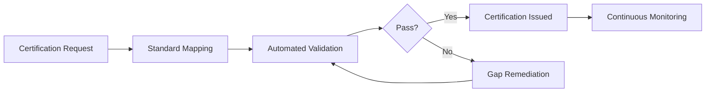

# Certification-as-a-Service (CertaaS)

## Definition

Certification-as-a-Service (CertaaS) provides formal validation and certification of AI systems against industry standards, regulatory requirements, and organizational policies. It answers the question regulators and procurement officers ask: "Has this AI system been independently validated for safety, accuracy, fairness, and compliance?" CertaaS issues certifications that carry weight with regulators, auditors, and enterprise buyers because they are backed by continuous platform telemetry rather than point-in-time assessments.

CertaaS is the credentialing Fries layer. Traditional AI certification is a periodic, expensive, manual process that produces a snapshot valid for 12 months. CertaaS provides living certifications that are continuously validated against real-time performance data. If an AI system drifts out of compliance, the certification is automatically suspended until remediation is complete. This continuous model is what regulators are moving toward, and CertaaS positions FrankMax as the certification infrastructure before the regulatory mandate arrives.

## How It Works

1. Customer selects certification standard(s) to validate against (ISO 42001, EU AI Act, NIST AI RMF, sector-specific)
2. CertaaS engine maps AI system configuration against certification requirements
3. Automated testing executes validation checks: accuracy, fairness, robustness, transparency, security
4. Certification is issued with scope, conditions, and continuous monitoring parameters
5. Real-time telemetry maintains certification validity; deviations trigger suspension and remediation
6. Certification data feeds Governance Pattern Libraries and Regulatory Pre-Compliance Sandboxes

## Target Audiences

- **Primary**: Audience 9 (Financial Services), Audience 2 (Defense), Audience 3 (Critical Infrastructure)
- **Secondary**: Audience 1 (Government), Audience 10 (Healthcare)
- **Attach Rate**: 41-79% in regulated verticals; critical for procurement eligibility

## Pricing Model

- **Per-certification**: $3,000-$15,000 per initial certification depending on complexity
- **Continuous maintenance**: $600-$2,800/month for living certification monitoring
- **Multi-standard**: 20% discount when certifying against 3+ standards simultaneously
- **Enterprise**: Custom pricing for portfolio-wide certification programs

## Revenue Economics

| Metric | Value |
|---|---|
| Gross Margin | 82-92% |
| Validation Compute Cost | 5-10% of certification price |
| Standards Maintenance | 3-5% |
| Average Monthly Revenue per Customer | $600-$6,000 |
| Margin Expansion Trigger | Each new standard increases certification revenue per customer |

CertaaS revenue grows automatically with the regulatory environment. Every new AI standard or regulation creates new certification requirements. The EU AI Act alone created demand for certifications across four risk categories. CertaaS is positioned to capture this demand before traditional certification bodies can build the technical infrastructure to assess AI systems.

## BPMN Workflow

