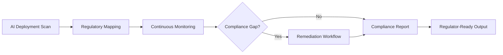

# Compliance-as-a-Service (CoaaS)

## Definition

Compliance-as-a-Service (CoaaS) provides continuous, automated compliance monitoring, reporting, and remediation for AI deployments across all regulatory frameworks. It maps every AI action to applicable regulations (GDPR, CCPA, EU AI Act, SOX, HIPAA, Basel III, sector-specific mandates), identifies gaps in real time, generates audit-ready documentation, and triggers remediation workflows when violations are detected.

CoaaS is the single highest-attachment Fries layer across all bundles. Every organization deploying AI faces compliance obligations, and those obligations multiply with each new regulation. The EU AI Act alone created 47 new compliance requirements for high-risk AI systems. Organizations that start with the Burger (cheap model access) discover within 30 days that they need compliance wrappers, making CoaaS the most natural and urgent attachment. Margin is 80-92% because the compliance logic is built once and applied across thousands of customers.

## How It Works

1. CoaaS maps the customer's AI deployments against all applicable regulatory frameworks
2. Continuous monitoring tracks every AI action for compliance alignment
3. Gap detection identifies non-conformance in real time and generates remediation tickets
4. Automated reporting produces regulator-ready documentation on demand
5. Regulatory change tracking updates compliance rules as new regulations are published
6. ORF protocol ensures every compliance action binds to a responsible human

## Target Audiences

- **Primary**: Audience 9 (Financial Services), Audience 1 (Government), Audience 3 (Critical Infrastructure)
- **Secondary**: Audience 10 (Healthcare), Audience 2 (Defense)
- **Attach Rate**: 72-89% across all bundles; highest in regulated industries

## Pricing Model

- **Subscription**: $900-$3,200/month depending on regulatory complexity and deployment count
- **Per-framework**: $400/month per additional regulatory framework monitored
- **Incident response**: $2,000-$10,000 per compliance incident remediation
- **Enterprise**: Custom agreements with SLA-backed compliance guarantees

## Revenue Economics

| Metric | Value |
|---|---|
| Gross Margin | 80-92% |
| AI Compute Cost | 5-12% of subscription price |
| Regulatory Update Maintenance | 3-8% |
| Average Monthly Revenue per Customer | $900-$8,500 |
| Margin Expansion Trigger | Each new regulation increases per-customer revenue |

CoaaS revenue grows automatically as regulatory burden increases. Every new AI regulation (EU AI Act, state-level AI bills, sector mandates) adds compliance requirements that map directly to CoaaS pricing tiers. The regulatory environment is the sales force.

## BPMN Workflow

