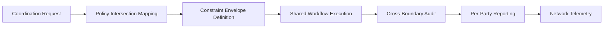

# Coordination-as-a-Service (CoordaaS)

## Definition

Coordination-as-a-Service (CoordaaS) manages the orchestration of AI-mediated activities across organizational boundaries -- between departments, between companies, between government agencies, and between jurisdictions. It solves the problem that arises when multiple parties need to collaborate using AI but have different governance policies, different risk tolerances, different regulatory obligations, and different technology stacks.

CoordaaS is the multi-party Fries layer. It becomes critical when organizations move beyond internal AI deployment to AI-mediated collaboration with external partners. A bank coordinating with a regulator. A defense agency coordinating with allied nations. A supply chain coordinating across 50 vendors. Each party maintains its own governance rules, and CoordaaS ensures that cross-boundary AI operations respect all parties' constraints simultaneously. This is the layer that makes FrankMax a platform rather than a tool: it becomes the coordination infrastructure that multiple organizations depend on.

## How It Works

1. Participating organizations define their governance policies, data sharing rules, and authority boundaries
2. CoordaaS engine maps the intersection of all parties' constraints to find the feasible coordination space
3. Shared workflows execute within the agreed constraint envelope with each party's governance applied
4. Cross-boundary data sharing follows the most restrictive party's rules (high-water mark)
5. Each party receives audit trails covering their portion of the coordinated activity
6. Coordination patterns feed the Kitchen layer for cross-industry optimization

## Target Audiences

- **Primary**: Audience 1 (Government), Audience 2 (Defense), Audience 3 (Critical Infrastructure)
- **Secondary**: Audience 7 (Enterprise IT), Audience 12 (Supply Chain)
- **Attach Rate**: 44-57% in multi-stakeholder environments

## Pricing Model

- **Per-coordination**: $50-$500 per cross-boundary coordination event
- **Subscription**: $1,100-$4,200/month for persistent coordination channels
- **Multi-party pricing**: Base fee + $300/month per additional coordinating party
- **Enterprise**: Custom agreements for standing coordination infrastructure

## Revenue Economics

| Metric | Value |
|---|---|
| Gross Margin | 80-90% |
| Compute Cost | 4-8% of coordination price |
| Policy Engine Overhead | 3-6% |
| Average Monthly Revenue per Customer | $1,100-$8,000 |
| Margin Expansion Trigger | Network effects as more organizations join coordination networks |

CoordaaS has strong network effects: each new organization that joins a coordination network increases the value for all existing participants. Revenue per network grows non-linearly as participants are added. A three-party coordination generates more revenue than three bilateral coordinations.

## BPMN Workflow

