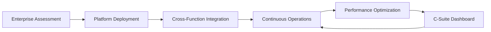

# Enterprise-as-a-Service (EaaS)

## Definition

Enterprise-as-a-Service (EaaS) provides a complete AI-native operating layer for an entire organization or business unit. It combines CaaS, SaaS, RaaS, and WaaS into a unified platform that handles cross-functional operations: finance talks to HR talks to compliance talks to operations through a single governed AI layer. EaaS is the "whole company on AI" service.

EaaS is the ceiling of the Fries layer. When an organization reaches this tier, every business function routes through the FrankMax platform. The switching cost at this level is not a feature comparison -- it is the cost of rebuilding an entire operating model. EaaS customers have the highest ARPU, lowest churn, and deepest data generation of any service tier. They are also the primary source of byproduct data for the Kitchen layer because their operations produce telemetry across every business function simultaneously.

## How It Works

1. Enterprise assessment maps all business functions, workflows, decision points, and integration requirements
2. EaaS platform deploys role agents, workflow engines, and capability endpoints across all functions
3. Cross-functional coordination layer ensures finance, operations, HR, compliance, and strategy share context
4. Governance dashboard provides C-suite visibility into AI utilization, cost, risk, and performance
5. Continuous optimization adjusts model routing, workflow paths, and role parameters based on performance data
6. Quarterly business reviews align AI operations with organizational strategy

## Target Audiences

- **Primary**: Audience 7 (Enterprise IT), Audience 9 (Financial Services)
- **Secondary**: Audience 1 (Government), Audience 3 (Critical Infrastructure)
- **Attach Rate**: Natural upgrade from Bundle 3 (Enterprise Operations) at 12+ month maturity

## Pricing Model

- **Platform subscription**: $12,000-$50,000/month depending on organization size
- **Per-user seat**: $150-$400/month per active user
- **Implementation**: $50,000-$200,000 one-time deployment and integration fee
- **Enterprise agreement**: Custom 24-60 month commitments with volume discounts

## Revenue Economics

| Metric | Value |
|---|---|
| Gross Margin | 80-92% |
| AI Compute Cost | 6-14% of subscription price |
| Platform Operations | 2-6% |
| Average Monthly Revenue per Customer | $12,000-$85,000 |
| Margin Expansion Trigger | Operational depth drives cross-sell of every other layer |

EaaS is the highest-margin service layer because it consolidates all other layers into a single contract. The implementation fee covers deployment costs, and the subscription is almost entirely margin after the first 90 days. Customer lifetime value exceeds $1M for mid-market deployments.

## BPMN Workflow

