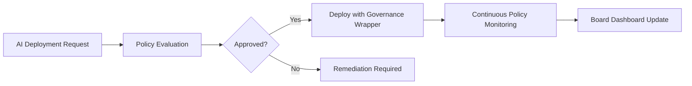

# Governance-as-a-Service (GaaS)

## Definition

Governance-as-a-Service (GaaS) provides the organizational control framework for AI operations: who can deploy what models, under what conditions, with what approval chains, subject to what oversight mechanisms. It is the policy layer that sits above compliance. Where CoaaS asks "are we following the rules?", GaaS asks "who sets the rules, who enforces them, and how do they change?"

GaaS is the structural Fries layer that transforms ad-hoc AI usage into governed AI operations. It implements the ORF (Obligation and Responsibility Finality) protocol at the organizational level, ensuring every AI deployment has a named owner, a defined scope, an approval chain, and an expiration condition. Organizations that adopt GaaS cannot revert to ungoverned AI usage without board-level risk acceptance, creating deep platform lock-in.

## How It Works

1. GaaS engine maps organizational structure: business units, roles, authority levels, decision chains
2. AI governance policies are defined or selected from industry-standard templates
3. Every AI deployment request routes through the governance approval workflow
4. Active deployments are monitored against policy boundaries with automated enforcement
5. Policy changes propagate across all governed AI systems in real time
6. Governance dashboards provide board-level visibility into AI risk posture

## Target Audiences

- **Primary**: Audience 1 (Government), Audience 9 (Financial Services), Audience 5 (Family Offices)
- **Secondary**: Audience 7 (Enterprise IT), Audience 3 (Critical Infrastructure)
- **Attach Rate**: 47-65% across bundles; highest in government and financial services

## Pricing Model

- **Subscription**: $1,200-$4,500/month depending on organizational complexity
- **Per-policy**: $200/month per active governance policy maintained
- **Board reporting**: $800/month add-on for quarterly board-ready governance reports
- **Enterprise**: Custom agreements with dedicated governance advisor support

## Revenue Economics

| Metric | Value |
|---|---|
| Gross Margin | 82-93% |
| AI Compute Cost | 4-8% of subscription price |
| Policy Template Maintenance | 3-5% |
| Average Monthly Revenue per Customer | $1,200-$6,000 |
| Margin Expansion Trigger | Policy template reuse drives near-zero marginal cost |

GaaS has the highest gross margin of any service layer because governance policies are knowledge artifacts, not compute-intensive operations. A governance framework built for one bank applies to hundreds of banks with minor customization. The compute cost is minimal -- it is policy evaluation, not model inference.

## BPMN Workflow

