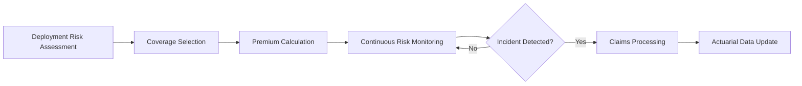

# Insurance-as-a-Service (InaaS)

## Definition

Insurance-as-a-Service (InaaS) provides risk transfer products specifically designed for AI-related failures: model hallucinations that cause financial loss, algorithmic bias that triggers discrimination lawsuits, autonomous system failures that cause physical harm, and compliance breaches that result in regulatory fines. Traditional insurance products do not cover AI-specific risks because underwriters lack the data to price them. InaaS solves this by using the platform's own telemetry as the actuarial basis.

InaaS is the risk-transfer Fries layer. It converts the Kitchen data (failure rates, drift patterns, compliance gaps) into underwritable risk profiles. Organizations that deploy AI through FrankMax get access to insurance products that are structurally unavailable to organizations using raw AI tools, because FrankMax can prove -- with telemetry data -- what the actual failure rates are. This creates a dual lock-in: the AI platform and the insurance coverage are interdependent.

## How It Works

1. Platform telemetry generates actuarial data: failure rates, confidence distributions, drift velocity, incident frequency
2. Risk models price coverage for specific AI deployments based on actual performance data
3. Customer selects coverage levels: basic (model errors), standard (compliance gaps), premium (consequential damages)
4. Continuous monitoring adjusts premiums in real time based on deployment risk profile
5. Claims processing uses the same audit trail used for compliance, enabling rapid adjudication
6. Claims data feeds Failure Intelligence Feeds and Enterprise Mortality Tables

## Target Audiences

- **Primary**: Audience 9 (Financial Services), Audience 5 (Family Offices), Audience 3 (Critical Infrastructure)
- **Secondary**: Audience 10 (Healthcare), Audience 2 (Defense)
- **Attach Rate**: 54-69% in high-risk verticals; lower in cost-sensitive segments

## Pricing Model

- **Premium-based**: 2-8% of AI deployment cost per month, risk-adjusted
- **Tiered coverage**: Basic ($500/mo), Standard ($1,800/mo), Premium ($3,500/mo)
- **Deductible structure**: Lower premiums with higher per-incident deductibles
- **Portfolio pricing**: Multi-deployment discounts for organizations with 10+ AI systems

## Revenue Economics

| Metric | Value |
|---|---|
| Gross Margin | 70-85% |
| Claims Reserve | 10-20% of premium revenue |
| Reinsurance Cost | 5-10% |
| Average Monthly Revenue per Customer | $500-$5,000 |
| Margin Expansion Trigger | Growing telemetry data improves risk pricing accuracy |

InaaS economics improve over time because every claim, every near-miss, and every failure event sharpens the actuarial models. At scale, the platform's failure data becomes the most accurate AI risk pricing dataset in existence -- a Kitchen byproduct that compounds daily.

## BPMN Workflow

