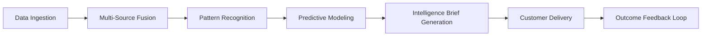

# Intelligence-as-a-Service (IaaS)

## Definition

Intelligence-as-a-Service (IaaS) delivers synthesized, actionable intelligence derived from multi-source data fusion, pattern recognition, and predictive modeling. Unlike raw analytics that show what happened, IaaS tells organizations what is happening, what will happen, and what to do about it. It fuses public data, proprietary platform telemetry, industry benchmarks, and customer-specific signals into intelligence briefs tailored to the recipient's decision context.

IaaS is the strategic Fries layer. It turns the Kitchen's compounding data assets into saleable intelligence products. As the platform accumulates telemetry from thousands of organizations across 15 audience segments, IaaS can produce cross-industry intelligence that no single organization could generate internally. The defense customer benefits from patterns observed in financial services. The infrastructure operator benefits from threat intelligence aggregated across all sectors. This cross-pollination of intelligence is the platform's deepest structural advantage.

## How It Works

1. Data ingestion layer aggregates public data, platform telemetry, and customer-authorized signals
2. Fusion engine cross-references signals across sources and identifies emerging patterns
3. Analytical models generate predictions with confidence intervals and scenario branches
4. Intelligence briefs are generated in the format and cadence requested by the customer
5. Feedback loops capture which intelligence was acted upon and what the outcome was
6. Outcome data feeds prediction model refinement (Kitchen compounding)

## Target Audiences

- **Primary**: Audience 2 (Defense/Intelligence), Audience 9 (Financial Services)
- **Secondary**: Audience 3 (Critical Infrastructure), Audience 1 (Government)
- **Attach Rate**: 44-84% depending on vertical; highest in defense and financial services

## Pricing Model

- **Subscription**: $1,800-$5,200/month for standard intelligence feeds
- **Custom briefs**: $3,000-$15,000 per custom intelligence engagement
- **Real-time alerts**: $800/month add-on for time-critical intelligence delivery
- **Enterprise**: Custom pricing with dedicated analyst support and classified handling

## Revenue Economics

| Metric | Value |
|---|---|
| Gross Margin | 75-88% |
| Data Acquisition Cost | 5-12% of subscription price |
| Analysis Compute Cost | 5-10% |
| Average Monthly Revenue per Customer | $1,800-$12,000 |
| Margin Expansion Trigger | Platform data growth improves intelligence quality at zero marginal cost |

IaaS margin improves as the Kitchen matures. Intelligence derived from proprietary platform telemetry has zero acquisition cost. At scale, 60-70% of intelligence inputs come from platform-generated data, pushing margins above 85%.

## BPMN Workflow

