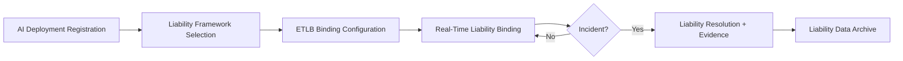

# Liability-as-a-Service (LaaS)

## Definition

Liability-as-a-Service (LaaS) provides the legal and operational infrastructure for assigning, tracking, and managing liability for AI-driven decisions and actions. It implements the ETLB (Execution-Time Liability Binding) protocol at the transaction level: every AI action is bound to a named human who accepts liability for the outcome within defined parameters. LaaS solves the "who is responsible when AI fails?" problem that paralyzes adoption in high-stakes environments.

LaaS is the accountability Fries layer. It exists because the law has not caught up with AI. When an AI system makes a decision that causes harm, the liability chain is undefined: is it the model provider, the deploying organization, the individual who approved the deployment, or the developer who built the integration? LaaS resolves this ambiguity at deployment time, before any incident occurs, by creating legally structured liability agreements that bind to specific humans for specific AI actions. This pre-incident clarity is what enables organizations to deploy AI in environments where undefined liability would otherwise block adoption.

## How It Works

1. AI deployment is registered with LaaS, defining the decision scope and potential impact domain
2. Liability framework maps actions to responsible parties with authority levels and financial caps
3. ETLB protocol binds each AI action in real time to the designated responsible human
4. Liability transfer events are logged with full context for legal admissibility
5. Incident response integrates with InaaS for risk transfer and AaaS for evidence assembly
6. Liability data feeds Human Accountability Infrastructure and Enterprise Mortality Tables

## Target Audiences

- **Primary**: Audience 9 (Financial Services), Audience 5 (Family Offices), Audience 2 (Defense)
- **Secondary**: Audience 10 (Healthcare), Audience 11 (Legal)
- **Attach Rate**: 48-72% in high-liability environments

## Pricing Model

- **Subscription**: $800-$2,800/month for liability framework maintenance
- **Per-binding**: $5-$50 per ETLB binding event depending on liability magnitude
- **Incident management**: $5,000-$25,000 per liability incident adjudication
- **Enterprise**: Custom agreements with pre-negotiated liability caps and transfer mechanisms

## Revenue Economics

| Metric | Value |
|---|---|
| Gross Margin | 82-93% |
| Compute Cost | 3-6% of subscription price |
| Legal Framework Maintenance | 4-8% |
| Average Monthly Revenue per Customer | $800-$6,000 |
| Margin Expansion Trigger | Liability frameworks are reusable legal templates with near-zero marginal cost |

LaaS has the highest margin potential of any service layer at scale because liability frameworks are legal documents, not compute operations. Once a liability template is drafted and validated for a sector, deploying it to additional customers costs almost nothing. The legal review that costs $50K to create generates $500K+ in annual revenue across customers.

## BPMN Workflow

