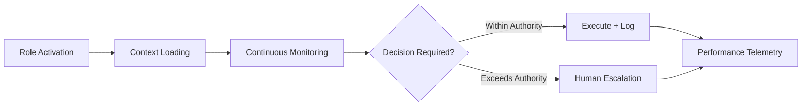

# Role-as-a-Service (RaaS)

## Definition

Role-as-a-Service (RaaS) packages AI as a persistent organizational role -- a virtual compliance officer, financial analyst, HR coordinator, or procurement specialist that operates continuously within an organization's workflow. Unlike CaaS (single capability) or SaaS (single task), RaaS fills a defined position with ongoing responsibilities, decision authority boundaries, and accountability chains.

RaaS is the layer where AI transitions from tool to teammate. Each deployed role has a defined scope of authority, escalation protocols, and performance metrics identical to what a human in that role would have. The critical difference: every decision the AI role makes is bound to a supervising human via ETLB, creating an accountability structure that does not exist when organizations use raw AI tools. This is the "Fries" layer that locks organizations into the platform because removing a role means re-hiring and re-training a human.

## How It Works

1. Customer defines a role from the catalog or customizes role parameters (scope, authority, escalation rules)
2. Role agent is instantiated with domain-specific knowledge, organizational context, and governance constraints
3. Role operates continuously -- monitoring, analyzing, recommending, and executing within its authority boundary
4. Actions exceeding authority threshold are escalated to the named human supervisor
5. Performance is reported weekly with accuracy, throughput, and escalation metrics
6. Role behavior data feeds the Kitchen layer for cross-customer optimization

## Target Audiences

- **Primary**: Audience 7 (Enterprise IT), Audience 8 (HR/Talent)
- **Secondary**: Audience 9 (Financial Services), Audience 1 (Government)
- **Attach Rate**: Highest with Bundle 3 (Enterprise Operations) and Bundle 1 (Government Starter)

## Pricing Model

- **Monthly subscription**: $800-$4,500/month per role depending on complexity
- **Multi-role discount**: 15% discount at 5+ roles, 25% at 10+ roles
- **Custom role development**: $12,000-$30,000 one-time build + monthly subscription
- **Hybrid model**: Base subscription + per-decision overage above threshold

## Revenue Economics

| Metric | Value |
|---|---|
| Gross Margin | 75-88% |
| AI Compute Cost | 8-18% of subscription price |
| Role Maintenance | 4-7% |
| Average Monthly Revenue per Customer | $800-$12,000 |
| Margin Expansion Trigger | Role templates reused across organizations |

RaaS has the highest retention of any service layer because removing a role creates an immediate operational gap. Average customer retention exceeds 24 months. Margin improves as role templates are standardized across industry verticals.

## BPMN Workflow

