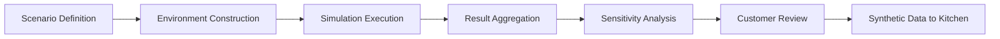

# Simulation-as-a-Service (SimaaS)

## Definition

Simulation-as-a-Service (SimaaS) provides the ability to model, test, and stress-test AI deployments, business scenarios, and organizational decisions in a sandboxed environment before committing to real-world execution. It answers: "What happens if we deploy this model? What happens if this regulation passes? What happens if this market crashes?" SimaaS runs thousands of scenarios in hours rather than the months required for traditional scenario planning.

SimaaS is the risk-reduction Fries layer. It reduces the cost of experimentation to near zero by allowing organizations to test decisions in simulation before executing them in production. For family offices modeling generational wealth transfer, defense agencies wargaming threat scenarios, or infrastructure operators stress-testing grid resilience, SimaaS is the difference between guessing and knowing. The simulation data also feeds the Kitchen layer, creating synthetic datasets that improve every other service.

## How It Works

1. Customer defines simulation parameters: variables, constraints, time horizon, and scenario count
2. SimaaS engine constructs the simulation environment using platform models and customer data
3. Monte Carlo and agent-based simulations execute across defined parameter space
4. Results are aggregated with probability distributions, sensitivity analysis, and tail-risk identification
5. Customer reviews outcomes and optionally adjusts parameters for iterative refinement
6. Simulation data feeds Synthetic Benchmark Enterprises and Economic Shock Absorption byproducts

## Target Audiences

- **Primary**: Audience 5 (Family Offices), Audience 2 (Defense), Audience 3 (Critical Infrastructure)
- **Secondary**: Audience 9 (Financial Services), Audience 1 (Government)
- **Attach Rate**: 54-73% in strategy-intensive and high-risk verticals

## Pricing Model

- **Per-simulation**: $500-$5,000 per simulation run depending on complexity and scenario count
- **Subscription**: $1,600-$4,200/month for unlimited simulation runs within a compute tier
- **Custom model development**: $10,000-$40,000 for domain-specific simulation models
- **Enterprise**: Dedicated simulation compute with guaranteed throughput

## Revenue Economics

| Metric | Value |
|---|---|
| Gross Margin | 72-85% |
| Compute Cost | 12-22% of simulation price |
| Model Maintenance | 3-6% |
| Average Monthly Revenue per Customer | $1,600-$8,000 |
| Margin Expansion Trigger | Simulation models improve with Kitchen data, reducing compute per insight |

SimaaS is compute-intensive but high-value. A single simulation run that identifies a $10M risk exposure justifies $50K in annual simulation spend. As the Kitchen matures, simulation models become more accurate with fewer compute cycles, pushing margins upward over time.

## BPMN Workflow

