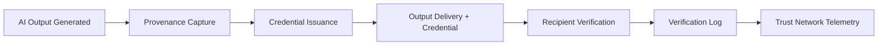

# Trust-as-a-Service (TaaS)

## Definition

Trust-as-a-Service (TaaS) provides cryptographic and organizational trust infrastructure for AI-mediated transactions, decisions, and commitments. It answers the question: "How do I know this AI output is authentic, unaltered, and produced by a governed system?" TaaS issues verifiable trust credentials for AI outputs -- digital signatures that prove provenance, integrity, and governance compliance for every AI-generated artifact.

TaaS is the credibility Fries layer. In a world where AI generates contracts, reports, assessments, and decisions, the recipient needs proof that the output was produced under governed conditions by a validated system with human oversight. TaaS provides that proof. It is the notarization layer for AI operations, and its value increases as AI-generated content becomes ubiquitous and the question "was this AI-generated, and if so, under what conditions?" becomes a standard business requirement.

## How It Works

1. AI output is generated through the governed platform pipeline (CaaS, SaaS, RaaS, or WaaS)
2. TaaS engine captures the full provenance chain: model, inputs, governance checks, human approvals
3. Cryptographic trust credential is generated and attached to the output artifact
4. Recipients can verify the credential independently without platform access
5. Trust credential includes expiration, revocation, and chain-of-custody metadata
6. Verification events feed Trust-as-a-Service byproduct data (the Kitchen)

## Target Audiences

- **Primary**: Audience 5 (Family Offices), Audience 9 (Financial Services), Audience 11 (Legal)
- **Secondary**: Audience 1 (Government), Audience 10 (Healthcare)
- **Attach Rate**: 42-78% depending on whether outputs are shared with external parties

## Pricing Model

- **Per-credential**: $0.50-$5.00 per trust credential issued
- **Subscription**: $500-$3,200/month for unlimited credentials within a volume tier
- **Verification API**: $0.10 per external verification request
- **Enterprise**: Custom pricing for high-volume issuance with dedicated trust roots

## Revenue Economics

| Metric | Value |
|---|---|
| Gross Margin | 85-94% |
| Compute Cost | 2-5% of credential price |
| Infrastructure Overhead | 3-6% |
| Average Monthly Revenue per Customer | $500-$5,000 |
| Margin Expansion Trigger | Network effects as more recipients accept TaaS credentials |

TaaS has near-zero marginal cost at scale because credential issuance is a cryptographic operation, not a model inference. Revenue grows as organizations share AI outputs externally and recipients demand provenance verification. This creates a network effect: the more organizations that issue TaaS credentials, the more recipients expect them.

## BPMN Workflow

