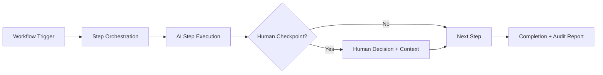

# Workflow-as-a-Service (WaaS)

## Definition

Workflow-as-a-Service (WaaS) orchestrates multi-step business processes that span multiple AI capabilities, human decision points, and system integrations into governed, repeatable workflows. Where SaaS executes a single skill, WaaS chains skills, roles, and human handoffs into end-to-end business processes: "employee onboarding from offer letter to day-30 review" or "regulatory filing from data collection to submission to examiner response."

WaaS is the operational backbone of the Fries layer. It makes AI adoption structural rather than experimental. Once a business process is encoded as a WaaS workflow, the organization depends on the platform for daily operations. Removing it means rebuilding the process manually, retraining staff, and accepting the latency and error rates that AI eliminated. This is where attachment becomes irreversible.

## How It Works

1. Customer selects or customizes a workflow template from the WaaS catalog
2. Workflow engine maps steps, decision gates, human checkpoints, and SLA timers
3. Execution begins: each step invokes the appropriate CaaS, SaaS, or RaaS component
4. Human decision points surface with full context, recommendations, and confidence scores
5. Exceptions are caught, logged, and routed to designated handlers per ORF protocol
6. Workflow completion triggers billing, audit report generation, and telemetry capture

## Target Audiences

- **Primary**: Audience 7 (Enterprise IT), Audience 8 (HR/Talent), Audience 9 (Financial Services)
- **Secondary**: Audience 1 (Government), Audience 3 (Critical Infrastructure)
- **Attach Rate**: Highest with Bundle 3 (Enterprise Operations) and Bundle 2 (Financial Services)

## Pricing Model

- **Per-workflow execution**: $10-$200 per completed workflow depending on step count
- **Subscription**: $1,400-$5,000/month for unlimited executions of specific workflow packs
- **Custom workflow design**: $8,000-$25,000 one-time design fee + monthly subscription
- **Enterprise**: Flat-rate agreements at high volume with SLA guarantees

## Revenue Economics

| Metric | Value |
|---|---|
| Gross Margin | 78-90% |
| AI Compute Cost | 8-15% of execution price |
| Orchestration Overhead | 2-5% |
| Average Monthly Revenue per Customer | $1,400-$8,000 |
| Margin Expansion Trigger | Workflow templates scale across verticals |

WaaS carries the highest margin of any operational service layer because workflow design is a one-time cost amortized across hundreds of customers. A workflow template built for one bank's regulatory filing process serves 50 banks with minor customization. Margin exceeds 85% at scale.

## BPMN Workflow

