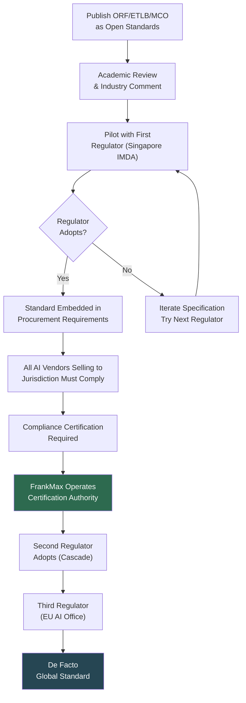

# Structural Dominance Strategy

Structural dominance means competitors cannot win even if they build a better product. The market structure itself favors FrankMax — not because of brand loyalty, network effects, or switching costs (those help), but because the competitive landscape is shaped so that competing requires going through FrankMax infrastructure.

This is achieved in 3 phases over 36 months.

---

## Phase 1: Make Competitors Buy Fries From You (Months 0-12)

### Strategy

Open-source the burger. Proprietary the fries.

The AI model access layer (the burger) is commoditizing rapidly. GPT, Claude, Gemini, Llama, Mistral — within 18 months, the cost difference between providers will be negligible. Competing on model access is a race to zero.

Instead, FrankMax makes the model access layer as open and cheap as possible (80% discount), then builds proprietary high-margin layers on top:
- Governance wrappers that competitors cannot replicate without the same regulatory relationships
- Audit trails that competitors cannot populate without the same transaction volume
- Compliance rules that competitors cannot maintain without the same regulatory monitoring infrastructure
- Failure intelligence that competitors cannot generate without the same ecosystem-wide failure data

### Desired Outcome

Competitors who build their own burger (model access) discover they need fries (governance, compliance, audit) to sell to regulated industries. The fastest path to those fries is licensing them from FrankMax.

**Even competitors become customers of the fries layer.**

### Key Actions

| Action | Timeline | Success Metric |
|---|---|---|
| Launch marketplace with 80% discount model access | Month 1-3 | 50 paying customers |
| Release governance wrapper SDK (proprietary) | Month 3-6 | 3 competitors integrating FrankMax compliance |
| Publish compliance rule database coverage metrics | Month 6-9 | Recognized as most comprehensive AI compliance database |
| Offer white-label fries to competitor platforms | Month 9-12 | 2+ competitor platforms reselling FrankMax governance |

---

## Phase 2: Own the Standards Layer (Months 12-24)

### Strategy

Convert protocols ([ORF](/protocols/orf), [ETLB](/protocols/etlb), [MCO](/protocols/mco)) from internal infrastructure into industry standards. Once the standards are adopted by regulators, every AI vendor must comply — and FrankMax operates the compliance ecosystem.

### Standards Capture Sequence

### Why This Works

The AI governance standards space is **empty**. No one has published machine-enforceable protocols for AI obligation management, liability binding, or system mortality. The first credible standard to be adopted by a regulator becomes the default — not because it is the best, but because switching standards after regulatory adoption is prohibitively expensive.

FrankMax is not competing with existing standards. It is creating a category where no standards exist and filling it before anyone else arrives.

### Key Actions

| Action | Timeline | Success Metric |
|---|---|---|
| Publish ORF/ETLB/MCO specifications (open license) | Month 12-15 | Specifications available, 50+ downloads |
| Submit to Singapore IMDA for pilot program | Month 15-18 | Accepted into regulatory sandbox |
| Present at 3 international standards bodies | Month 18-21 | Formal consideration by at least 1 body |
| First procurement specification references ORF/ETLB | Month 21-24 | Government RFP requires ORF compliance |

---

## Phase 3: Shift From Service Provider to Infrastructure Owner (Months 24-36)

### Strategy

Stop being a company that sells AI services. Become the infrastructure that AI services run on — the same way AWS shifted from "online bookstore's servers" to "the cloud."

At Phase 3, FrankMax's position is:
- **Model access** is fully commoditized (anyone can offer cheap AI); FrankMax's burger is one of many
- **Governance/compliance layers** are industry requirements; FrankMax's fries are either used directly or white-labeled through competitors
- **ORF/ETLB/MCO** are regulatory standards; compliance requires FrankMax certification or a compatible implementation
- **Kitchen systems** have 24+ months of compounding data; no competitor can replicate the Failure Pattern Library, Operator Performance Graph, or Industry Ontology

The shift: FrankMax stops competing for end customers and instead licenses infrastructure to every AI platform, consultancy, and government system integrator. Revenue moves from per-customer subscription to per-ecosystem transaction.

### Revenue Model Transition

| Revenue Source | Phase 1 | Phase 2 | Phase 3 |
|---|---|---|---|
| **Direct customer subscriptions** | 80% | 50% | 20% |
| **White-label licensing** | 5% | 20% | 30% |
| **Certification & compliance** | 10% | 20% | 25% |
| **Data & intelligence licensing** | 5% | 10% | 25% |

### Key Actions

| Action | Timeline | Success Metric |
|---|---|---|
| Launch infrastructure licensing program | Month 24-27 | 5 platform partners |
| Release Kitchen data APIs (anonymized intelligence feeds) | Month 27-30 | 10+ subscribers to failure intelligence feeds |
| Establish certification authority as independent body | Month 30-33 | Certification recognized by 3+ jurisdictions |
| First competitor fully runs on FrankMax infrastructure | Month 33-36 | Competitor's governance layer is FrankMax white-label |

---

## Failure Modes & Stress Tests

Every strategy has failure modes. These are the 7 most likely threats to structural dominance, ranked by impact.

| # | Threat | Impact | Probability | Mitigation |
|---|---|---|---|---|
| 1 | **Hyperscaler builds governance layer** (AWS/Azure/GCP adds compliance wrappers natively) | Critical — removes need for FrankMax fries | Medium | Move faster on standards capture; hyperscalers are slow at regulatory engagement. If they build governance, ensure it must be ORF-compliant. |
| 2 | **Regulatory delay** (AI governance mandates postponed 2+ years) | High — removes forcing function for compliance fries | Medium | Diversify revenue toward voluntary adoption (insurance requirements, board governance demands). Regulation is a tailwind, not a prerequisite. |
| 3 | **Open-source compliance tools** (community builds free governance wrappers) | High — commoditizes fries layer | Medium-Low | Open-source tools lack jurisdiction-specific rules, certification authority, and liability backing. Free tools do not come with insurance or audit defensibility. |
| 4 | **Customer concentration** (top 5 customers = 60%+ revenue) | High — single churn event is existential | Medium | Cap any single customer at 15% of revenue. Diversify across segments (gov, finance, healthcare, consulting). |
| 5 | **Model provider disintermediation** (Anthropic/OpenAI add governance directly to API) | Medium-High — reduces burger + fries value prop | Low-Medium | FrankMax is model-agnostic; governance across 10+ models is more valuable than governance for one. Providers will not build cross-model governance. |
| 6 | **Standards competition** (ISO/IEEE publishes competing AI accountability standard) | Medium — splits the standards landscape | Low | Engage with ISO/IEEE early; contribute FrankMax protocols as input. Better to shape the standard than compete with it. |
| 7 | **Founder risk** (solo founder, bootstrapped, burnout/incapacity) | Medium — execution halts | Medium | Document everything (this documentation site exists for this reason). Build to the point where the business can operate with hired execution by Month 12. |

---

## Structural Dominance Indicators

How to know if the strategy is working:

| Indicator | Phase 1 Target | Phase 2 Target | Phase 3 Target |
|---|---|---|---|
| **Competitors using FrankMax fries** | 1-3 | 5-10 | 15+ |
| **Regulators referencing FrankMax protocols** | 0 | 1-2 | 3-5 |
| **% revenue from non-direct customers** | 5% | 30% | 55% |
| **Certification requests per month** | 5 | 50 | 200+ |
| **Kitchen data volume (daily transactions)** | 10K | 500K | 5M+ |
| **Industry press mentions of ORF/ETLB/MCO** | 0 | 10+ | 50+ |

---

## The Endgame

At 36 months, the structural dominance strategy produces a business where:

1. **Competitors are customers** — they license FrankMax governance, compliance, and certification
2. **Regulators are allies** — they reference FrankMax protocols in procurement and enforcement
3. **Insurers are dependent** — they underwrite AI liability based on FrankMax data (MCO status, ETLB records, failure rates)
4. **Switching is irrational** — the cost of leaving the ecosystem exceeds years of subscription fees
5. **The Kitchen is irreplaceable** — 36 months of compounding data creates intelligence no competitor can replicate without processing the same volume of transactions

This is not a moat. It is a **structural reality** — the same way TCP/IP is not a moat for the internet but the infrastructure everything runs on.

---

## Related

- [Burger / Fries / Kitchen Framework](/economic-model/burger-fries-kitchen) — The economic model that enables this strategy
- [Unit Economics Model](/economic-model/unit-economics) — The numbers behind each phase
- [High-Margin Attachment Layers](/economic-model/attachment-layers) — The fries that competitors must license
- [Habit Engineering Strategy](/economic-model/habit-engineering) — How customer lock-in is achieved
- [ORF Protocol](/protocols/orf) — The foundational standard being captured
- [ETLB Protocol](/protocols/etlb) — The liability binding standard
- [MCO Protocol](/protocols/mco) — The mortality enforcement standard
