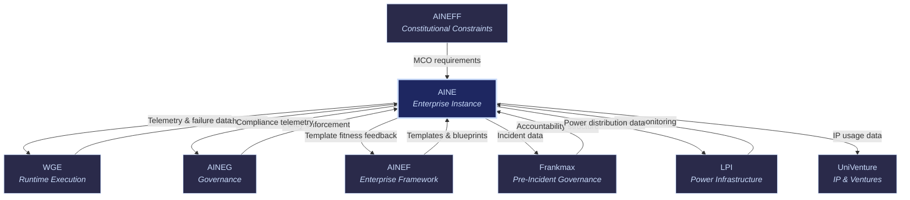

# AINE: AI-Native Enterprise

AINE

> **The running enterprise.** AINE is what a customer actually operates — a live, governed, telemetry-producing enterprise instance built from [AINEF](/ecosystem-entities/ainef) blueprints, executed by [WGE](/ecosystem-entities/wge), governed by [AINEG](/ecosystem-entities/aineg), and constrained by [AINEFF](/ecosystem-entities/aineff). Every customer organization that adopts the ecosystem becomes an AINE instance.

## Role in Ecosystem

AINE is the enterprise template instantiated. It is not a product you buy off a shelf — it is the living, running enterprise that consumes every other ecosystem service. Each AINE instance:

- Runs business processes through WGE
- Enforces governance through AINEG
- Respects constitutional constraints from AINEFF
- Generates telemetry that feeds the "kitchen" (the compounding data moat)
- Produces failure patterns that make every other instance better
- Structures accountability through Frankmax

AINE instances are the primary source of ecosystem value. They generate the data, the patterns, the failure libraries, and the operational intelligence that compounds daily. The more AINE instances running, the smarter every template, governance pattern, and routing decision becomes.

## Core Functions

| # | Function | Description |
|---|----------|-------------|
| 1 | **Runtime Enterprise Instance** | The operational enterprise — real workflows, real data, real decisions. Each instance is a fully functional AI-native organization with its own configuration, policies, and operational context. |
| 2 | **Framework Service Consumption** | Consumes services from every other entity: templates from AINEF, governance from AINEG, runtime from WGE, accountability from Frankmax, constraints from AINEFF, power monitoring from LPI. |
| 3 | **Telemetry Generation** | Produces continuous operational telemetry — performance metrics, decision logs, resource utilization, model accuracy, latency, cost, and compliance status. This data feeds the ecosystem's compounding intelligence. |
| 4 | **Failure Pattern Production** | Every failure, near-miss, degradation, and anomaly is captured and anonymized into the failure library. This is the "kitchen" — the data moat that no competitor can replicate without running equivalent enterprise instances. |
| 5 | **Business Process Execution** | Executes actual business processes (claims processing, document review, underwriting, compliance checking, etc.) through WGE-orchestrated agent teams, governed by AINEG policies. |

## Products & Services

### Enterprise-as-a-Service (EaaS)

A fully managed AI-native enterprise instance. The customer defines their business requirements, selects a vertical blueprint, and receives a running enterprise with governance, compliance, telemetry, and accountability built in.

| Tier | Description | Target |
|------|-------------|--------|
| **Starter** | Single vertical, basic governance, standard models, monthly telemetry | SMBs exploring AI-native operations |
| **Professional** | Multi-vertical, full governance suite, model selection, weekly telemetry | Mid-market with active AI initiatives |
| **Enterprise** | Unlimited verticals, custom governance, premium models, real-time telemetry, dedicated support | Large organizations, regulated industries |

### Pre-Configured Vertical Instances

Ready-to-deploy enterprise instances optimized for specific industries. Each vertical instance comes with:

- Industry-specific workflow templates
- Applicable regulatory compliance modules
- Pre-trained governance patterns
- Vertical-specific model routing (best model for each task type)
- Industry benchmarks and performance baselines

**Available verticals:**

| Vertical | Key Workflows | Regulatory Modules |
|----------|--------------|-------------------|
| **Healthcare** | Claims processing, clinical decision support, prior authorization, coding optimization | HIPAA, state health regulations |
| **Financial Services** | Transaction monitoring, credit decisioning, regulatory reporting, fraud detection | SOC 2, GLBA, state banking regulations |
| **Insurance** | Underwriting automation, claims adjudication, actuarial analysis, policyholder communications | State insurance regulations, NAIC standards |
| **Legal** | Document review, contract analysis, matter management, billing compliance | Bar association rules, privilege requirements |
| **Government** | Benefit administration, case management, regulatory enforcement, public communications | FedRAMP, FISMA, state-specific mandates |
| **General Enterprise** | Procurement, HR processes, financial operations, customer service | SOC 2, GDPR, industry-specific as needed |

## Governance Mandate

### What AINE Is Authorized To Do

- Execute business processes within governed boundaries
- Consume services from all ecosystem entities
- Generate and transmit telemetry and failure pattern data
- Configure enterprise-specific policies (within AINEG parameters)
- Select and deploy models (within WGE routing constraints)
- Customize workflows (within AINEF template rules)

### What AINE Is Constrained From Doing

- **Cannot bypass AINEFF constraints** — constitutional limits are hard-coded, not configurable
- **Cannot disable governance** — AINEG monitoring cannot be turned off at the instance level
- **Cannot suppress telemetry** — data generation is mandatory; it feeds the ecosystem's compounding value
- **Cannot operate without MCO** — every AI component must have a valid Mortality Compliance Object
- **Cannot self-govern** — AINE instances are governed by AINEG, not by themselves
- **Cannot exceed WGE resource allocation** — runtime resources are managed by WGE, not self-allocated

## Revenue Model

| Revenue Stream | Mechanism | Margin |
|----------------|-----------|--------|
| Enterprise SaaS Fees | Monthly/annual subscription by tier | 70-85% |
| Per-Workflow Execution Fees | Micro-fees per workflow execution via WGE | 60-75% |
| Vertical Instance Licensing | Per-deployment fee for pre-configured vertical instances | 75-85% |
| Telemetry Premium | Premium tier with enhanced telemetry and analytics | 85-95% |
| Custom Configuration Fees | Professional services for enterprise-specific customization | 50-65% |

**Key economic dynamic**: AINE instances are where "burger" (cheap AI access) meets "fries" (governance) meets "kitchen" (telemetry). Each instance simultaneously:
- Consumes AI models at 80% below provider pricing (loss leader)
- Attaches governance services at 70-95% margin (profit)
- Generates telemetry and failure data (compounding moat)

## Integration Points

### Upstream (AINE Receives)

| From | What | Purpose |
|------|------|---------|
| [AINEF](/ecosystem-entities/ainef) | Enterprise templates & blueprints | Structural foundation for the instance |
| [AINEFF](/ecosystem-entities/aineff) | Constitutional constraints & MCO requirements | Hard boundaries the instance cannot cross |
| [AINEG](/ecosystem-entities/aineg) | Governance policies & compliance monitoring | Day-to-day governance enforcement |
| [WGE](/ecosystem-entities/wge) | Agent orchestration & runtime execution | The engine that runs all workflows |
| [Frankmax](/ecosystem-entities/frankmax) | Accountability structures | Pre-incident defensibility for all AI operations |
| [LPI](/ecosystem-entities/lpi) | Power monitoring | Ensures no internal concentration of authority |

### Downstream (AINE Provides)

| To | What | Purpose |
|----|------|---------|
| [WGE](/ecosystem-entities/wge) | Runtime telemetry & failure patterns | Feeds the compounding intelligence moat |
| [AINEG](/ecosystem-entities/aineg) | Compliance telemetry | Real-time governance data for monitoring |
| [AINEF](/ecosystem-entities/ainef) | Template fitness feedback | What works, what breaks, what needs redesign |
| [Frankmax](/ecosystem-entities/frankmax) | Incident data | Evidence for accountability assessments |
| [LPI](/ecosystem-entities/lpi) | Power distribution data | Input for concentration detection |
| [UniVenture](/ecosystem-entities/univenture) | IP usage data | Operational data on IP deployment and performance |

## The Kitchen Effect

Every AINE instance contributes to three compounding assets:

1. **Failure Library** — Every failure, near-miss, and anomaly is captured, anonymized, and added to the ecosystem-wide failure library. New instances benefit from every previous instance's mistakes.

2. **Industry Ontology** — Operational data builds increasingly precise models of how specific industries, roles, and processes work. This ontology makes governance patterns more accurate and model routing more efficient over time.

3. **Telemetry Corpus** — Aggregate performance data across all instances enables predictive analytics: which model combinations work best for which task types, where governance overhead can be reduced, where risk is concentrating.

These assets compound daily. A competitor starting from zero cannot replicate them without running equivalent enterprise instances for equivalent time. This is the moat.

## Related

- [AINEF](/ecosystem-entities/ainef) — Framework that defines AINE blueprints
- [WGE](/ecosystem-entities/wge) — Runtime engine that powers AINE workflows
- [AINEG](/ecosystem-entities/aineg) — Governance layer that monitors AINE instances
- [AINEFF](/ecosystem-entities/aineff) — Constitutional constraints that bound AINE behavior
- [Frankmax](/ecosystem-entities/frankmax) — Pre-incident accountability for AINE operations
- [Protocols](/protocols) — ORF, ETLB, and MCO protocols active in every AINE instance
- [Agent Recovery Prompt](/recovery) — Full ecosystem context
