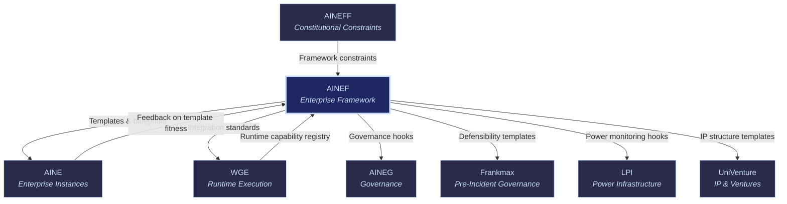

# AINEF: AI-Native Enterprise Framework

AINEF

> **The blueprint.** AINEF is the structural framework for building any AI-native enterprise. It defines how enterprises are composed, how modules connect, and how the DOC-AS-CODE spine holds everything together. If AINE is the running enterprise, AINEF is the architectural drawing it was built from.

## Role in Ecosystem

AINEF provides the reusable, composable blueprint that any organization uses to become an AI-native enterprise. It is not a running system — it is the set of templates, composition rules, integration standards, and lifecycle patterns that turn a concept into a deployable [AINE](/ecosystem-entities/aine) instance.

Every AINE instance in the ecosystem was built from AINEF templates. Every module that plugs into an enterprise follows AINEF composition rules. Every integration between entities follows AINEF standards. The framework is the shared language that makes the ecosystem interoperable.

## Core Functions

| # | Function | Description |
|---|----------|-------------|
| 1 | **Enterprise Template Design** | Creates and maintains the canonical templates for AI-native enterprises across 15 audience segments and 20+ NAICS sectors. Templates encode structure, governance hooks, telemetry points, and compliance requirements. |
| 2 | **DOC-AS-CODE Spine Architecture** | Defines and maintains the documentation-as-code backbone that every enterprise instance runs on. The spine ensures that documentation, configuration, policy, and code are a single unified artifact — not separate deliverables. |
| 3 | **Module Composition Rules** | Specifies how individual capabilities (models, agents, workflows, governance layers) compose into larger functional units. Defines interface contracts, dependency rules, and compatibility matrices. |
| 4 | **Inter-Entity Integration Standards** | Publishes the standards that govern how the 8 ecosystem entities communicate, share data, and coordinate. API contracts, event schemas, authentication patterns, and failure handling. |
| 5 | **Enterprise Lifecycle Management** | Defines the stages an enterprise instance moves through: provisioning, configuration, activation, operation, scaling, migration, and decommissioning. Each stage has defined gates, requirements, and rollback procedures. |

## Products & Services

### DOC-AS-CODE Template Kit

The foundational toolkit for building documentation-driven enterprises. Every configuration, policy, workflow, and integration is expressed as versioned, reviewable, deployable code.

| Component | Description |
|-----------|-------------|
| **Spine Generator** | Scaffolds the DOC-AS-CODE backbone for a new enterprise instance |
| **Policy-as-Code Templates** | Pre-built governance policies in executable format |
| **Workflow-as-Code Templates** | Business process definitions ready for WGE execution |
| **Integration-as-Code Templates** | Pre-wired connection patterns between ecosystem entities |
| **Compliance-as-Code Templates** | Regulatory requirements expressed as testable assertions |

### Enterprise Architecture Blueprints

Pre-designed enterprise architectures for specific verticals and use cases. Each blueprint includes the complete set of modules, integrations, governance layers, and telemetry points required for a functional AI-native enterprise.

- **Healthcare Blueprint** — HIPAA-compliant, claims-processing-ready, clinical decision support hooks
- **Financial Services Blueprint** — SOC 2 baseline, transaction monitoring, regulatory reporting built-in
- **Government/Public Sector Blueprint** — FedRAMP-aligned, authority-to-operate documentation, FISMA controls
- **Insurance Blueprint** — Claims lifecycle, underwriting automation, actuarial model integration
- **Legal Blueprint** — Matter management, document review, privilege detection, billing compliance
- **General Enterprise Blueprint** — Horizontal template suitable for any NAICS sector

### Module Composition Engine

Tooling that validates, assembles, and tests module compositions before deployment. Ensures that combining capabilities A + B + C produces a functional, compliant, performant system — not a collision of incompatible parts.

- **Compatibility Checker** — Validates module combinations against composition rules
- **Dependency Resolver** — Identifies and resolves module dependencies automatically
- **Integration Tester** — Runs integration tests on composed modules before deployment
- **Performance Predictor** — Estimates resource requirements and performance characteristics of compositions

## Governance Mandate

### What AINEF Is Authorized To Do

- Define and publish enterprise templates and blueprints
- Set module composition rules and interface contracts
- Publish inter-entity integration standards
- Certify enterprise architectures for compliance readiness
- Version and deprecate templates with migration guidance
- Define lifecycle stage gates and requirements

### What AINEF Is Constrained From Doing

- **Cannot run enterprise instances** — AINEF designs blueprints; [AINE](/ecosystem-entities/aine) runs instances
- **Cannot enforce governance** — AINEF defines governance hooks; [AINEG](/ecosystem-entities/aineg) enforces them
- **Cannot violate AINEFF constraints** — all templates must embed [AINEFF](/ecosystem-entities/aineff) constitutional requirements
- **Cannot execute workflows** — AINEF defines workflow templates; [WGE](/ecosystem-entities/wge) executes them
- **Cannot modify its own standards unilaterally** — standard changes require ecosystem-wide review

## Revenue Model

| Revenue Stream | Mechanism | Margin |
|----------------|-----------|--------|
| Template Licensing | Per-instance licensing for enterprise templates | 85-95% |
| Framework Certification | Certification that an enterprise build conforms to AINEF standards | 80-90% |
| Enterprise Setup Fees | Professional services for initial enterprise provisioning from blueprints | 60-70% |
| Blueprint Customization | Custom vertical blueprints for specific industry requirements | 65-75% |
| Module Composition Licensing | Per-deployment licensing for the composition engine | 85-95% |
| Standard Subscription | Access to latest integration standards and composition rules | 90-95% |

## Integration Points

### Upstream (AINEF Receives)

| From | What | Purpose |
|------|------|---------|
| [AINEFF](/ecosystem-entities/aineff) | Constitutional constraints | All templates must embed foundational limits |
| [AINE](/ecosystem-entities/aine) | Template fitness feedback | Running instances report what works and what breaks |
| [WGE](/ecosystem-entities/wge) | Runtime capability registry | Available capabilities inform template design |

### Downstream (AINEF Provides)

| To | What | Purpose |
|----|------|---------|
| [AINE](/ecosystem-entities/aine) | Enterprise templates & blueprints | The building blocks for every enterprise instance |
| [WGE](/ecosystem-entities/wge) | Integration standards | How the runtime connects to enterprise components |
| [AINEG](/ecosystem-entities/aineg) | Governance hooks | Where governance policies attach to enterprise structure |
| [Frankmax](/ecosystem-entities/frankmax) | Defensibility templates | Pre-built accountability structures in every blueprint |
| [LPI](/ecosystem-entities/lpi) | Power monitoring hooks | Telemetry points for detecting concentration |
| [UniVenture](/ecosystem-entities/univenture) | IP structure templates | Standard structures for IP packaging and licensing |

## Key Principle

AINEF encodes a critical insight: the structure of an AI-native enterprise is itself intellectual property. The way modules compose, the way governance hooks attach, the way telemetry flows — these patterns are the "kitchen" that compounds over time. Every enterprise instance built from AINEF templates feeds back data that makes the next template better.

## Related

- [AINE](/ecosystem-entities/aine) — Runtime instances built from AINEF blueprints
- [AINEFF](/ecosystem-entities/aineff) — Constitutional constraints that AINEF templates must respect
- [WGE](/ecosystem-entities/wge) — Runtime engine that executes workflows defined in AINEF templates
- [Protocols](/protocols) — ORF, ETLB, and MCO protocols embedded in every template
- [Agent Recovery Prompt](/recovery) — Full ecosystem context
