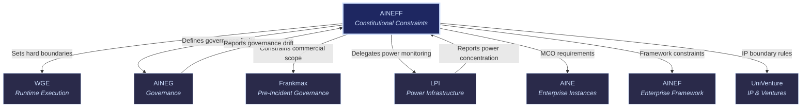

# AINEFF: AI-Native Enterprise Foundation Framework

AINEFF

> **The "Bill of Rights" layer.** AINEFF defines what the ecosystem CANNOT do. Every other entity operates inside the boundaries AINEFF sets. No entity — including AINEFF itself — can override these constitutional constraints.

## Role in Ecosystem

AINEFF is the constitutional constraint layer of the FrankMax ecosystem. While every other entity defines what _can_ be done, AINEFF defines what _must never_ be done. It establishes hard boundaries on AI autonomy, enforces mortality requirements on all AI systems through the [MCO protocol](/protocols/mco), and ensures that no AI action crosses irreversibility thresholds without human authorization.

AINEFF does not execute work. It does not govern day-to-day operations. It exists solely to prevent the ecosystem from violating its own foundational principles — and to prevent any single entity (including itself) from accumulating unchecked power.

## Core Functions

| # | Function | Description |
|---|----------|-------------|
| 1 | **Hard Boundary Definition** | Defines the absolute limits of AI autonomy across the ecosystem. These are not guidelines — they are immutable constraints that no runtime, governance layer, or commercial entity can override. |
| 2 | **Mortality Requirements (MCO)** | Establishes and enforces Mortality Compliance Objects for every AI system. Every agent, model, and automated process must have a defined lifespan, a kill condition, and an expiration mechanism. No immortal AI. |
| 3 | **Human Accountability Enforcement** | Requires that every consequential AI decision traces back to a named, accountable human. Anonymous automation is prohibited. The chain of accountability must be unbroken from output to person. |
| 4 | **Irreversibility Threshold Management** | Defines which decisions AI cannot make alone. Financial commitments above threshold, personnel actions, legal filings, public communications — all require human-in-the-loop before execution. |
| 5 | **Constitutional Integrity Maintenance** | Monitors all entities for constitutional compliance. Detects drift, escalation, and scope creep that would violate foundational constraints. Issues binding correction orders. |
| 6 | **Power Concentration Prevention** | Delegates active power monitoring to [LPI](/ecosystem-entities/lpi) but sets the thresholds and definitions. Defines what constitutes illegitimate concentration and authorizes intervention mechanisms. |

## Products & Services

### MCO Generator & Validator

Generates compliant Mortality Compliance Objects for any AI system. Validates existing MCOs against current constitutional requirements. Issues compliance certificates.

- **Input**: AI system specification, deployment context, operational scope
- **Output**: MCO document with kill conditions, expiration parameters, and override protocols
- **Validation**: Continuous — MCOs are re-validated on schedule and on any system change

### Kill-Switch Infrastructure

The technical infrastructure that enforces MCO mortality requirements. Provides guaranteed termination capability for any AI system in the ecosystem.

- Hard kill (immediate termination, no graceful shutdown)
- Soft kill (graceful wind-down with state preservation)
- Cascade kill (terminate agent and all downstream dependents)
- Scheduled expiration (automatic termination at MCO-defined end-of-life)

### Human Override Infrastructure

Ensures humans can always intervene in any AI process. Provides override mechanisms at every layer of the stack — from individual agent actions to entire workflow pipelines.

- Single-action override (block one decision)
- Process override (pause and redirect a workflow)
- System override (halt an entire AI system)
- Emergency override (ecosystem-wide halt capability)

### Constitutional Compliance Checker

Automated tooling that continuously evaluates entity behavior against AINEFF constraints. Produces compliance reports, flags violations, and triggers escalation workflows.

## Governance Mandate

### What AINEFF Is Authorized To Do

- Define and amend constitutional constraints (subject to multi-party ratification)
- Issue binding compliance orders to any entity
- Mandate MCO requirements for any AI system
- Authorize kill-switch activation
- Delegate power monitoring to LPI
- Require human accountability chains for any process

### What AINEFF Is Constrained From Doing

- **Cannot override itself unilaterally** — constitutional changes require multi-party ratification across entities
- **Cannot execute work** — AINEFF defines boundaries, it does not perform operational tasks
- **Cannot expand its own scope** — self-constraining by design; any scope expansion triggers automatic LPI review
- **Cannot operate AI systems** — AINEFF constrains AI, it does not run AI
- **Cannot generate revenue from enforcement** — compliance fees are fixed and transparent; no incentive to over-enforce

### Amendment Process

1. Proposed amendment submitted to AINEFF
2. Impact assessment across all 8 entities
3. 30-day review period
4. Multi-party ratification (minimum 5 of 8 entities must approve)
5. LPI verification that amendment does not concentrate power
6. Implementation with 90-day grace period for compliance

## Revenue Model

| Revenue Stream | Mechanism | Margin |
|----------------|-----------|--------|
| MCO Certification Fees | Per-system MCO generation and validation | 80-90% |
| Constitutional Audit Fees | Per-entity compliance audits (quarterly) | 75-85% |
| Kill-Switch Infrastructure Licensing | Per-deployment licensing for termination infrastructure | 85-95% |
| Override Infrastructure Licensing | Per-deployment licensing for human override systems | 85-95% |
| Amendment Processing Fees | Per-amendment administrative and assessment fees | 70-80% |

AINEFF revenue is deliberately modest relative to other entities. Its purpose is constraint, not profit. Revenue exists to sustain operations, not to create incentives for scope expansion.

## Integration Points

### Upstream (AINEFF Receives)

| From | What | Purpose |
|------|------|---------|
| [LPI](/ecosystem-entities/lpi) | Power concentration alerts | Triggers constitutional review when thresholds approached |
| [AINEG](/ecosystem-entities/aineg) | Governance drift reports | Identifies entities drifting outside constitutional bounds |
| All entities | Amendment proposals | Constitutional change requests requiring ratification |

### Downstream (AINEFF Provides)

| To | What | Purpose |
|----|------|---------|
| [WGE](/ecosystem-entities/wge) | Runtime boundary constraints | Hard limits on what agents can do at execution time |
| [AINEG](/ecosystem-entities/aineg) | Governance scope limits | Defines the envelope within which governance policies operate |
| [Frankmax](/ecosystem-entities/frankmax) | Commercial scope constraints | Prevents accountability services from overreaching |
| [LPI](/ecosystem-entities/lpi) | Power concentration thresholds | Defines what constitutes illegitimate concentration |
| [AINE](/ecosystem-entities/aine) | MCO requirements | Every enterprise instance must embed compliant MCOs |
| [AINEF](/ecosystem-entities/ainef) | Framework constraints | Blueprint designs must respect constitutional limits |
| [UniVenture](/ecosystem-entities/univenture) | IP boundary rules | IP licensing cannot violate constitutional constraints |

## Key Principle

AINEFF exists because the question is not "what can AI do?" but "what must AI never do?" Every capability the ecosystem builds is bounded by AINEFF's constraints. If AINEFF fails, the ecosystem has no floor — and a system with no floor eventually falls through it.

## Related

- [MCO Protocol](/protocols/mco) — Mortality Compliance Objects defined and enforced by AINEFF
- [ORF Protocol](/protocols/orf) — Obligation & Responsibility Finality, constrained by AINEFF boundaries
- [ETLB Protocol](/protocols/etlb) — Execution-Time Liability Binding, operates within AINEFF limits
- [LPI](/ecosystem-entities/lpi) — Delegated power monitoring partner
- [AINEG](/ecosystem-entities/aineg) — Governance layer operating within AINEFF constraints
- [Agent Recovery Prompt](/recovery) — Full ecosystem context
