# AINEG: AI-Native Enterprise Governance

AINEG

> **The referee.** AINEG provides governance infrastructure — policies, controls, audit frameworks, and ongoing compliance monitoring. It does not set the constitutional rules (that is [AINEFF](/ecosystem-entities/aineff)) and it does not handle pre-incident accountability (that is [Frankmax](/ecosystem-entities/frankmax)). AINEG handles everything in between: the day-to-day enforcement, monitoring, and audit machinery that keeps the ecosystem honest.

## Role in Ecosystem

AINEG is the governance engine of the FrankMax ecosystem. It compiles policies from constitutional constraints into enforceable rules, monitors compliance in real time, generates audit trails for every consequential action, and detects governance drift before it becomes governance failure.

AINEG occupies the "fries" layer of the economic model — high-margin governance services that attach to the "burger" of cheap AI model access. Governance-as-a-Service, Compliance-as-a-Service, and Audit-as-a-Service are the primary revenue drivers with 70-95% margins. The critical threshold: below 40% attachment rate of governance services to AI model purchases, the economic model fails.

## Core Functions

| # | Function | Description |
|---|----------|-------------|
| 1 | **Policy Compilation & Enforcement** | Translates constitutional constraints (from AINEFF) and regulatory requirements into executable, enforceable policies. Policies are code, not documents — they run at execution time via WGE integration. |
| 2 | **Audit Trail Generation** | Produces immutable, tamper-evident audit trails for every consequential action in the ecosystem. Every AI decision, human override, policy evaluation, and resource allocation is logged with full context. |
| 3 | **Compliance Monitoring** | Continuous, real-time monitoring of all entities and enterprise instances against applicable governance policies. Detects violations as they occur, not after the fact. |
| 4 | **Governance Pattern Libraries** | Maintains a catalog of proven governance patterns for specific industries, regulatory regimes, and risk profiles. Patterns are composable and version-controlled. |
| 5 | **Regulatory Mapping** | Maps regulatory requirements (HIPAA, SOC 2, GDPR, FedRAMP, state-level AI laws) to specific governance controls and monitoring rules. Keeps mappings current as regulations evolve. |
| 6 | **Drift Detection** | Identifies when entity behavior, policy enforcement, or governance posture is gradually moving away from compliant baseline. Early warning before drift becomes violation. |

## Products & Services

### Governance-as-a-Service (GaaS)

Turnkey governance infrastructure for AI-native enterprises. Provides the complete governance stack — policy engine, enforcement layer, monitoring dashboards, and escalation workflows — as a managed service.

| Tier | Scope | Target |
|------|-------|--------|
| **Starter** | Core policy enforcement, basic audit trail, monthly compliance report | Small enterprises, single-model deployments |
| **Professional** | Full policy engine, real-time monitoring, drift detection, quarterly audit | Mid-market, multi-model deployments |
| **Enterprise** | Custom policy compilation, continuous audit, regulatory mapping, dedicated support | Large enterprises, regulated industries |

### Compliance-as-a-Service (CaaS)

Pre-built compliance frameworks mapped to specific regulatory regimes. Enterprises select applicable regulations and receive a complete, continuously updated compliance posture.

- **HIPAA Compliance Module** — Healthcare data governance, BAA management, access controls
- **SOC 2 Compliance Module** — Security, availability, processing integrity, confidentiality, privacy
- **GDPR Compliance Module** — Data subject rights, processing records, cross-border transfer controls
- **AI-Specific Compliance** — EU AI Act readiness, state-level AI transparency laws, bias monitoring

### Audit-as-a-Service (AaaS)

On-demand and continuous audit capabilities. Generates audit-ready reports for internal governance reviews, regulatory examinations, and third-party assessments.

- **Continuous Audit** — Real-time audit trail with automated anomaly detection
- **On-Demand Audit** — Point-in-time audit reports for specific periods, entities, or processes
- **Regulatory Audit Prep** — Pre-formatted reports aligned to specific regulatory examination frameworks
- **Third-Party Audit Support** — Evidence packages for external auditors (Big 4, specialized firms)

### Governance Pattern Libraries

Curated, versioned collections of governance patterns for specific use cases:

| Library | Patterns | Use Case |
|---------|----------|----------|
| **Healthcare Governance** | 45+ patterns | Clinical AI, claims processing, patient data |
| **Financial Services Governance** | 60+ patterns | Trading, lending, AML/KYC, reporting |
| **Government Governance** | 35+ patterns | Authority-to-operate, FISMA, FedRAMP |
| **General Enterprise Governance** | 80+ patterns | Horizontal governance for any sector |

### Drift Early-Warning Systems

Automated monitoring that detects governance drift — the gradual movement away from compliant baseline that precedes governance failures.

- **Policy Drift** — Policies being bypassed, weakened, or ignored over time
- **Behavioral Drift** — Entity or agent behavior diverging from governed norms
- **Configuration Drift** — System configurations moving away from compliant state
- **Cultural Drift** — Human override frequency, escalation patterns, and response times indicating governance fatigue

## Governance Mandate

### What AINEG Is Authorized To Do

- Compile and enforce governance policies within AINEFF constitutional bounds
- Generate and maintain audit trails for all ecosystem actions
- Monitor compliance in real time across all entities and instances
- Publish governance patterns and best practices
- Map regulatory requirements to controls
- Issue compliance violations and escalate to AINEFF for constitutional issues
- Certify enterprise instances as governance-compliant

### What AINEG Is Constrained From Doing

- **Cannot set constitutional rules** — that is [AINEFF](/ecosystem-entities/aineff)'s exclusive domain
- **Cannot handle pre-incident accountability** — that is [Frankmax](/ecosystem-entities/frankmax)'s domain
- **Cannot execute business workflows** — AINEG monitors and governs; [WGE](/ecosystem-entities/wge) executes
- **Cannot modify AINEFF constraints** — can only propose amendments through the ratification process
- **Cannot self-audit** — AINEG's own compliance is monitored by [LPI](/ecosystem-entities/lpi) and [AINEFF](/ecosystem-entities/aineff)

## Revenue Model

| Revenue Stream | Mechanism | Margin |
|----------------|-----------|--------|
| GaaS Subscriptions | Monthly/annual SaaS fees by tier | 80-95% |
| CaaS Subscriptions | Per-regulation compliance module fees | 85-95% |
| AaaS Fees | Per-audit and continuous audit subscription fees | 70-85% |
| Per-Action Audit Fees | Micro-fees for individual action audit trail entries | 90-95% |
| Governance Pattern Licensing | Per-library or per-pattern licensing fees | 90-95% |
| Compliance Certification | Per-instance certification fees | 80-90% |
| Drift Monitoring Subscription | Monthly monitoring and alerting fees | 85-95% |

**Critical metric**: AINEG services must achieve at least 40% attachment rate to AI model access purchases. Below this threshold, the "fries" margin cannot subsidize the "burger" loss leader.

## Integration Points

```mermaid
graph TB
    AINEG["AINEG<br/><i>Governance Infrastructure</i>"]

    AINEFF["AINEFF<br/><i>Constitutional Constraints</i>"] -->|"Governance scope limits"| AINEG
    AINEG -->|"Policy enforcement at runtime"| WGE["WGE<br/><i>Runtime Execution</i>"]
    AINEG -->|"Compliance monitoring"| AINE["AINE<br/><i>Enterprise Instances</i>"]
    AINEG -->|"Governance drift reports"| AINEFF
    AINEG -->|"Audit data for accountability"| Frankmax["Frankmax<br/><i>Pre-Incident Governance</i>"]
    AINEG -->|"Governance compliance data"| LPI["LPI<br/><i>Power Infrastructure</i>"]
    AINEG -->|"Governance hooks in templates"| AINEF["AINEF<br/><i>Enterprise Framework</i>"]
    AINEG -->|"IP governance compliance"| UniVenture["UniVenture<br/><i>IP & Ventures</i>"]

    WGE -->|"Runtime telemetry"| AINEG
    AINE -->|"Instance telemetry"| AINEG

    style AINEG fill:#1E2761,stroke:#CADCFC,stroke-width:3px,color:#CADCFC
    style AINEFF fill:#2a2a4a,stroke:#CADCFC,color:#CADCFC
    style WGE fill:#2a2a4a,stroke:#CADCFC,color:#CADCFC
    style AINE fill:#2a2a4a,stroke:#CADCFC,color:#CADCFC
    style Frankmax fill:#2a2a4a,stroke:#CADCFC,color:#CADCFC
    style LPI fill:#2a2a4a,stroke:#CADCFC,color:#CADCFC
    style AINEF fill:#2a2a4a,stroke:#CADCFC,color:#CADCFC
    style UniVenture fill:#2a2a4a,stroke:#CADCFC,color:#CADCFC
```

### Upstream (AINEG Receives)

| From | What | Purpose |
|------|------|---------|
| [AINEFF](/ecosystem-entities/aineff) | Constitutional constraints | Defines the boundaries within which governance operates |
| [WGE](/ecosystem-entities/wge) | Runtime telemetry | Raw execution data for compliance monitoring |
| [AINE](/ecosystem-entities/aine) | Instance telemetry | Enterprise-level behavior data for audit and drift detection |

### Downstream (AINEG Provides)

| To | What | Purpose |
|----|------|---------|
| [WGE](/ecosystem-entities/wge) | Executable policies | Runtime-enforceable governance rules |
| [AINE](/ecosystem-entities/aine) | Compliance status | Real-time governance posture for each instance |
| [AINEFF](/ecosystem-entities/aineff) | Drift reports | Early warning when entities approach constitutional boundaries |
| [Frankmax](/ecosystem-entities/frankmax) | Audit data | Evidence base for pre-incident accountability assessments |
| [LPI](/ecosystem-entities/lpi) | Governance compliance data | Input for power concentration analysis |
| [AINEF](/ecosystem-entities/ainef) | Governance requirements | Requirements that templates must satisfy |
| [UniVenture](/ecosystem-entities/univenture) | IP governance compliance | Governance status for IP licensing decisions |

## Key Principle

Governance is not a tax — it is a product. Enterprises do not buy governance because they want to; they buy it because the cost of ungoverned AI (regulatory fines, lawsuit exposure, reputational damage, operational chaos) is orders of magnitude higher than the cost of governed AI. AINEG makes governance effortless enough that the 40% attachment rate is not a sales problem but an infrastructure default.

## Related

- [AINEFF](/ecosystem-entities/aineff) — Constitutional constraints that scope AINEG's authority
- [Frankmax](/ecosystem-entities/frankmax) — Pre-incident accountability that complements AINEG's ongoing governance
- [WGE](/ecosystem-entities/wge) — Runtime engine where AINEG policies execute
- [Protocols](/protocols) — ORF, ETLB, and MCO protocols that AINEG monitors
- [Agent Recovery Prompt](/_recovery) — Full ecosystem context
