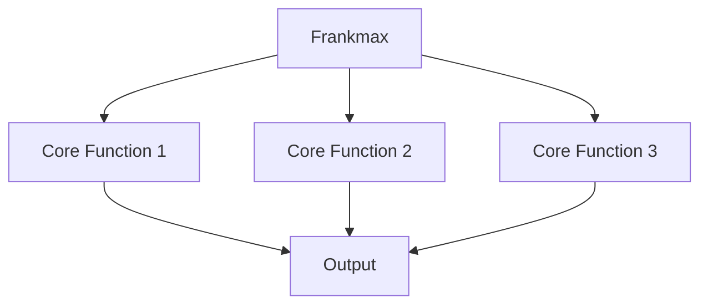

# Frankmax: FrankMax Digital

Frankmax

## Role in Ecosystem

Pre-incident governance — accountability, liability, defensibility services

## Core Functions

<!-- TODO: Define 5-7 core functions from source documents -->

## Products & Services

<!-- TODO: Link to specific marketplace products owned by this entity -->

## Governance Mandate

<!-- TODO: What this entity is authorized to do and constrained from doing -->

## Revenue Model

<!-- TODO: How this entity generates revenue -->

## Integration Points

<!-- TODO: How this entity connects to other entities -->

## BPMN Workflow

## Related

- [Protocols](/protocols)
- [Agent Recovery Prompt](/_recovery)
