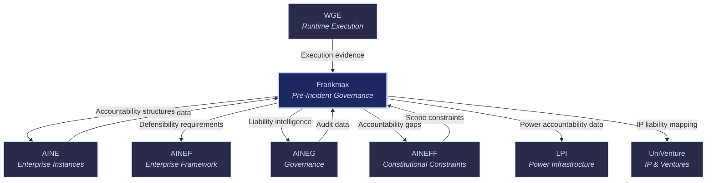

# Frankmax: FrankMax Digital

Frankmax

> **"If this fails, can you survive investigation?"** Frankmax is the pre-incident governance entity. It does not monitor compliance (that is [AINEG](/ecosystem-entities/aineg)) or set constitutional rules (that is [AINEFF](/ecosystem-entities/aineff)). Frankmax answers one question: when an AI system fails — and it will — can the organization demonstrate that it acted responsibly, knew its risks, and had defensible decision-making in place?

## Role in Ecosystem

Frankmax occupies a structurally empty market. No competitor exists for pre-incident AI governance. Post-incident services are abundant (lawyers, consultants, PR firms). But the work of preparing _before_ failure — mapping accountability, analyzing failure propagation, structuring defensibility — is unoccupied territory.

This is the entity that generates day-one revenue. While other entities require platform infrastructure, Frankmax delivers advisory services with minimal technical dependency. A PIAR engagement at $15K-$75K requires a consultant, a methodology, and a deliverable — not a deployed platform.

**Critical market characteristic**: Pre-incident governance is one-way adoption. Once an organization adopts it after experiencing or witnessing an AI incident, they never remove it. The cost of removal (exposure to the next incident) is asymmetrically higher than the cost of continuation.

## Core Functions

| # | Function | Description |
|---|----------|-------------|
| 1 | **Pre-Incident Accountability Review (PIAR)** | The flagship service. Conducts a comprehensive review of an organization's AI deployment to determine: who is accountable for what, where liability concentrates, what fails first, and whether the organization can survive regulatory/legal investigation after an incident. |
| 2 | **Authority & Liability Mapping** | Maps every AI decision point to a named, accountable human. Identifies where authority is exercised, where liability attaches, and where gaps exist between the two. |
| 3 | **Failure Propagation Analysis** | Models how failure in one AI component cascades through the system. Identifies single points of failure, cascading risk paths, and blast radius for each failure mode. |
| 4 | **Jurisdictional Exposure Assessment** | Maps AI operations to applicable jurisdictions and identifies regulatory exposure. A model serving customers in 12 states faces 12 different regulatory regimes — this service maps all of them. |
| 5 | **Decision Defensibility Structuring** | Structures the decision-making process so that each AI decision can be explained, justified, and defended after the fact. Not "explainable AI" — defensible decisions by accountable humans. |
| 6 | **Institutional Memory Continuity** | Ensures that organizational knowledge about AI risks, decisions, and accountability structures persists across personnel changes. When the CISO leaves, the accountability map does not leave with them. |
| 7 | **Accreditation & Defensibility Signals** | Provides external signals (certifications, accreditations, audit reports) that demonstrate governance maturity to regulators, partners, customers, and courts. |

## Products & Services

| Service | Price Range | Delivery | Description |
|---------|-----------|----------|-------------|
| **Pre-Incident Accountability Review (PIAR)** | $15,000 - $75,000 | 2-6 weeks | Comprehensive review producing accountability map, liability analysis, failure propagation model, and remediation roadmap. The first product to sell — day 1 revenue. |
| **Authority & Liability Mapping** | $10,000 - $50,000 | 1-4 weeks | Detailed map of every AI decision point, the human accountable for it, and the liability attached. Delivered as a living document, not a static report. |
| **Failure Propagation Analysis** | $20,000 - $100,000 | 3-8 weeks | Modeling of failure cascades across all AI systems. Identifies critical paths, single points of failure, and blast radius. Includes mitigation recommendations. |
| **Jurisdictional Exposure Assessment** | $25,000 - $150,000 | 4-12 weeks | Complete mapping of regulatory exposure across all operating jurisdictions. Includes compliance gap analysis and remediation timeline. |
| **Decision Defensibility Retainer** | $5,000 - $20,000/mo | Ongoing | Monthly retainer for continuous defensibility structuring. Reviews new AI deployments, updates accountability maps, and maintains decision audit trails. |
| **Institutional Memory Service** | $3,000 - $10,000/mo | Ongoing | Continuous service ensuring accountability knowledge persists across personnel changes. Includes knowledge base maintenance, transition protocols, and succession documentation. |
| **Accreditation Program** | $10,000 - $50,000/yr | Annual | Annual certification program providing external defensibility signals. Includes initial assessment, certification, and annual renewal audit. |

### Revenue Priority & Timeline

| Priority | Product | Timeline | Revenue Potential |
|----------|---------|----------|-------------------|
| 1 | PIAR | 0-30 days | $15K-$75K per engagement |
| 2 | Authority & Liability Mapping | 0-30 days | $10K-$50K per engagement |
| 3 | Failure Propagation Analysis | 30-60 days | $20K-$100K per engagement |
| 4 | Jurisdictional Exposure Assessment | 30-60 days | $25K-$150K per engagement |
| 5 | Decision Defensibility Retainer | 60-90 days | $5K-$20K/mo recurring |
| 6 | Institutional Memory Service | 60-90 days | $3K-$10K/mo recurring |
| 7 | Accreditation Program | 90-180 days | $10K-$50K/yr recurring |

## Governance Mandate

### What Frankmax Is Authorized To Do

- Conduct pre-incident accountability assessments for any entity or enterprise instance
- Map authority and liability chains across AI systems
- Model failure propagation and cascading risk
- Assess jurisdictional regulatory exposure
- Structure decision defensibility for AI operations
- Maintain institutional memory and accountability knowledge bases
- Issue accreditations and defensibility certifications
- Advise on remediation of accountability gaps

### What Frankmax Is Constrained From Doing

- **Cannot provide legal advice** — Frankmax structures accountability, it does not practice law
- **Cannot enforce governance** — that is [AINEG](/ecosystem-entities/aineg)'s domain
- **Cannot set constitutional constraints** — that is [AINEFF](/ecosystem-entities/aineff)'s domain
- **Cannot investigate post-incident** — Frankmax is pre-incident only; post-incident is legal/regulatory territory
- **Cannot guarantee regulatory outcomes** — defensibility structuring improves outcomes but cannot guarantee them
- **Cannot expand scope to operational governance** — Frankmax advises on accountability, it does not govern operations

## Revenue Model

| Revenue Stream | Mechanism | Margin |
|----------------|-----------|--------|
| Advisory Engagement Fees | Per-project fees for PIAR, mapping, analysis, assessment | 65-80% |
| Monthly Retainers | Recurring fees for defensibility and institutional memory services | 75-85% |
| Annual Certifications | Yearly accreditation program fees | 80-90% |
| Training & Workshops | Per-session fees for accountability training | 70-80% |
| Remediation Consulting | Per-project fees for implementing accountability improvements | 55-70% |

**Critical characteristic**: Frankmax is the only entity that generates revenue from day one without platform infrastructure. Advisory services require methodology and expertise, not deployed software. This makes Frankmax the bootstrap revenue engine for the entire ecosystem.

## Integration Points

### Upstream (Frankmax Receives)

| From | What | Purpose |
|------|------|---------|
| [AINEFF](/ecosystem-entities/aineff) | Commercial scope constraints | Defines what Frankmax can and cannot advise on |
| [AINEG](/ecosystem-entities/aineg) | Audit and compliance data | Evidence base for accountability assessments |
| [WGE](/ecosystem-entities/wge) | Execution evidence | Decision logs and action traces for accountability mapping |
| [AINE](/ecosystem-entities/aine) | Incident and operational data | Real-world evidence of how AI systems behave |

### Downstream (Frankmax Provides)

| To | What | Purpose |
|----|------|---------|
| [AINE](/ecosystem-entities/aine) | Accountability structures | Pre-incident defensibility for each enterprise instance |
| [AINEF](/ecosystem-entities/ainef) | Defensibility requirements | Requirements that must be built into every template |
| [AINEG](/ecosystem-entities/aineg) | Liability intelligence | Information about where liability concentrates, informing governance priorities |
| [AINEFF](/ecosystem-entities/aineff) | Accountability gap reports | Constitutional-level gaps that require amendment |
| [LPI](/ecosystem-entities/lpi) | Power accountability data | Accountability chain data for power concentration analysis |
| [UniVenture](/ecosystem-entities/univenture) | IP liability mapping | Liability analysis for IP licensing arrangements |

## Why This Market Is Empty

Pre-incident governance has no natural buyer — until after an incident. The sales cycle depends on one of three triggers:

1. **The organization experienced an AI failure** and realized they had no accountability structure
2. **A competitor or peer experienced a public AI failure** and the board asked "could that happen to us?"
3. **A regulator signaled enforcement intent** and the legal team demanded preparation

Each trigger is irreversible. Once the question "can we survive investigation?" has been asked, it cannot be un-asked. And the answer — "we don't know" — is unacceptable. This creates one-way adoption: Frankmax services, once engaged, are never removed.

## Related

- [AINEG](/ecosystem-entities/aineg) — Ongoing governance that complements Frankmax's pre-incident focus
- [AINEFF](/ecosystem-entities/aineff) — Constitutional constraints that scope Frankmax's advisory authority
- [ORF Protocol](/protocols/orf) — Obligation & Responsibility Finality, core to accountability mapping
- [ETLB Protocol](/protocols/etlb) — Execution-Time Liability Binding, core to liability analysis
- [Protocols](/protocols) — All protocols relevant to pre-incident governance
- [Agent Recovery Prompt](/recovery) — Full ecosystem context
